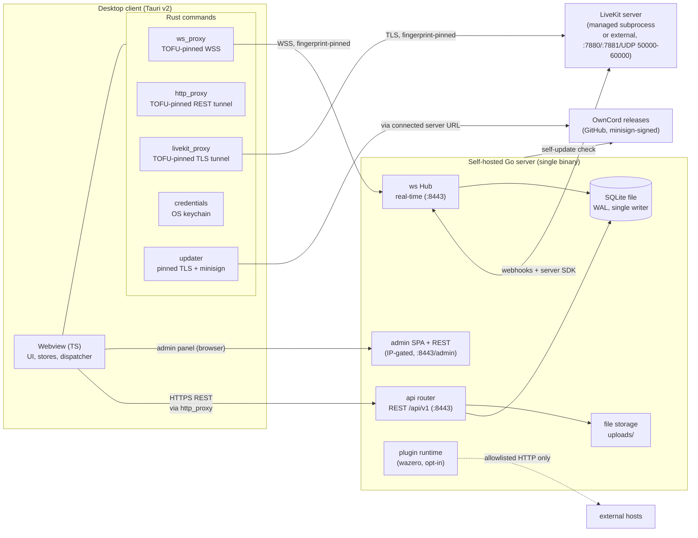
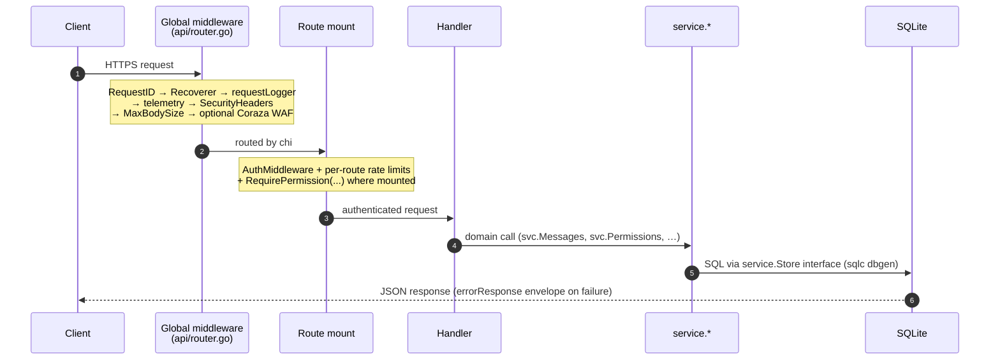
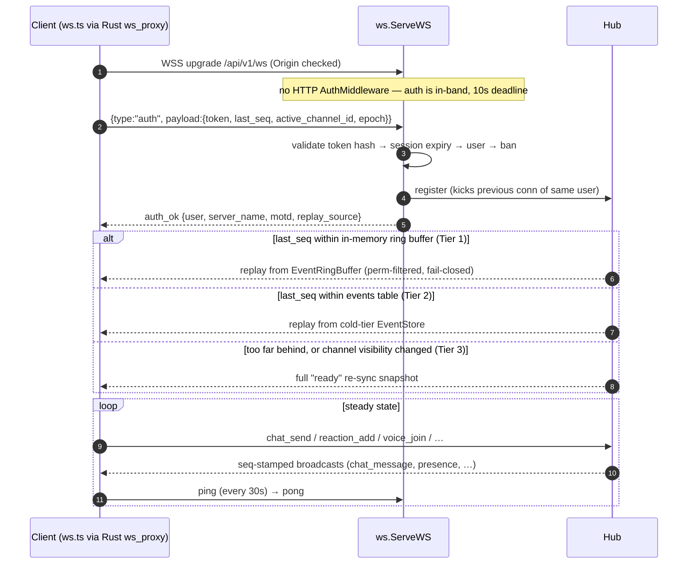
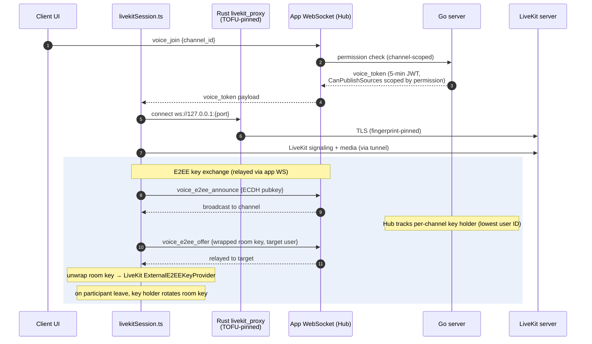

# Architecture

Condensed from the sources listed at the end, at commit `7732f969` (2026-09-25). On conflict, the source documents win.

OwnCord is a self-hosted chat platform: one Go server binary per community, a Tauri desktop client that can hold profiles for many servers, LiveKit for voice/video media, and an embedded web admin panel. This document is a map for connecting the pieces — for deep dives, follow the linked docs.

## System overview

**Trust boundaries.** All three client-to-server transports terminate TLS inside Rust proxies sharing one trust-on-first-use (TOFU) core: the WebSocket and LiveKit tunnels pin a SHA-256 leaf-certificate fingerprint per host, and the REST path also now runs through the TOFU-pinned `http_proxy`. Deciding never auto-writes a pin — first contact and any later mismatch both reject the connection and show a blocking modal; only an explicit accept stores the pin. The admin panel is gated to configured CIDRs (private ranges by default) plus bearer/session auth. Plugins (off by default, compiled out of release binaries) run in a WASM sandbox whose HTTP capability is allowlisted per manifest. Both the server self-updater and the client updater verify minisign signatures against pinned embedded public keys. The server never holds the voice E2EE room key — see [Data flow](#data-flow) below.

**Deployment unit.** One process per community owns TLS, the SQLite database, uploads, the admin panel, and optionally a managed LiveKit subprocess. The design is explicitly single-instance: rate-limit windows, the pub/sub + replay ring buffer, the TOTP replay store, and presence/voice state are process-local, and SQLite runs with a single writer enforced by an OS-level lock. See [Scalability notes](#scalability-notes).

## Tech stack

| Layer                   | Technology                                                                        | Notes                                                                            |
| ----------------------- | --------------------------------------------------------------------------------- | -------------------------------------------------------------------------------- |
| Server language/runtime | Go 1.26                                                                           | Module `github.com/J3vb/OwnCord/Server`, ~42k LOC production / 71k LOC tests     |
| Server HTTP             | `chi` router                                                                      | REST `/api/v1`, middleware chain, WAF                                            |
| Server database         | SQLite via `modernc.org/sqlite` (pure Go, no CGO)                                 | WAL mode, single writer; the only supported `database.type`                      |
| Server query layer      | sqlc-generated (`Server/db/dbgen`)                                                | `Server/db/*_queries.go` wraps it; a documented remainder is hand-written SQL    |
| Server WebSocket        | `github.com/coder/websocket`                                                      | Hub-based real-time engine, ~9.5k LOC                                            |
| Voice/video SFU         | LiveKit (`livekit-server`, pinned release, auto-downloaded or externally managed) | DTLS/ICE/codec negotiation; OwnCord manages permissions, tokens, room lifecycle  |
| Server security/WAF     | Coraza                                                                            | Optional middleware in the global chain                                          |
| Server plugins          | Wazero (WASM), build-tag `wazero`                                                 | Opt-in, experimental, compiled out of release binaries by default                |
| Server observability    | OpenTelemetry, build-tag `otel`; Prometheus metrics                               | No-op exporter by default                                                        |
| Client shell            | Tauri v2                                                                          | Desktop app: TypeScript webview + thin Rust backend                              |
| Client frontend         | Vanilla TypeScript (Vite), no UI framework                                        | Hand-rolled reactive store (`src/lib/store.ts`), imperative DOM components       |
| Client native backend   | Rust (`src-tauri/`), ~4.7k LOC across 16 modules                                  | TLS-pinning proxies, credentials, updater, native voice (Linux)                  |
| Linux native voice      | LiveKit Rust SDK (`livekit` crate), `cpal`, `nnnoiseless` (RNNoise), libyuv       | WebKitGTK ships no WebRTC, so voice/video runs in the Rust backend on Linux only |
| Client testing          | Vitest, Playwright, Stryker, oxlint, ESLint, Prettier, `cargo test`, `clippy`     | 224 test files, ~83k LOC (~2x source)                                            |
| Config                  | `go.yaml.in/yaml/v3`, defaults → YAML → `OWNCORD_*` env                           | `Server/config/config.go`                                                        |

## Project structure

Top-level (verified against the working tree):

| Path            | Responsibility                                                                |
| --------------- | ----------------------------------------------------------------------------- |
| `Server/`       | Go server: REST API, WebSocket hub, DB layer, auth, voice/LiveKit integration |
| `Client/`       | Tauri v2 desktop client: TypeScript webview + Rust native backend             |
| `protocol/`     | `schema.json`, the single source of truth for WebSocket message types         |
| `docs/`         | Reference specs, architecture blueprints, deployment/operations guides        |
| `deploy/`       | Deployment artifacts (e.g. the systemd unit template `owncord.service`)       |
| `scripts/`      | Repo-level shell/JS tooling                                                   |
| `tools/`        | Auxiliary tooling                                                             |
| `graphify-out/` | Local-only generated knowledge graph (gitignored)                             |

`Server/` key subdirectories:

| Path            | Responsibility                                                                                                                                   |
| --------------- | ------------------------------------------------------------------------------------------------------------------------------------------------ |
| `api/`          | REST handlers, router, middleware chain, WAF, LiveKit HTTP proxy, uploads                                                                        |
| `ws/`           | The Hub: pub/sub, sequence counter, 3-tier reconnect replay, typed command dispatch, voice E2EE relay                                            |
| `admin/`        | Embedded admin SPA + admin REST, SSE log stream                                                                                                  |
| `service/`      | Domain logic (Message/Channel/Permission/User/DM/Invite/Block/Moderation/Voice) shared by `api` and `ws`                                         |
| `permissions/`  | Role/permission bitfield and the `Checker`/predicate API                                                                                         |
| `plugin/`       | Wazero WASM plugin runtime, registry, manifest, host APIs (build-tag `wazero`)                                                                   |
| `db/`           | Hand-written query wrappers (`*_queries.go`) delegating to `dbgen`; migration runner                                                             |
| `db/dbgen/`     | sqlc-generated query code (generated — do not hand-edit)                                                                                         |
| `migrations/`   | Ordered, embedded SQL migrations (schema source of truth)                                                                                        |
| `auth/`         | Bcrypt, sessions, tokens, TOTP, rate limiting, TLS                                                                                               |
| `config/`       | Defaults → YAML → env configuration loading                                                                                                      |
| `storage/`      | Upload files on disk                                                                                                                             |
| `safefetch/`    | The one bounded outbound-content boundary (address classification, redirect/byte/time bounds) used by the GIF proxy and plugin `http` capability |
| `telemetry/`    | OpenTelemetry instrumentation (build-tag `otel`, no-op by default)                                                                               |
| `updater/`      | Self-update download + minisign signature verification                                                                                           |
| `internal/app/` | Composition root (`StartRuntime`, `startRouter`)                                                                                                 |
| `invariants/`   | Enforced architectural rules (DB-import boundary, permission chokepoints, lock discipline)                                                       |
| `cmd/`          | Executable tooling: `genprotocol`, `seed`, `dbinventory`, `gendocs`, `smoke`                                                                     |

`Client/` key subdirectories:

| Path                                                | Responsibility                                                                                                                                          |
| --------------------------------------------------- | ------------------------------------------------------------------------------------------------------------------------------------------------------- |
| `src/main.ts`                                       | Bootstrap: page orchestration, auth wiring, appearance pre-render                                                                                       |
| `src/lib/`                                          | Protocol client, WebSocket (`ws.ts`), dispatcher, voice/E2EE facades, store base                                                                        |
| `src/stores/`                                       | Observable store singletons (auth, channels, messages, members, voice, dm, blocks, emoji, ui)                                                           |
| `src/features/`                                     | Extracted feature modules (voice, messaging, connection, moderation, navigation, etc.) with colocated tests                                             |
| `src/pages/`, `src/components/`                     | Imperative-DOM UI: ConnectPage, MainPage, ~60 component files                                                                                           |
| `src/platform/contracts/`                           | Type-only desktop/browser seam interfaces (no `@tauri-apps` imports)                                                                                    |
| `src/platform/desktop/`                             | The only place `@tauri-apps` may be imported; implements every platform contract                                                                        |
| `src/i18n/`                                         | English UI-string catalogs                                                                                                                              |
| `src-tauri/src/`                                    | Rust backend: TOFU core (`tofu.rs`), proxies (`ws_proxy.rs`, `http_proxy.rs`, `livekit_proxy.rs`), credentials, updater, native voice (`native_voice/`) |
| `tests/unit`, `tests/integration`, `tests/contract` | Vitest (jsdom)                                                                                                                                          |
| `tests/e2e`                                         | Playwright (web, admin, native)                                                                                                                         |

## Data flow

### REST request lifecycle

Layering is `api → service → db`. Authentication is bearer-token (SHA-256-hashed opaque tokens). Authorization has two deliberate scopes: `RequirePermission` middleware gates two channel-less routes on server-wide role permissions, while anything channel-scoped is checked in the service layer via `permissions.Checker` (resolves channel overrides, fails closed if they can't be fetched). A residual seam remains: some `Server/api` and `Server/admin` handlers still take a raw `*db.DB` alongside `svc` rather than going fully through the service layer.

### WebSocket connect, replay, dispatch

Every broadcast gets a monotonic `seq`. A `visibilityChangeSeq` watermark forces a full re-sync if channel visibility changed while the client was away, so permission changes can never be replayed around. Per-client queues are priority-tiered (`sendHigh` for DMs/mentions, `send` for chat/reactions, `sendLow` for typing/presence); a full high/normal queue disconnects the client (forcing a replay-restoring reconnect), while a full low queue silently drops — overflow policy is intentional, since dropping a chat message would corrupt state but dropping a typing indicator would not. Inbound messages parse through a typed constructor into a `Command`, dispatch to one V2 handler, and the handler's `Result` is applied by one applier (`reply`, `EmitEvents`, `SetChannelID`, `JoinVoice`/`LeaveVoice`).

Message-type constants are generated from `protocol/schema.json` into `Server/ws/message_types.go` and `Client/src/lib/protocolTypes.ts` (CI fails on drift).

### Voice join and E2EE key exchange

The server mints short-lived LiveKit JWTs and relays E2EE announce/offer messages but never holds the room key: the key is generated on a participant's machine, wrapped per-recipient with ECDH+AES-GCM, and rotated by the key holder whenever a participant leaves (forward secrecy). Voice permission is enforced twice — at `voice_join` (channel permission) and inside the LiveKit JWT itself (`CanPublishSources`). Each user has a long-lived ECDSA identity key pinned by peers on first contact (TOFU); a later change to a pinned peer's key blocks with a mismatch modal, but a _first-sight_ identity from a modified server is not detected — see [docs/trust-model.md](docs/trust-model.md) for the full threat model. On Linux, voice/video runs through a native Rust LiveKit backend (`Client/src-tauri/src/native_voice/`) instead of the webview, because no mainstream WebKitGTK build ships WebRTC; the E2EE key format stays byte-compatible with Windows.

## Database & storage

The canonical schema is the ordered migration set under `Server/migrations/`, applied by the runner in `Server/db/migrate.go`. SQLite (via `modernc.org/sqlite`, no CGO) is the only supported database engine. The data layer, generated query code, table domains, and storage/backup mechanics are covered in [DATABASE.md](DATABASE.md); see also [docs/architecture/data-model.md](docs/architecture/data-model.md) and [docs/schema.md](docs/schema.md) for full DDL.

## External services

| Service                                          | Purpose                                                      | Notes                                                                                                                                                       |
| ------------------------------------------------ | ------------------------------------------------------------ | ----------------------------------------------------------------------------------------------------------------------------------------------------------- |
| LiveKit server                                   | Voice/video SFU (DTLS, ICE, codec negotiation, simulcast)    | Run as a Docker Compose container, an OwnCord-managed companion process (auto-downloaded pinned release, or an operator-supplied binary), or fully external |
| GitHub Releases (`api.github.com`, `github.com`) | Server and client update metadata + signed release downloads | Only on request (update check) or admin-triggered update, never on a timer; minisign-verified                                                               |
| GitHub Releases (LiveKit)                        | Pinned `livekit-server` binary download                      | Only at startup, only if `voice.auto_download_livekit` and no `voice.livekit_binary` set; checksum-verified                                                 |
| `api.klipy.com`                                  | GIF search/trending                                          | Proxied through the server so the API key never reaches the client; disabled (503) when `gif.api_key` is empty                                              |
| STUN / cloud metadata endpoints                  | External-address discovery by the LiveKit subprocess         | Triggered by LiveKit's own `use_external_ip: true`, not controlled by OwnCord directly                                                                      |
| `acme-v02.api.letsencrypt.org`                   | ACME certificate issuance/renewal                            | Only when `tls.mode: acme`                                                                                                                                  |
| Operator's OTLP collector                        | Traces and metrics                                           | Only when `telemetry.exporter: otlp` (default `none`)                                                                                                       |
| Plugin `http_allowlist` hosts                    | Plugin-initiated HTTP calls                                  | Empty by default; plugins off by default                                                                                                                    |

No federation, no directory/discovery service, and no required external service exist — OwnCord servers never talk to each other, and a LAN-only, offline install works. See [docs/trust-model.md](docs/trust-model.md) for the full outbound-connection inventory and the absence-of-federation proof.

## Deployment

- **Standalone binaries.** One Go binary per architecture (Windows x64/ARM64, Linux x64/ARM64), built with `CGO_ENABLED=0` on Linux for a fully static binary. First run generates `config.yaml`, a `data/` directory (database, TLS cert, uploads, backups), and a self-signed TLS pair; the setup wizard creates the Owner account.
- **Docker.** `ghcr.io/j3vb/owncord-server` is a multi-arch (`linux/amd64`/`linux/arm64`) image built `FROM gcr.io/distroless/static-debian12`, running as non-root (uid 65532) with no shell inside the container. The shipped `docker-compose.yml` runs LiveKit as a separate container on an internal Docker network (`ws://livekit:7880`) and drops all Linux capabilities (`cap_drop: ALL`, `no-new-privileges:true`). The image ships its own `HEALTHCHECK`.
- **Process supervision.** A crash needs a supervisor to restart the binary: a systemd unit template ships at `deploy/owncord.service`; NSSM or Task Scheduler cover Windows. The server signals systemd/NSSM to relaunch it after a self-update, backup restore, or setup-wizard restart rather than spawning its own replacement, when supervised mode is configured.
- **Ports.** `8443/TCP` (HTTPS + WebSocket, REST, admin, uploads) is always required; `80/TCP` only for ACME HTTP-01; for voice, `7880/TCP` (LiveKit signaling) and `7881/TCP` (TCP fallback) plus `50000-60000/UDP` (WebRTC media) — the UDP range cannot be carried by an HTTP reverse proxy and must reach the LiveKit host directly.
- **Port forwarding / Tailscale.** A server behind CGNAT, hairpin NAT, or an ISP-blocked port cannot be reached by direct port forwarding — [docs/tailscale.md](docs/tailscale.md) documents Tailscale as the zero-config alternative (works behind CGNAT; note the admin panel needs `100.64.0.0/10` explicitly added to `server.admin_allowed_cidrs` since it isn't in the private-range default). [docs/port-forwarding.md](docs/port-forwarding.md) covers manual forwarding, and states plainly that the server can never verify its own inbound reachability — an outside network must test it.
- **Reverse proxy.** Not required — OwnCord terminates its own TLS and proxies LiveKit signaling at `/livekit/*`. For a public domain, fronting with Caddy/nginx/Traefik is the recommended way to get qualified ACME certificate renewal, since OwnCord's own domain-ACME support is implemented but not qualified for that. A reverse proxy can front everything on `8443` but never the LiveKit UDP media range.

Full detail: [docs/deployment.md](docs/deployment.md), [docs/livekit-setup.md](docs/livekit-setup.md), [docs/tailscale.md](docs/tailscale.md), [docs/port-forwarding.md](docs/port-forwarding.md).

## Scalability notes

OwnCord is explicitly **single-instance**; horizontal scale-out is out of scope today. Process-local state that would need to move to shared infrastructure to scale out:

- In-memory rate-limiter windows (lockouts persist across restarts; the windows themselves do not).
- In-memory pub/sub and the replay ring buffer (Tier 1 reconnect replay).
- The process-local TOTP replay store.
- SQLite single-writer (`MaxOpenConns=1`), enforced by an OS-level lock beside the database file so a second process fails fast rather than corrupting state.
- Presence and voice state, derived from live hub membership and cold-reset at every process boot.

**Backpressure.** The Hub disconnects a client whose high- or normal-priority send queue fills (forcing a replay-restoring reconnect) rather than dropping a chat message; low-priority (typing/presence) frames are dropped silently when their queue fills. A global broadcast channel drops with a `broadcastDrops` counter when saturated. `GET /api/v1/metrics` exposes `broadcast_drops`, `db_writer_wait_seconds`, `db_reader_wait_seconds`, `reconnect_tier_full`, and `backpressure_queue_disconnects` as the signals to alert on as a community grows.

**Published capacity profile** ([docs/capacity.md](docs/capacity.md)): qualified for **250 registered users, 100 simultaneous connections (sustained 180s), and 25 concurrent voice sessions** on reference hardware of **2 vCPU / 4 GB RAM** (reproduced via a cgroup-constrained Docker container, not owned hardware). Measured latency budgets at that profile (p95/p99, all met): REST login 307/344 ms (budget 600 ms/1 s); WebSocket open → `auth_ok` 13/29 ms (200 ms/500 ms); message send → sender acknowledgement 57/83 ms (150 ms/300 ms); send → recipient delivery 60/85 ms (200 ms/400 ms); voice join (OwnCord half only — the LiveKit half is not percentile-measurable with the available tooling) 3/4 ms (250 ms/500 ms). A ceiling-search profile that spread load across a single channel found the load generator's own per-channel topic rate limiter (100 msg/s per channel) rather than a hardware ceiling — the qualified numbers above are not a claim about where the real hardware ceiling lies; locating it is an explicit, separate, non-CI-gated exercise (`load-baseline.yml`, `workflow_dispatch` only).

Operator-facing configuration ceilings, each with its own refusal behavior and metric: `server.max_ws_connections` (refuses new WS upgrades with 503), `database.max_readers` (read queries queue), `upload.max_size_mb` / `upload.user_quota_mb` (refuses with 507), and `server.min_free_disk_mb` (refuses uploads, `/health` reports degraded — but chat keeps flowing even with the disk completely full).

## Sources

- [docs/architecture/README.md](docs/architecture/README.md)
- [docs/architecture/system-overview.md](docs/architecture/system-overview.md)
- [docs/architecture/server.md](docs/architecture/server.md)
- [docs/architecture/client.md](docs/architecture/client.md)
- [docs/architecture/websocket.md](docs/architecture/websocket.md)
- [docs/architecture/data-model.md](docs/architecture/data-model.md)
- [docs/architecture/voice-e2ee.md](docs/architecture/voice-e2ee.md)
- [docs/architecture/server-boundaries.md](docs/architecture/server-boundaries.md)
- [docs/architecture/platform-contracts.md](docs/architecture/platform-contracts.md)
- [docs/deployment.md](docs/deployment.md)
- [docs/livekit-setup.md](docs/livekit-setup.md)
- [docs/capacity.md](docs/capacity.md)
- [docs/trust-model.md](docs/trust-model.md)
- [docs/tailscale.md](docs/tailscale.md)
- [docs/port-forwarding.md](docs/port-forwarding.md)
- [Server/CLAUDE.md](Server/CLAUDE.md)
- [Client/CLAUDE.md](Client/CLAUDE.md)
