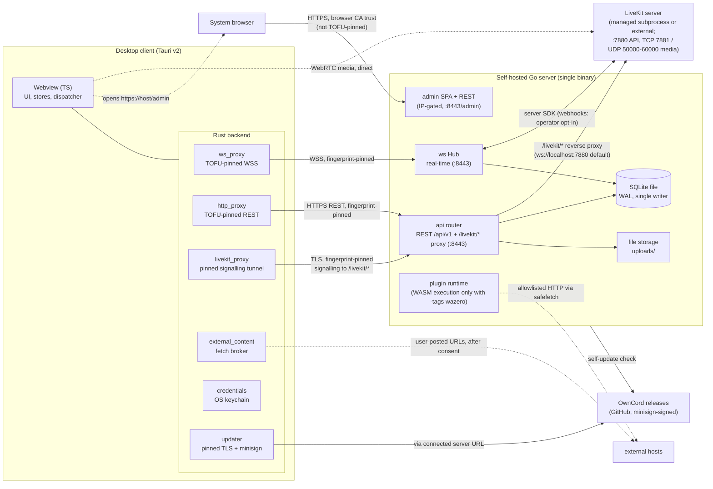
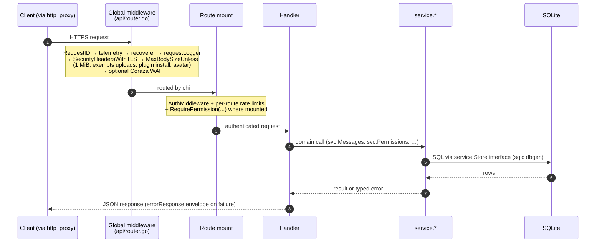
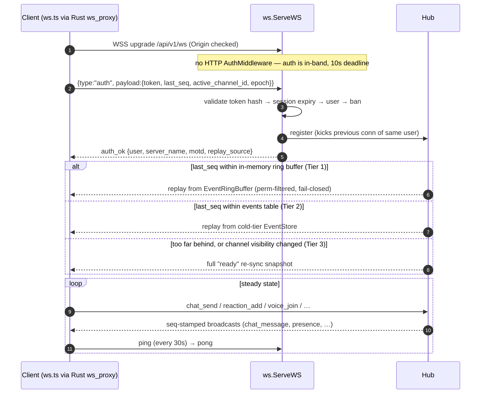
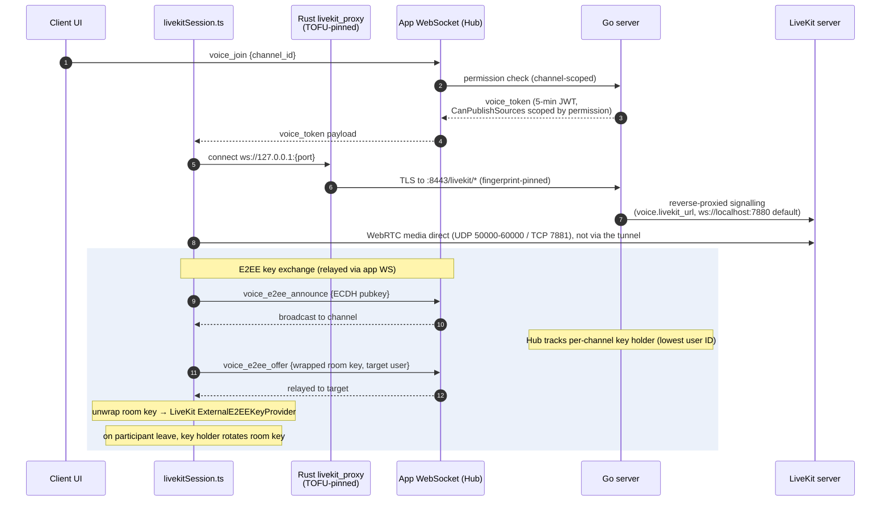

# Architecture

Condensed from the sources listed at the end, at commit `7732f969` (2026-09-25). On conflict, the code wins, then the source documents.

OwnCord is a self-hosted chat platform: one Go server binary per community, a Tauri desktop client that can hold profiles for many servers, LiveKit for voice/video media, and an embedded web admin panel. This document is the map of how the pieces connect; for deep dives, follow the linked docs.

## System overview

**Trust boundaries.**

- **WebSocket and REST** terminate TLS inside the Rust proxies (`ws_proxy`, `http_proxy`). They capture the leaf certificate's SHA-256 fingerprint and decide against the stored per-host pin in the shared TOFU core (`tofu.rs`). Deciding never writes a pin: first contact and a later mismatch both reject the connection and emit `cert-tofu`, the webview shows a blocking modal, and only an explicit accept (`accept_cert_fingerprint`) stores the pin.
- **The LiveKit signalling tunnel** (`livekit_proxy`) never establishes trust itself. It refuses to start without an existing pin for the server host and fails the handshake on a mismatch. A local server whose LiveKit URL is loopback is dialled directly, and WebRTC media always goes straight to the SFU, outside every proxy (protected by E2EE, not by the pin).
- **The admin panel** opens in the system browser (its own CA trust) and is gated to configured CIDRs (private ranges by default) plus bearer/session auth.
- **Plugins** are off by default, and WASM execution is compiled out of release binaries. A plugin whose manifest declares the `http` capability can reach only hosts on the operator's server-wide `plugins.http_allowlist` (empty by default), through `Server/safefetch`.
- **Updates:** both the server self-updater and the client updater verify minisign signatures against pinned embedded public keys.
- **Voice E2EE:** the server never holds the room key; see [Data flow](#data-flow).

**Deployment unit.** One process per community owns TLS, the SQLite database, uploads, the admin panel and, optionally, a managed LiveKit subprocess. The design is explicitly single-instance: rate-limit windows, the pub/sub + replay ring buffer, and presence/voice state are process-local, and SQLite runs with a single writer enforced by an OS-level lock. See [Scalability notes](#scalability-notes).

## Tech stack

| Layer                   | Technology                                                                        | Notes                                                                                                                                          |
| ----------------------- | --------------------------------------------------------------------------------- | ---------------------------------------------------------------------------------------------------------------------------------------------- |
| Server language/runtime | Go 1.26                                                                           | Module `github.com/J3vb/OwnCord/Server`                                                                                                        |
| Server HTTP             | `chi` router                                                                      | REST `/api/v1`, middleware chain, WAF                                                                                                          |
| Server database         | SQLite via `modernc.org/sqlite` (pure Go, no CGO)                                 | WAL mode, single writer; the only supported `database.type`                                                                                    |
| Server query layer      | sqlc-generated (`Server/db/dbgen`)                                                | `Server/db/*_queries.go` wraps it; a documented remainder is hand-written SQL                                                                  |
| Server WebSocket        | `github.com/coder/websocket`                                                      | Hub-based real-time engine                                                                                                                     |
| Voice/video SFU         | LiveKit (`livekit-server`, pinned release, auto-downloaded or externally managed) | DTLS/ICE/codec negotiation; OwnCord manages permissions, tokens and room lifecycle                                                             |
| Server security/WAF     | Coraza                                                                            | Optional middleware in the global chain                                                                                                        |
| Server plugins          | Wazero (WASM), build tag `wazero`                                                 | Opt-in and experimental; WASM execution compiled out of release binaries                                                                       |
| Server observability    | OpenTelemetry tracing + Prometheus `/metrics`, both only in a `-tags otel` build  | Release binaries and the Docker image are built without it; every build serves JSON `GET /api/v1/metrics`                                      |
| Client shell            | Tauri v2                                                                          | Desktop app: TypeScript webview + thin Rust backend                                                                                            |
| Client frontend         | Vanilla TypeScript (Vite), no UI framework                                        | Hand-rolled reactive store (`src/lib/store.ts`), imperative DOM components                                                                     |
| Client native backend   | Rust (`src-tauri/`)                                                               | TLS-pinning proxies, the external-content fetch broker, credentials + verified secret store, updater, push-to-talk, tray, native voice (Linux) |
| Linux native voice      | LiveKit Rust SDK (`livekit` crate), `cpal`, `nnnoiseless` (RNNoise), libyuv       | WebKitGTK ships no WebRTC, so voice/video runs in the Rust backend on Linux only                                                               |
| Client testing          | Vitest, Playwright, Stryker, oxlint, ESLint, Prettier, `cargo test`, clippy       | Tests under `Client/tests/` plus colocated `src/**/*.test.ts`                                                                                  |
| Config                  | `go.yaml.in/yaml/v3`; defaults → YAML → `OWNCORD_*` env                           | `Server/config/config.go`                                                                                                                      |

## Project structure

Top level:

| Path                 | Responsibility                                                                         |
| -------------------- | -------------------------------------------------------------------------------------- |
| `Server/`            | Go server: REST API, WebSocket hub, DB layer, auth, voice/LiveKit integration          |
| `Client/`            | Tauri v2 desktop client: TypeScript webview + Rust native backend                      |
| `protocol/`          | `schema.json`, the single source of truth for WebSocket message types                  |
| `docs/`              | Reference specs, architecture blueprints, deployment and operations guides, plans      |
| `deploy/`            | Deployment artifacts (e.g. the systemd unit template `owncord.service`)                |
| `scripts/`           | Repo-level tooling, including the local CI mirror (`scripts/run.mjs`)                  |
| `tools/`             | Auxiliary tooling (e.g. `tools/mcp-introspect/`)                                       |
| `.github/workflows/` | CI (`ci.yml`), the release pipeline (`release.yml`), load/soak/smoke/nightly workflows |
| `.githooks/`         | `pre-commit` / `pre-push` hooks (`npm run hooks:install` sets `core.hooksPath`)        |
| `.superpowers/`      | `findings-ledger.json`, the tracked bug-hunt ledger                                    |
| `.claude/`           | Tracked plans, skills, rules and workflows for agents                                  |

`Server/` key subdirectories:

| Path            | Responsibility                                                                                                                                                      |
| --------------- | ------------------------------------------------------------------------------------------------------------------------------------------------------------------- |
| `api/`          | REST handlers, router, middleware chain, WAF, LiveKit HTTP proxy, uploads                                                                                           |
| `ws/`           | The Hub: pub/sub, sequence counter, three-tier reconnect replay, typed command dispatch, voice E2EE relay                                                           |
| `admin/`        | Embedded admin SPA + admin REST, SSE log stream                                                                                                                     |
| `service/`      | Domain logic (Message/Channel/Permission/User/DM/Invite/Block/Moderation/Voice) shared by `api` and `ws`                                                            |
| `permissions/`  | Role/permission bitfield and the `Checker`/predicate API                                                                                                            |
| `plugin/`       | Plugin registry, manifest and host APIs (compiled in every build); WASM execution via Wazero only with `-tags wazero` (`sandbox_wazero.go`)                         |
| `db/`           | Hand-written query wrappers delegating to `dbgen`; migration runner                                                                                                 |
| `db/dbgen/`     | sqlc-generated query code (generated; do not hand-edit)                                                                                                             |
| `migrations/`   | Ordered, embedded SQL migrations (schema source of truth)                                                                                                           |
| `auth/`         | bcrypt, sessions, tokens, TOTP, rate limiting, TLS                                                                                                                  |
| `config/`       | Defaults → YAML → env configuration loading                                                                                                                         |
| `storage/`      | Upload files on disk                                                                                                                                                |
| `safefetch/`    | The bounded outbound-content boundary (address classification, redirect/byte/time bounds) used by the GIF proxy, the plugin `http` capability and Web Push dispatch |
| `telemetry/`    | OpenTelemetry instrumentation (build tag `otel`; a no-op otherwise)                                                                                                 |
| `updater/`      | Self-update download + minisign signature verification                                                                                                              |
| `internal/app/` | Composition root (`StartRuntime`, `startRouter`)                                                                                                                    |
| `invariants/`   | Enforced architectural rules (DB-import boundary, permission chokepoints, lock discipline, egress sites, file sizes)                                                |
| `cmd/`          | Executable tooling: `genprotocol`, `seed`, `dbinventory`, `gendocs`, `smoke`                                                                                        |

`Client/` key subdirectories:

| Path                                                | Responsibility                                                                                                                                                                                               |
| --------------------------------------------------- | ------------------------------------------------------------------------------------------------------------------------------------------------------------------------------------------------------------ |
| `src/main.ts`                                       | Bootstrap: page orchestration, auth wiring, appearance pre-render                                                                                                                                            |
| `src/lib/`                                          | Protocol client, WebSocket (`ws.ts`), dispatcher, voice/E2EE facades, store base                                                                                                                             |
| `src/stores/`                                       | Observable store singletons (auth, channels, messages, members, voice, dm, blocks, emoji, ui)                                                                                                                |
| `src/features/`                                     | Extracted feature modules (voice, messaging, connection, moderation, navigation, etc.) with colocated tests                                                                                                  |
| `src/pages/`, `src/components/`                     | Imperative-DOM UI: ConnectPage, MainPage and the shared components                                                                                                                                           |
| `src/platform/contracts/`                           | Type-only desktop/browser seam interfaces (no `@tauri-apps` imports)                                                                                                                                         |
| `src/platform/desktop/`                             | The only place `@tauri-apps` may be imported; implements every platform contract                                                                                                                             |
| `src/i18n/`                                         | English UI-string catalogs                                                                                                                                                                                   |
| `src-tauri/src/`                                    | Rust backend: TOFU core (`tofu.rs`), proxies (`ws_proxy.rs`, `http_proxy.rs`, `livekit_proxy.rs`), the external-content broker (`external_content.rs`), credentials, updater, native voice (`native_voice/`) |
| `tests/unit`, `tests/integration`, `tests/contract` | Vitest (jsdom)                                                                                                                                                                                               |
| `tests/e2e`                                         | Playwright (web, admin, native)                                                                                                                                                                              |

## Data flow

### REST request lifecycle

Layering is `api → service → db`. Authentication is bearer-token (SHA-256-hashed opaque tokens). Authorization has two deliberate scopes: `RequirePermission` middleware gates two channel-less mounts on server-wide role permissions (the `/api/v1/invites` group with `MANAGE_INVITES`, and `GET /api/v1/diagnostics/connectivity` with `ADMINISTRATOR`), while anything channel-scoped is checked in the service layer via `permissions.Checker` (it resolves channel overrides and fails closed if they cannot be fetched). A residual seam remains: some `Server/api` and `Server/admin` handlers still take a raw `*db.DB` alongside `svc` rather than going fully through the service layer.

### WebSocket connect, replay, dispatch

Every sequenced broadcast gets a monotonic `seq`, and a `visibilityChangeSeq` watermark forces a full re-sync if channel visibility changed while the client was away, so permission changes can never be replayed around. Every seq-stamped frame (chat including DMs, reactions, connect/disconnect presence, channel events) shares the normal `send` queue, so the client's max(`seq`) ack never passes an undelivered frame. `sendHigh` carries only unsequenced user-targeted frames (DM-channel opens, DM requests, call signals) and falls back to `send` when full; `sendLow` carries unsequenced typing indicators and targeted moderation/appeal notices, never replayed. A full `send` queue (or a high frame with both full) disconnects the client, forcing a replay-restoring reconnect; a full low queue silently drops. Inbound messages parse through a typed constructor into a `Command`, dispatch to one V2 handler, and the handler's `Result` is applied by one applier (`reply`, `EmitEvents`, `SetChannelID`, `JoinVoice`/`LeaveVoice`).

Message-type constants are generated from `protocol/schema.json` into `Server/ws/message_types.go` and `Client/src/lib/protocolTypes.ts` (CI fails on drift).

### Voice join and E2EE key exchange

The server mints short-lived LiveKit JWTs and relays E2EE announce/offer messages but never holds the room key: the key is generated on a participant's machine, wrapped per recipient with ECDH + AES-GCM, and rotated by the key holder whenever a participant leaves (forward secrecy). Voice permission is enforced twice: at `voice_join` (channel permission) and inside the LiveKit JWT itself (`CanPublishSources`). Each user has a long-lived ECDSA identity key pinned by peers on first contact (TOFU); a later change to a pinned peer's key blocks with a mismatch modal, but a _first-sight_ identity from a modified server is not detected. See [docs/trust-model.md](docs/trust-model.md) for the full threat model. On Linux, voice/video runs through a native Rust LiveKit backend (`Client/src-tauri/src/native_voice/`) instead of the webview, because no mainstream WebKitGTK build ships WebRTC; the E2EE key format stays byte-compatible with Windows.

## Database & storage

The canonical schema is the ordered migration set under `Server/migrations/`, applied by the runner in `Server/db/migrate.go`. SQLite (via `modernc.org/sqlite`, no CGO) is the only supported database engine. The data layer, generated query code, table domains, and storage and backup mechanics are covered in [DATABASE.md](DATABASE.md); see also [docs/schema.md](docs/schema.md) for the full DDL.

## External services

| Service                                          | Purpose                                                                                                                                          | Notes                                                                                                                                                                                                                                                                                                                  |
| ------------------------------------------------ | ------------------------------------------------------------------------------------------------------------------------------------------------ | ---------------------------------------------------------------------------------------------------------------------------------------------------------------------------------------------------------------------------------------------------------------------------------------------------------------------- |
| LiveKit server                                   | Voice/video SFU (DTLS, ICE, codec negotiation, simulcast)                                                                                        | Run as a Docker Compose container, an OwnCord-managed companion process (an auto-downloaded pinned release, or an operator-supplied binary), or fully external                                                                                                                                                         |
| GitHub Releases (`api.github.com`, `github.com`) | Server and client update metadata and signed release downloads                                                                                   | Only on request (update check) or an admin-triggered update, never on a timer; minisign-verified                                                                                                                                                                                                                       |
| GitHub Releases (LiveKit)                        | Pinned `livekit-server` binary download                                                                                                          | Only at startup, only if `voice.auto_download_livekit` is set and no `voice.livekit_binary` is given; checksum-verified                                                                                                                                                                                                |
| `api.klipy.com`                                  | GIF search/trending                                                                                                                              | Proxied through the server so the API key never reaches the client; disabled (503) when `gif.api_key` is empty                                                                                                                                                                                                         |
| STUN / cloud metadata endpoints                  | External-address discovery by the managed LiveKit                                                                                                | Triggered by `use_external_ip: true`, which OwnCord's auto-generated `livekit.yaml` sets unconditionally (`Server/ws/livekit_process.go`); `voice.node_ip` does not turn discovery off, only not running the managed LiveKit (or taking over the file by deleting its auto-generated header line) does                 |
| `acme-v02.api.letsencrypt.org`                   | ACME certificate issuance/renewal                                                                                                                | Only when `tls.mode: acme`                                                                                                                                                                                                                                                                                             |
| Operator's OTLP collector                        | Traces (metrics stay on the pull-based Prometheus `/metrics`)                                                                                    | Only in a `-tags otel` build (not the release binaries or Docker image) with `telemetry.enabled: true` and `telemetry.exporter: otlp` (default `none`)                                                                                                                                                                 |
| Browser push services                            | Web Push wake-ups to the `endpoint` of each stored subscription: an encrypted `{"t":"activity"}` payload with a VAPID header, no message content | Only when both `push.enabled` and `push.dispatch_enabled` are `true` (both default `false`); sent through `Server/safefetch`                                                                                                                                                                                           |
| Plugin `http_allowlist` hosts                    | Plugin-initiated HTTP calls                                                                                                                      | Empty by default; plugins are off by default                                                                                                                                                                                                                                                                           |
| URLs other users posted                          | Link previews, YouTube oEmbed/thumbnails, external images, GIF media on the Klipy CDN, external avatars                                          | Fetched by the desktop client itself, never the server: only through the Rust broker `external_content.rs` (https/443, every resolved address classified, at most 3 redirects, byte/time/type/concurrency bounds) and only after the per-server viewer-consent choice; the YouTube player is a direct `frame-src` load |

No federation, no directory or discovery service, and no required external service exist: OwnCord servers never talk to each other, and a LAN-only, offline install works. The full outbound-connection inventory the code enforces is in [docs/architecture/diagnostics.md](docs/architecture/diagnostics.md) (the egress inventory, checked by the `egress-sites` invariant in `Server/invariants/egress_sites.go`); [docs/trust-model.md](docs/trust-model.md) has the absence-of-federation proof.

## Deployment

- **Standalone binaries.** One Go binary per architecture (Windows x64/ARM64, Linux x64/ARM64), built with `CGO_ENABLED=0` on Linux for a fully static binary. The first run generates `config.yaml`, a `data/` directory (database, TLS certificate, uploads, backups) and a self-signed TLS pair; the setup wizard creates the Owner account.
- **Docker.** `ghcr.io/j3vb/owncord-server` is a multi-arch (`linux/amd64`/`linux/arm64`) image built `FROM gcr.io/distroless/static-debian12`, running as non-root (uid 65532) with no shell inside the container. The shipped `docker-compose.yml` runs LiveKit as a separate container on an internal Docker network (`ws://livekit:7880`) and drops all Linux capabilities (`cap_drop: ALL`, `no-new-privileges:true`). The image ships its own `HEALTHCHECK`. In a container the admin panel's in-place self-update is refused (`503 CONTAINER_DEPLOYMENT`; the image sets `OWNCORD_CONTAINER=1`): upgrading is `docker compose pull && docker compose up -d`, and backup restore and wizard restarts rely on the compose file's `restart: unless-stopped`.
- **Process supervision.** A crash needs a supervisor to restart the binary: a systemd unit template ships at `deploy/owncord.service` (`Restart=always`); on Windows use NSSM, since Task Scheduler only starts the process and never restarts it. After a self-update, backup restore or setup-wizard restart, the server drains, exits cleanly and lets the supervisor relaunch it. `server.restart_mode: auto` (the default) detects systemd (`INVOCATION_ID`) and containers; NSSM needs `OWNCORD_SERVER_RESTART_MODE=supervised`; an unsupervised server (`spawn`) starts its own replacement.
- **Ports.** `8443/TCP` (HTTPS + WebSocket, REST, admin, uploads) is always required; `80/TCP` only for ACME HTTP-01. For voice: `7881/TCP` (LiveKit TCP fallback) plus `50000-60000/UDP` (WebRTC media). `7880/TCP` is LiveKit's own API/signalling endpoint and is **not** required: remote clients tunnel signalling through `:8443/livekit`, and exposing `7880` needlessly exposes LiveKit's API. The UDP range cannot be carried by an HTTP reverse proxy and must reach the LiveKit host directly.
- **Port forwarding and Tailscale.** Behind CGNAT no port-forwarding rule can work; [docs/tailscale.md](docs/tailscale.md) documents Tailscale as the zero-config alternative (the admin panel then needs `100.64.0.0/10` added to `server.admin_allowed_cidrs`, since it is not in the private-range default). Hairpin NAT only breaks LAN clients that use the public address (give them the LAN address, or use split-horizon DNS), and an ISP-blocked port is avoided by staying on a high port such as 8443. [docs/port-forwarding.md](docs/port-forwarding.md) covers manual forwarding and states plainly that the server can never verify its own inbound reachability: an outside network must test it.
- **Reverse proxy.** Not required: OwnCord terminates its own TLS and proxies LiveKit signalling at `/livekit/*`. For a public domain, fronting with Caddy/nginx/Traefik is the recommended way to get qualified ACME certificate renewal, since OwnCord's own domain-ACME support is implemented but not qualified. A reverse proxy can front everything on `8443`, but never the LiveKit UDP media range.

Full detail: [docs/deployment.md](docs/deployment.md), [docs/livekit-setup.md](docs/livekit-setup.md), [docs/tailscale.md](docs/tailscale.md), [docs/port-forwarding.md](docs/port-forwarding.md).

## Scalability notes

OwnCord is explicitly **single-instance**; horizontal scale-out is out of scope today. Process-local state that would need to move to shared infrastructure to scale out:

- In-memory rate-limiter windows (lockouts persist across restarts; the windows themselves do not).
- In-memory pub/sub and the replay ring buffer (Tier 1 reconnect replay).
- The SQLite single writer (`MaxOpenConns=1`), enforced by an OS-level lock beside the database file, so a second process fails fast rather than corrupting state.
- Presence and voice state, derived from live hub membership and cold-reset at every process boot.

**Backpressure.** The hub disconnects a client whose normal `send` queue fills (forcing a replay-restoring reconnect) rather than dropping a sequenced frame; low-priority frames (typing indicators, moderation/appeal notices) are dropped silently when their queue fills. The global broadcast channel drops with a `broadcastDrops` counter when saturated. `GET /api/v1/metrics` exposes `broadcast_drops`, `db_writer_wait_seconds`, `db_reader_wait_seconds`, `reconnect_tier_full` and `backpressure_queue_disconnects` as the signals to alert on as a community grows.

**Published capacity profile** ([docs/capacity.md](docs/capacity.md)): qualified for **250 registered users, 100 simultaneous connections (sustained 180 s) and 25 concurrent voice sessions** on reference hardware of **2 vCPU / 4 GB RAM** (reproduced in a cgroup-constrained Docker container, not on owned hardware), meeting every latency budget in [PRD.md](PRD.md#performance); the measured figures are in `docs/capacity.md`. A ceiling-search run that put every connection in a single channel hit the server's own per-channel topic rate limit (`topicRateLimitPerSecond = 100` msg/s, `Server/ws/hub_stats.go`), so it located a code constant, not a hardware ceiling. The harness now spreads load across channels and fails on any shed frame, and no corrected ceiling has been published. The qualified numbers are not a claim about where the real hardware ceiling lies; locating it is a separate, non-CI-gated exercise (`load-baseline.yml`, `workflow_dispatch` only).

Operator-facing configuration ceilings, each with its own refusal behaviour and metric:

- `server.max_ws_connections`: refuses new WebSocket upgrades with 503.
- `database.max_readers`: read queries queue.
- `upload.max_size_mb`: a larger file is refused with `400 BAD_REQUEST` ("file exceeds maximum size").
- `upload.user_quota_mb`: refuses with `507 STORAGE_QUOTA_EXCEEDED`.
- `server.min_free_disk_mb`: below it, uploads get `507 STORAGE_LOW_DISK` and `/health` reports degraded while chat keeps flowing. On a completely full disk every database write, chat included, is refused with an error frame; the server stays up, and everything recovers without a restart once space is freed.

## Sources

- [docs/architecture/README.md](docs/architecture/README.md), [system-overview.md](docs/architecture/system-overview.md), [server.md](docs/architecture/server.md), [client.md](docs/architecture/client.md), [websocket.md](docs/architecture/websocket.md), [data-model.md](docs/architecture/data-model.md), [voice-e2ee.md](docs/architecture/voice-e2ee.md), [server-boundaries.md](docs/architecture/server-boundaries.md), [platform-contracts.md](docs/architecture/platform-contracts.md), [diagnostics.md](docs/architecture/diagnostics.md)
- [docs/deployment.md](docs/deployment.md), [docs/livekit-setup.md](docs/livekit-setup.md), [docs/capacity.md](docs/capacity.md), [docs/trust-model.md](docs/trust-model.md), [docs/tailscale.md](docs/tailscale.md), [docs/port-forwarding.md](docs/port-forwarding.md)
- [Server/api/router.go](Server/api/router.go), [Server/api/livekit_proxy.go](Server/api/livekit_proxy.go), [Server/ws/emit.go](Server/ws/emit.go), [Server/ws/client.go](Server/ws/client.go), [Server/ws/hub_stats.go](Server/ws/hub_stats.go), [Server/ws/livekit_process.go](Server/ws/livekit_process.go), [Server/plugin/host_http.go](Server/plugin/host_http.go), [Server/config/config.go](Server/config/config.go), [Server/updater/supervisor.go](Server/updater/supervisor.go)
- [Client/src-tauri/src/tofu.rs](Client/src-tauri/src/tofu.rs), [Client/src-tauri/src/livekit_proxy.rs](Client/src-tauri/src/livekit_proxy.rs), [Client/src-tauri/src/external_content.rs](Client/src-tauri/src/external_content.rs), [Client/src/platform/desktop/nativeProxies.ts](Client/src/platform/desktop/nativeProxies.ts), [Client/src/lib/admin-panel.ts](Client/src/lib/admin-panel.ts)
- [.github/workflows/release.yml](.github/workflows/release.yml), [Server/CLAUDE.md](Server/CLAUDE.md), [Client/CLAUDE.md](Client/CLAUDE.md)
