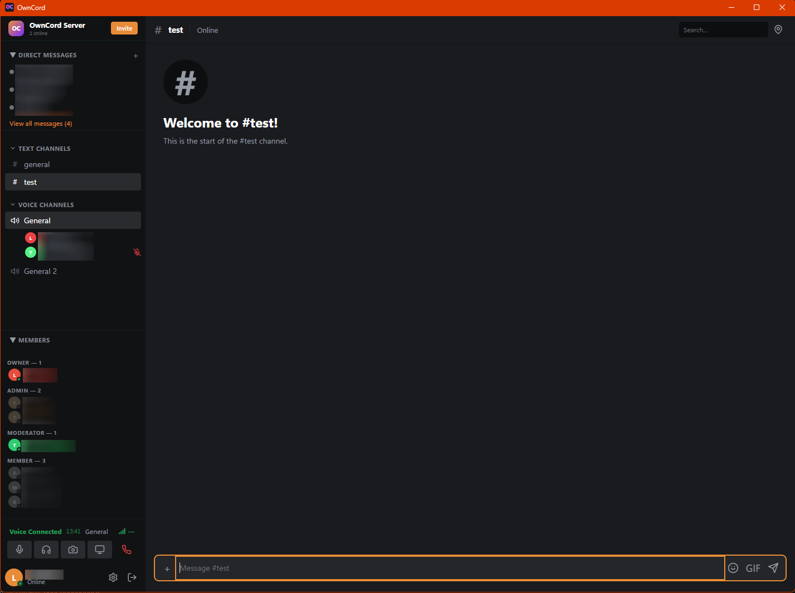
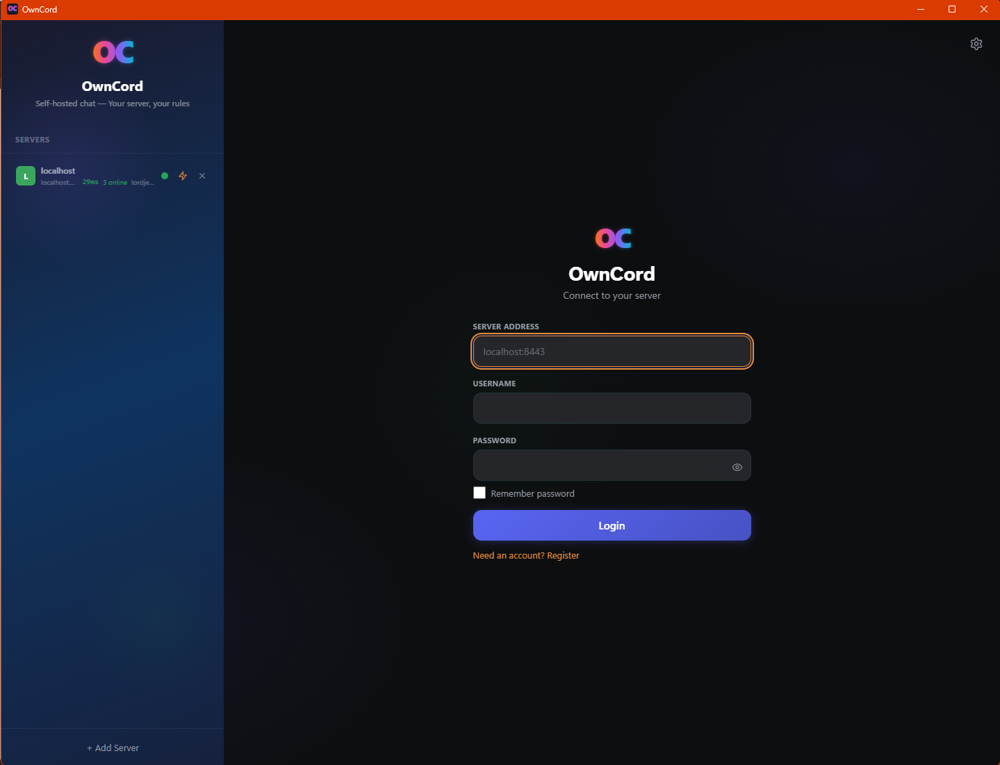
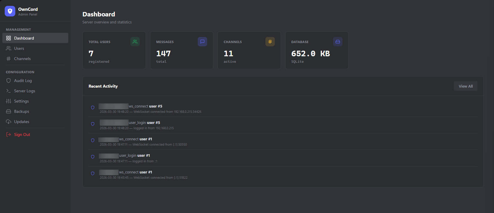

[](https://github.com/J3vb/OwnCord/actions/workflows/ci.yml)
[](https://github.com/J3vb/OwnCord/releases/latest)


[](LICENSE)

# OwnCord

A self-hosted chat app I build for me and my friends — text channels, voice and video, and a server you actually own.

> **Alpha, and a hobby project.**
> This is something I build for fun and run for a small group of friends. It isn't a product, there's no support, and it isn't production-ready. Expect rough edges, rapid changes, and the occasional breaking change.
>
> Don't use it for anything sensitive.

It's a Go server plus a Tauri desktop client: real-time messaging, voice/video via LiveKit, file sharing, and a web admin panel.
Run the server on a spare box or a VPS, hand your friends an invite code, and that's the whole thing.

<p align="center">
  
</p>

<p align="center">
  
  
</p>

## How it's built

Most of the implementation is generated with AI tooling, with quality held up by automated checks — CI, tests, linting — and by me and my friends actually using it.
That keeps iteration fast, and it also means behaviour can change quickly between releases.

## What works right now

| Area | Status |
| ---- | ------ |
| Core chat flow | Working in alpha |
| Voice/video | Working in alpha |
| Admin panel | Working in alpha |
| Security hardening | Ongoing review passes; findings and their statuses are tracked in the dated audits in [docs/](docs/) (see the Docs Index below) |

## Platform Support (Current Releases)

| Component | Windows x64 | Linux x64 | Linux ARM64 |
| --------- | ----------- | --------- | ----------- |
| Server binary | Yes | Yes | Not yet |
| Desktop client | Yes (NSIS installer) | Yes (AppImage, .deb) | Yes (AppImage, .deb) |
| Docker server | N/A | Build from source (compose) | Not yet |

## Start Here

- New user quick path: [docs/quick-start.md](docs/quick-start.md)
- Linux Docker deployment: [docs/deployment.md](docs/deployment.md)
- Remote access without router config: [docs/tailscale.md](docs/tailscale.md)
- Manual router/network setup: [docs/port-forwarding.md](docs/port-forwarding.md)

## Quick Start

### Option A: Prebuilt binaries

1. Download assets from [Releases](https://github.com/J3vb/OwnCord/releases) (binaries, checksums, signatures, and a full source snapshot per release).
2. Run the server binary:
   - Windows: `chatserver.exe`
   - Linux: `./chatserver`
3. Open `https://localhost:8443/admin` and complete the setup wizard — it creates your Owner account and configures the server for you (settings are saved to `config.yaml` automatically).
4. Generate invite codes in the admin panel and share them with friends.

### Option B: Docker (Linux server)

```bash
cd Server
cp .env.example .env
cp livekit.yaml.example livekit.yaml
# Edit both files before starting
docker compose up -d
```

See the full setup guide in [docs/deployment.md](docs/deployment.md).

The client uses TOFU (Trust On First Use) for self-signed certificates: it prompts once, then pins the certificate for future connections.

## What OwnCord Already Has

- Real-time channels and direct messages over WebSocket
- Voice/video channels via LiveKit — the LiveKit server binary is downloaded and managed for you
- Invite-only registration and role-based permissions
- Web admin panel with logs, backups, and update tooling
- File uploads and inline media rendering
- TOTP 2FA support and API rate limiting
- Desktop client auto-update with signature verification
- WASM plugin system (slash commands; sandboxed, default-disabled — enable via
  `plugins.enabled` and build with `-tags wazero`)
- GIF picker — off by default; each server supplies its own
  [Klipy](https://partner.klipy.com) key via `gif.api_key`
  ([setup](docs/server-configuration.md#gif-picker-gif))

See deeper feature and architecture docs in [docs/architecture/](docs/architecture/README.md) and [docs/protocol.md](docs/protocol.md).

## Architecture

Two main components:

- Go server (REST API, WebSocket hub, SQLite, admin panel)
- Tauri v2 desktop client (Rust backend + TypeScript frontend)

```text
+---------------------+         +---------------------+
|   OwnCord Client    |         |   OwnCord Server    |
|   (Tauri v2)        |         |       (Go)          |
|                     |         |                     |
|  +---------------+  |  WSS    |  +---------------+  |
|  |  Chat UI      |--+------->|  |  WebSocket Hub|  |
|  +---------------+  |         |  +---------------+  |
|  +---------------+  |  HTTPS  |  +---------------+  |
|  |  REST Client  |--+------->|  |  REST API     |  |
|  +---------------+  |         |  +---------------+  |
|  +---------------+  | LiveKit |  +---------------+  |
|  |  Voice/Video  |--+------->|  |  LiveKit SFU  |  |
|  +---------------+  |         |  +---------------+  |
+---------------------+         |  +---------------+  |
                                |  |  SQLite DB    |  |
                                |  +---------------+  |
                                +---------------------+
```

## Build and Test

### Prerequisites

- Go 1.26+
- Node.js 20+
- Rust stable (client builds)

### Build from source

```bash
# Server (Windows)
cd Server
go build -o chatserver.exe -ldflags "-s -w -X main.version=1.2.0-alpha.1" .

# Server (Linux)
cd Server
CGO_ENABLED=0 go build -o chatserver -ldflags "-s -w -X main.version=1.2.0-alpha.1" .

# Client
cd Client/tauri-client
npm install
npm run tauri build
```

### Core verification commands

```bash
# Server
cd Server
go test ./...

# Client
cd Client/tauri-client
npm run typecheck
npm run lint
npm test
```

For the full command set, use [docs/contributing.md](docs/contributing.md).

## Configuration

On first run, the server generates `config.yaml` and a local `data/` directory:

```text
data/
├── chatserver.db
├── certs/
├── uploads/
└── backups/
```

Key options include TLS mode, upload limits, LiveKit settings, and admin CIDR restrictions.
See [docs/server-configuration.md](docs/server-configuration.md).

## Security and Vulnerability Reporting

- For vulnerabilities, use GitHub Security Advisories (private disclosure flow).
- Do not open public issues for security bugs.
- Read full policy and hardening notes in [docs/security.md](docs/security.md).

## Update Signing Notes (Maintainers)

Client and server update signing keys are intentionally separate.

Required Actions secrets for release signing:

- `TAURI_SIGNING_PRIVATE_KEY`
- `TAURI_SIGNING_PRIVATE_KEY_PASSWORD`
- `SERVER_UPDATE_SIGNING_PRIVATE_KEY`
- `SERVER_UPDATE_SIGNING_PRIVATE_KEY_PASSWORD`

When rotating the server updater key, update [Server/updater/server_update_public_key.txt](Server/updater/server_update_public_key.txt) and use staged rollover for live fleets.

## Docs Index

- [docs/quick-start.md](docs/quick-start.md)
- [docs/deployment.md](docs/deployment.md)
- [docs/livekit-setup.md](docs/livekit-setup.md)
- [docs/port-forwarding.md](docs/port-forwarding.md)
- [docs/tailscale.md](docs/tailscale.md)
- [docs/architecture/](docs/architecture/README.md) — system blueprints (diagrams + flows)
- [docs/audit-2026-08-04-docs-and-coverage.md](docs/audit-2026-08-04-docs-and-coverage.md) — latest full audit (docs accuracy, UX flow coverage, test runs)
- [docs/audit-2026-08-04.md](docs/audit-2026-08-04.md) — latest security review
- [docs/audit-2026-07-19.md](docs/audit-2026-07-19.md) — architecture & spec-conformance audit
- [docs/api.md](docs/api.md)
- [docs/protocol.md](docs/protocol.md)
- [docs/schema.md](docs/schema.md)
- [docs/architecture/client.md](docs/architecture/client.md) — client architecture (replaces client-architecture.md)
- [docs/architecture/ux/](docs/architecture/ux/README.md) — client UX specification (target-state flows, per-view states, event→reaction maps)
- [docs/server-configuration.md](docs/server-configuration.md)
- [docs/credential-storage.md](docs/credential-storage.md)
- [docs/mcp-introspect.md](docs/mcp-introspect.md) — dev-only MCP server for introspecting a running instance
- [docs/audit-test-coverage-2026-07-25.md](docs/audit-test-coverage-2026-07-25.md) — test-coverage audit
- [docs/audit-2026-04-07.md](docs/audit-2026-04-07.md) — first comprehensive audit
- [docs/plans/](docs/plans/) — design plans and decision records (each carries a verified status header)
- [docs/contributing.md](docs/contributing.md)
- [docs/security.md](docs/security.md)

## Contributing

1. Create a branch from `dev` (the active development branch).
2. Keep changes focused and tested.
3. Open a PR targeting `dev` — `dev` is merged to `main` for releases.

See [docs/contributing.md](docs/contributing.md) for the full process.

## License

AGPL-3.0
