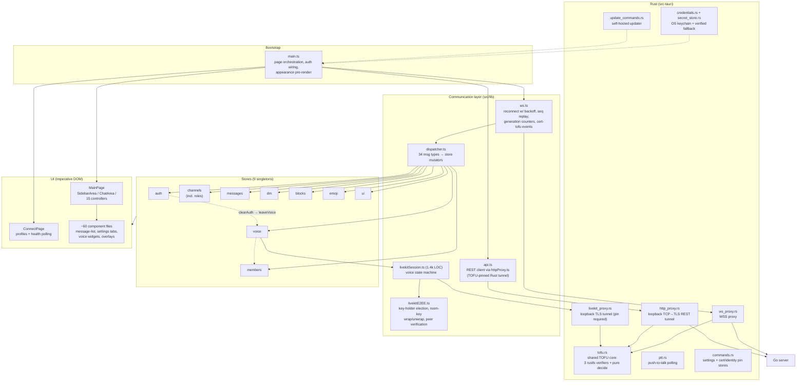

# Client Architecture (Tauri)

**Verified against:** commit `5630aa1`, 2026-08-04

Desktop client built on Tauri v2: a TypeScript webview (~42k LOC, vanilla TS —
no UI framework) plus ~4.7k LOC of Rust across 16 modules. State lives in a
hand-rolled reactive store (`src/lib/store.ts`: immutable updates,
microtask-batched notifications, selector subscriptions). Components are
factory functions returning `{ element, mount, destroy }` built with the
`@lib/dom` helpers; a 2-page state machine (`src/lib/router.ts`) switches
between the Connect and Main pages.

> `docs/client-architecture.md` is a 15-line redirect stub kept for old links;
> this document is the client architecture reference. The abandoned SolidJS
> beachhead that used to live under `src/components/solid/` was fully removed
> (audit A-2026-07-12, closed 2026-07-19).

## D7 — Module map

**What this shows.** Data flows one way in the happy path: WS frame → Rust
`ws_proxy` → `ws.ts` → `dispatcher.ts` → store mutators → subscribed components
re-render. All three network paths — WebSocket, REST, and LiveKit — terminate
TLS inside Rust proxies that share one TOFU core (`tofu.rs`): the WS and HTTP
proxies use a capture-then-decide verifier, and the LiveKit proxy refuses to
start without an existing pin. Deciding never writes a pin — a first
connection is _rejected_ and surfaced to the user as a blocking trust prompt
before any pin is stored (the former auto-pin-on-first-use behavior was
removed in the 2026-07-22 security remediation). The remaining dashed edges
mark cross-store coupling (auth→voice→members) — known structural debt, not
yet scheduled.

### Key mechanisms

| Concern             | Where                                                                                  | How                                                                                                                                                                                                                                                                                                                                                                                                          |
| ------------------- | -------------------------------------------------------------------------------------- | ------------------------------------------------------------------------------------------------------------------------------------------------------------------------------------------------------------------------------------------------------------------------------------------------------------------------------------------------------------------------------------------------------------ |
| Reconnect           | `src/lib/ws.ts`                                                                        | Exponential backoff (cap 30s), heartbeat 30s, `last_seq` replay + bounded dedup set, generation counter invalidates stale listeners                                                                                                                                                                                                                                                                          |
| Cert trust          | `src-tauri/src/tofu.rs` (shared by `ws_proxy.rs`, `http_proxy.rs`, `livekit_proxy.rs`) | TOFU with explicit consent: fingerprints stored per host in `certs.json`, but _deciding never writes a pin_ — first use and mismatch both reject the connection and emit a `cert-tofu` event; the TS side shows a blocking modal (`CertMismatchModal.ts`) and only an explicit Accept stores/updates the pin. The updater uses a fourth, host-scoped verifier (pin for the OwnCord host, WebPKI for GitHub). |
| Voice E2EE identity | `src/lib/identity.ts` + `src-tauri/src/commands.rs`                                    | Long-term ECDSA identity key in the OS keyring (`identity:{host}`); peer identity keys pinned in `identity_pins.json`; changed peer key → blocking identity-mismatch modal with safety-number comparison                                                                                                                                                                                                     |
| Credentials         | `src-tauri/src/credentials.rs`                                                         | OS keychain per host; password field `serde(skip)` so it never crosses IPC back to JS                                                                                                                                                                                                                                                                                                                        |
| Multi-server        | `src/lib/profiles.ts`                                                                  | Server profiles w/ 15s health polling and auto-connect; one active connection, quick-switch replaces WS + tunnels                                                                                                                                                                                                                                                                                            |
| HTTP capability     | `src-tauri/capabilities/default.json`                                                  | `http:allow-fetch` is the only URL-scoped identifier (the other two `fetch_*` commands take a validated `ResourceId`); allows `https://*` + `http://127.0.0.1:*`, denies https loopback. Wildcard is required by link previews — see [docs/plans/tauri-capability-narrowing.md](../plans/tauri-capability-narrowing.md)                                                                                      |
| Updates             | `src/lib/updater.ts` + `update_commands.rs`                                            | Endpoint derived from the connected server URL, https-only, TLS pinned to TOFU fingerprint, minisign-verified                                                                                                                                                                                                                                                                                                |
| Settings            | `commands.rs` + `src/lib/preferences.ts`                                               | Split persistence: Rust store (`settings.json`, key-allowlisted) _and_ raw `localStorage` for UI prefs/themes                                                                                                                                                                                                                                                                                                |
| Theming             | `src/lib/themes.ts` + `styles/tokens.css`                                              | CSS custom properties; 4 built-in themes + custom overrides                                                                                                                                                                                                                                                                                                                                                  |
| GIF picker          | `src/lib/gifProvider.ts` + `components/GifPicker.ts`                                   | Calls the user's own server (`/api/v1/gif/*`) through `api.ts` — no provider API key in the bundle. Server answers `503 GIF_DISABLED` when unconfigured: the picker shows "GIFs are not enabled on this server" and `onUnavailable` disables the composer's GIF button (with a `title`/`aria-label` reason) instead of failing silently. Returned media URLs are still pinned to the `klipy.com` CDN.        |

### Quality tooling

224 test files (~83k LOC — about 2× the source): Vitest unit + integration
(70% coverage gate, blocking in CI), Playwright E2E (web suite in CI —
non-blocking full run plus a blocking `@parity` subset — and a native Tauri
suite that is deliberately not wired to CI), Stryker mutation testing
(manual-only), oxlint + type-checked ESLint, Prettier, Knip (non-blocking),
strict `tsc`. Rust: 84 `cargo test --lib` tests across 10 of the 16 modules,
blocking in CI together with `cargo clippy -D warnings`.

**Source of truth:** `src/main.ts`, `src/lib/dispatcher.ts`, `src/lib/ws.ts`,
`src/lib/api.ts`, `src/lib/store.ts`, `src/stores/*.store.ts`,
`src-tauri/src/lib.rs`, `src-tauri/tauri.conf.json`.
