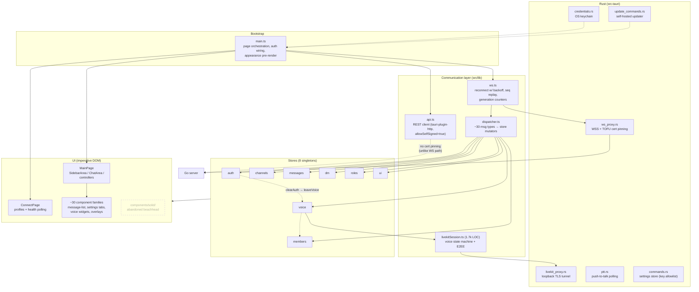

# Client Architecture (Tauri)

**Verified against:** commit `ddc49f0`, 2026-07-19

Desktop client built on Tauri v2: a TypeScript webview (~31.7k LOC, vanilla TS —
no UI framework) plus ~2.3k LOC of Rust commands. State lives in a hand-rolled
reactive store (`src/lib/store.ts`: immutable updates, microtask-batched
notifications, selector subscriptions). Components are factory functions
returning `{ element, mount, destroy }` built with the `@lib/dom` helpers; a
2-page state machine (`src/lib/router.ts`) switches between the Connect and
Main pages.

> `docs/client-architecture.md` still describes a SolidJS-based client. The
> Solid migration was **abandoned** (per CHANGELOG); only a 154-LOC beachhead
> remains under `src/components/solid/`. This document reflects the actual
> state.

## D7 — Module map

**What this shows.** Data flows one way in the happy path: WS frame → Rust
`ws_proxy` → `ws.ts` → `dispatcher.ts` → store mutators → subscribed components
re-render. The dashed edges mark the audit findings: the HTTP path accepts any
certificate (`allowSelfSigned` hardcoded, no TOFU pinning — unlike the WS and
LiveKit paths, which pin fingerprints in Rust), the stores cross-import each
other (auth→voice→members), and the Solid beachhead is dead weight.

### Key mechanisms

| Concern | Where | How |
|---------|-------|-----|
| Reconnect | `src/lib/ws.ts` | Exponential backoff (cap 30s), heartbeat 30s, `last_seq` replay + bounded dedup set, generation counter invalidates stale listeners |
| Cert trust | `src-tauri/src/ws_proxy.rs` | TOFU: first fingerprint pinned per host (`certs.json`); mismatch → modal (`CertMismatchModal`) |
| Credentials | `src-tauri/src/credentials.rs` | OS keychain per host; password field `serde(skip)` so it never crosses IPC back to JS |
| Multi-server | `src/lib/profiles.ts` | Server profiles w/ 15s health polling and auto-connect; one active connection, quick-switch replaces WS + tunnels |
| Updates | `src/lib/updater.ts` + `update_commands.rs` | Endpoint derived from the connected server URL, https-only, TLS pinned to TOFU fingerprint, minisign-verified |
| Settings | `commands.rs` + `src/lib/preferences.ts` | Split persistence: Rust store (`settings.json`, key-allowlisted) *and* raw `localStorage` for UI prefs/themes |
| Theming | `src/lib/themes.ts` + `styles/tokens.css` | CSS custom properties; 4 built-in themes + custom overrides |
| GIF picker | `src/lib/gifProvider.ts` + `components/GifPicker.ts` | Calls the user's own server (`/api/v1/gif/*`) through `api.ts` — no provider API key in the bundle. Server answers `503 GIF_DISABLED` when unconfigured: the picker shows "GIFs are not enabled on this server" and `onUnavailable` disables the composer's GIF button (with a `title`/`aria-label` reason) instead of failing silently. Returned media URLs are still pinned to the `klipy.com` CDN. |

### Quality tooling

157 test files (~63k LOC — about 2× the source): Vitest unit + integration,
Playwright E2E (web and native Tauri suites), Stryker mutation testing, oxlint +
type-checked ESLint, Prettier, Knip, strict `tsc`. The client unit suite is
green and blocking; it must pass 100% before a push (audit item A-2026-07-04,
closed 2026-07-20).

**Source of truth:** `src/main.ts`, `src/lib/dispatcher.ts`, `src/lib/ws.ts`,
`src/lib/api.ts`, `src/lib/store.ts`, `src/stores/*.store.ts`,
`src-tauri/src/lib.rs`, `src-tauri/tauri.conf.json`.
