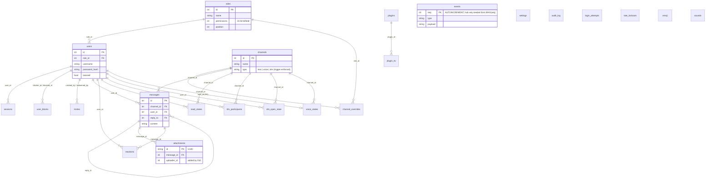

# Data Model

**Verified against:** commit `ddc49f0`, 2026-07-19

The canonical schema is the ordered migration set `Server/migrations/001–015`
(embedded via `go:embed`, applied by the custom runner in `Server/db/migrate.go`,
tracked in the `schema_versions` table). SQLite is the only supported engine —
`Server/main.go` rejects any other `database.type` at startup.

## D5 — Entity-relationship overview

All 23 application tables, grouped by domain. Junction/leaf detail columns are
elided; the goal is the relationship graph, not full DDL (see `docs/schema.md`
for DDL — note it is currently 6 migrations behind, see
[audit-2026-07-19.md §2](../audit-2026-07-19.md)).

### Domain notes

| Domain | Tables | Notes |
|--------|--------|-------|
| Identity & access | `roles`, `users`, `sessions`, `channel_overrides`, `user_blocks`, `invites`, `login_attempts`, `rate_lockouts` | Sessions store only SHA-256 token hashes. Permissions are a bitfield on `roles.permissions`; channel overrides use Discord semantics `(role &^ deny) \| allow`. `rate_lockouts` (011) persists rate-limiter lockouts across restarts. |
| Messaging | `channels`, `messages`, `attachments`, `reactions`, `read_states`, `emoji` | `channels.type` is constrained to `text \| voice \| dm` by INSERT/UPDATE triggers from migration 013 — the `announcement` type in the specs/admin UI is rejected at this layer. `attachments.uploader_id` (010) backs upload-ownership checks. |
| Direct messages | `dm_participants`, `dm_open_state` | DMs are `channels` rows with `type='dm'`; these tables track membership and per-user open/closed UI state (009). |
| Voice | `voice_states` | One row per user (`user_id` is the PK) — a user occupies at most one voice channel. |
| Real-time replay | `events` | Cold tier of the 3-tier reconnect replay ([websocket.md](websocket.md)); written by the async `EventPersister`, pruned by retention. Hub seq counter is seeded from `MAX(events.seq)` at startup so seqs stay monotonic across restarts. |
| Plugins | `plugins`, `plugin_kv` | 015. `plugin_kv` is per-plugin namespaced KV via composite PK `(plugin_id, key)`. |
| Ops | `settings`, `audit_log`, `sounds` | `settings` is a generic KV read by admin and the WS hub (via `db.GetSetting`). Migration 003 rebuilds `audit_log` through a transient `audit_log_v6` rename — only `audit_log` exists at runtime. `sounds` is **dead schema** — the soundboard feature was removed but the table remains. |

### How the schema is accessed (three coexisting styles)

1. **Raw SQL in `Server/db`** — hand-written queries (`*_queries.go`, ~178 call
   sites). This is what actually runs, used directly by `Server/api` handlers,
   `Server/admin`, and the `ws.Hub`.
2. **`store.Store` interface** (`Server/store`) — a 14-domain composed interface
   with `SQLiteStore` (delegates to `db.DB`) and `MemStore` (test double).
   Consumed by the `Server/service` layer only.
3. **sqlc-generated `Server/db/dbgen`** (~3.5k LOC, from `Server/db/queries/sqlite/`
   per `sqlc.yaml`) — **imported by nothing**; dead code kept verified by the
   `sqlc-verify` CI job.

The coexistence of all three is the largest structural finding of the audit —
see [audit-2026-07-19.md §3](../audit-2026-07-19.md).

**Source of truth:** `Server/migrations/*.sql` (schema), `Server/db/migrate.go`
(runner), `Server/db/*_queries.go` (live queries), `Server/store/store.go`
(interface), `sqlc.yaml` + `Server/db/dbgen/` (dormant generated layer).
