# Data Model

**Verified against:** commit `5630aa1`, 2026-08-04

The canonical schema is the ordered migration set `Server/migrations/001–028`
(embedded via `go:embed`, applied by the custom runner in `Server/db/migrate.go`,
tracked in the `schema_versions` table). SQLite is the only supported engine —
`Server/main.go` rejects any other `database.type` at startup.

## D5 — Entity-relationship overview

All 26 application tables, grouped by domain. Junction/leaf detail columns are
elided; the goal is the relationship graph, not full DDL — see
[`docs/schema.md`](../schema.md) for per-table DDL (current through
migration 028).

```mermaid
erDiagram
    %% ── Identity & access ──
    roles ||--o{ users : "role_id"
    users ||--o{ sessions : "user_id"
    users ||--o{ api_tokens : "user_id"
    roles ||--o{ channel_overrides : "role_id"
    channels ||--o{ channel_overrides : "channel_id"
    users ||--o{ channel_user_overrides : "user_id"
    channels ||--o{ channel_user_overrides : "channel_id"
    users ||--o{ user_blocks : "blocker_id / blocked_id"
    users ||--o{ invites : "created_by / redeemed_by"

    %% ── Messaging ──
    channels ||--o{ messages : "channel_id"
    users ||--o{ messages : "user_id"
    messages ||--o{ messages : "reply_to"
    messages ||--o{ attachments : "message_id"
    messages ||--o{ reactions : "message_id"
    users ||--o{ reactions : "user_id"
    messages ||--o{ message_mentions : "message_id"
    users ||--o{ message_mentions : "mentioned_user_id"
    users ||--o{ read_states : "user_id"
    channels ||--o{ read_states : "channel_id"

    %% ── Direct messages (channels with type='dm') ──
    channels ||--o{ dm_participants : "channel_id"
    users ||--o{ dm_participants : "user_id"
    channels ||--o{ dm_open_state : "channel_id"
    users ||--o{ dm_open_state : "user_id"

    %% ── Voice ──
    users ||--o| voice_states : "user_id (PK)"
    channels ||--o{ voice_states : "channel_id"

    %% ── Plugins ──
    plugins ||--o{ plugin_kv : "plugin_id"

    %% ── Standalone (no FK edges) ──
    events
    settings
    audit_log
    login_attempts
    rate_lockouts
    emoji
    sounds

    users {
        int id PK
        int role_id FK
        string username
        string password_hash
        bool banned
    }
    roles {
        int id PK
        string name
        int permissions "31-bit bitfield"
        int position
    }
    channels {
        int id PK
        string name
        string type "text | voice | announcement | dm (trigger-enforced)"
        bool is_group "028: marks a group DM"
    }
    messages {
        int id PK
        int channel_id FK
        int user_id FK
        int reply_to FK
        string content
    }
    attachments {
        string id PK "UUID"
        int message_id FK
        int uploader_id "added by 010"
    }
    events {
        int seq PK "AUTOINCREMENT, hub seq seeded from MAX(seq)"
        string type
        string payload
    }
```

### Domain notes

| Domain | Tables | Notes |
|--------|--------|-------|
| Identity & access | `roles`, `users`, `sessions`, `api_tokens`, `channel_overrides`, `channel_user_overrides`, `user_blocks`, `invites`, `login_attempts`, `rate_lockouts` | Sessions store only SHA-256 token hashes. `api_tokens` (018) are long-lived bearer credentials (owner-minted, hash-stored) that deliberately live outside the session table. Permissions are a bitfield on `roles.permissions`; channel overrides use Discord semantics `(role &^ deny) \| allow`, with `channel_user_overrides` (024) as a per-user final layer on top of the role layer. `users` gained `identity_public_key` (017) for voice E2EE identity pinning and `display_name`/`about`/`custom_status` (027). `rate_lockouts` (011) persists rate-limiter lockouts across restarts. |
| Messaging | `channels`, `messages`, `attachments`, `reactions`, `read_states`, `message_mentions`, `emoji` | `message_mentions` (022) stores server-resolved `@username` mentions per message; `messages.mentions_everyone` flags an authorized `@everyone`/`@here`, and `read_states.mention_count` is the per-user unread badge those two drive. `channels.type` is constrained to `text \| voice \| announcement \| dm` by INSERT/UPDATE triggers (migration 013, extended by 016 to allow `announcement`). Announcement channels read like text but require `MANAGE_MESSAGES` to post. `attachments.uploader_id` (010) backs upload-ownership checks. |
| Direct messages | `dm_participants`, `dm_open_state` | DMs are `channels` rows with `type='dm'`; these tables track membership and per-user open/closed UI state (009). `channels.is_group` (028) marks a group DM so group-ness survives participants leaving. |
| Voice | `voice_states` | One row per user (`user_id` is the PK) — a user occupies at most one voice channel. |
| Real-time replay | `events` | Cold tier of the 3-tier reconnect replay ([websocket.md](websocket.md)); written by the async `EventPersister`, pruned by retention. Hub seq counter is seeded from `MAX(events.seq)` at startup so seqs stay monotonic across restarts. |
| Plugins | `plugins`, `plugin_kv` | 015. `plugin_kv` is per-plugin namespaced KV via composite PK `(plugin_id, key)`. |
| Ops | `settings`, `audit_log`, `sounds` | `settings` is a generic KV read by admin and the WS hub (via `db.GetSetting`). Migration 003 rebuilds `audit_log` through a transient `audit_log_v6` rename — only `audit_log` exists at runtime. `sounds` is **dead schema** — the soundboard feature was removed but the table remains. |

### How the schema is accessed

The `Server/db` package is the single data layer. Its methods live in
`*_queries.go` and mostly delegate to the sqlc-generated `Server/db/dbgen` code
(D2), so sqlc is the type-checked query layer rather than dead generated code; a
documented remainder of raw queries stays hand-written where sqlc can't express
them (variable-length `IN` lists, FTS, multi-statement transactions,
PRAGMA/VACUUM) — see [plans/sqlc-adoption.md](../plans/sqlc-adoption.md).

Consumers depend on narrow interfaces that `*db.DB` satisfies rather than on the
concrete type: `service.Store` (the service layer), `ws.EventStore` (cold-tier
replay), and `plugin.PluginStore` (plugin registry). D3 removed the former
`store` package (a pass-through `SQLiteStore` plus a `MemStore` test double);
tests now run against a real in-memory SQLite `db`. The residual style issue is
that many `Server/api` handlers and the `Server/admin` package still take a raw
`*db.DB` directly instead of going through the service layer — the remaining
consolidation work (audit A-2026-07-06).

**Source of truth:** `Server/migrations/*.sql` (schema), `Server/db/migrate.go`
(runner), `Server/db/*_queries.go` (live queries), `Server/service/datastore.go`
(service interface), `sqlc.yaml` + `Server/db/dbgen/` (generated query layer).
