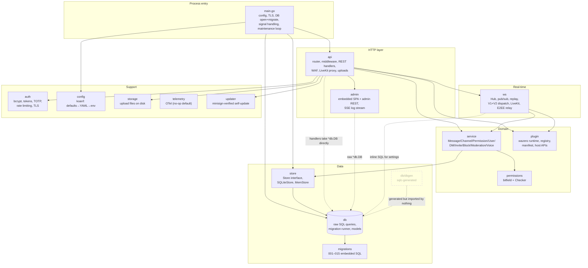
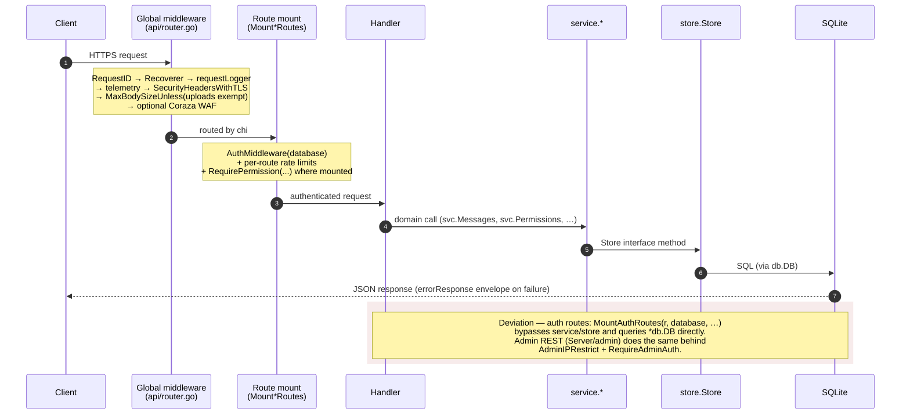

# Server Architecture

**Verified against:** commit `ddc49f0`, 2026-07-19

Single Go binary (`github.com/owncord/server`, Go 1.25). Pure-Go SQLite
(`modernc.org/sqlite`, no CGO), chi router, `nhooyr.io/websocket`, LiveKit for
voice, Wazero for plugins (build-tag gated), optional OpenTelemetry
(`-tags otel`). Roughly 29k LOC of production code and 46k LOC of tests.

## D2 — Package map

**What this shows.** The intended layering is
`api → service → store → db`, and the `service` layer does follow it. But three
dashed edges mark where the seam is bypassed: nearly every REST handler receives
both `svc` *and* a raw `*db.DB`; the `admin` package operates on `*db.DB`
almost exclusively; and the `ws.Hub` runs inline SQL against the `settings`
table. `db/dbgen` (sqlc output) is generated and CI-verified but referenced by
no code. In effect the server has three coexisting data-access styles — see
[data-model.md](data-model.md) and the audit for the consolidation
recommendation.

`api.NewRouter` (`Server/api/router.go`) is the composition root: it constructs
the rate limiter, TOTP key, storage, `service.New`, the `ws.Hub`, the LiveKit
client/subprocess, the updater, the admin handler, and the plugin admin handler;
spawns background goroutines; and mounts all routes. `main.go` performs only
process-level wiring (config, TLS, DB, event persistence, HTTP server,
shutdown).

**Source of truth:** `Server/main.go`, `Server/api/router.go`, package import
graph (`go list -deps`), `Server/store/store.go`, `sqlc.yaml`.

## D3 — REST request lifecycle

**What this shows.** The global chain is assembled in `NewRouter`; note that
chi's `middleware.RealIP` is deliberately omitted — client IP is resolved via
`clientIPWithProxies` against configured trusted proxies instead, so spoofed
`X-Real-IP`/`X-Forwarded-For` headers are not trusted by default. Authentication
is bearer-token (SHA-256-hashed opaque tokens); authorization is enforced
inconsistently — sometimes as `RequirePermission` middleware at mount time,
sometimes in-handler through `svc.Permissions` (an audit finding). The shaded
region marks the two documented bypass paths of the domain layer.

**Source of truth:** `Server/api/router.go`, `Server/api/middleware.go`,
`Server/api/auth_handler.go`, `Server/admin/middleware.go`, `Server/service/`.
