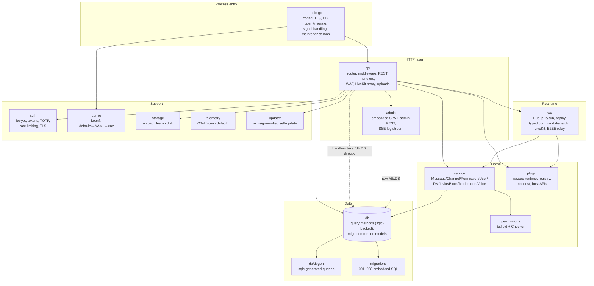
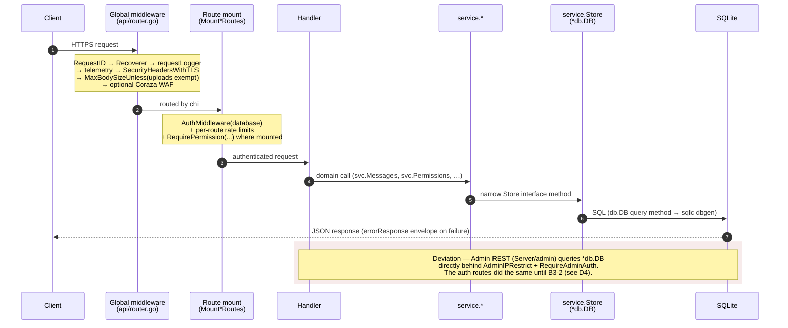

# Server Architecture

**Verified against:** commit `5630aa1`, 2026-08-04; §D4 and the auth rows of
§D3 against `fe1d11b8`, 2026-08-30 (B3-2)

Single Go binary (`github.com/J3vb/OwnCord/Server`, Go 1.26). Pure-Go SQLite
(`modernc.org/sqlite`, no CGO), chi router, `github.com/coder/websocket`,
LiveKit for voice, Wazero for plugins (build-tag gated), optional OpenTelemetry
(`-tags otel`). Roughly 42k LOC of production code and 71k LOC of tests.

## D2 — Package map

Which of these packages may import `db`, and what every file above the domain
layer does with it, is inventoried in
[server-boundaries.md](server-boundaries.md) (B3-0) and enforced by the
`db-import-boundary` rule in `Server/invariants/`.

**What this shows.** The layering is `api → service → db` (D3 removed the former
`store` seam). The `service` layer depends on a narrow `service.Store` interface
that `*db.DB` satisfies; `ws` and `plugin` depend on their own small interfaces
(`ws.EventStore`, `plugin.PluginStore`) the same way. The `db` package's query
methods delegate to the sqlc-generated `db/dbgen` code (D2), so sqlc is now the
type-checked query layer rather than dead generated code. Two dashed edges mark
the residual seam: many REST handlers still receive a raw `*db.DB` alongside
`svc`, and the `admin` package operates on `*db.DB` almost exclusively —
consolidating those behind the service layer is the remaining work (audit
A-2026-07-06 — resolved for the store seam itself; the residual consolidation
is its backlog item 12). See [data-model.md](data-model.md).

`api.NewRouter` (`Server/api/router.go`) is the composition root: it constructs
the rate limiter, TOTP key, storage, `service.New`, the `ws.Hub`, the LiveKit
client/subprocess, the updater, the admin handler, and the plugin admin handler;
spawns background goroutines; and mounts all routes. `main.go` performs only
process-level wiring (config, TLS, DB, event persistence, HTTP server,
shutdown).

The `plugin` package is experimental and compiled out of release binaries;
[plugins.md](plugins.md) records that boundary — what exists, what carries no
promise, and which core concerns will never move behind it.

**Source of truth:** `Server/main.go`, `Server/api/router.go`, package import
graph (`go list -deps`), `Server/service/datastore.go`, `sqlc.yaml`.

## D3 — REST request lifecycle

**What this shows.** The global chain is assembled in `NewRouter`; note that
chi's `middleware.RealIP` is deliberately omitted — client IP is resolved via
`clientIPWithProxies` against configured trusted proxies instead, so spoofed
`X-Real-IP`/`X-Forwarded-For` headers are not trusted by default. Authentication
is bearer-token (SHA-256-hashed opaque tokens); authorization is enforced at two
deliberate scopes (D13): `RequirePermission` middleware gates the two
channel-less routes on server-wide role permissions via
`permissions.HasServerPerm` (channel overrides deliberately not consulted — a
per-channel allow must never open a server-wide gate), while anything
channel-scoped is checked in the service layer through `svc.Permissions` /
`permissions.Checker`, which resolves overrides and fails closed if they cannot
be fetched. The shaded region marks the remaining documented bypass of the
domain layer; the auth routes left it in B3-2 (`MountAuthRoutes(r, svc,
requireAuth, …)` → `service.AuthService` → `Store`).

**Source of truth:** `Server/api/router.go`, `Server/api/middleware.go`,
`Server/api/auth_handler.go`, `Server/admin/middleware.go`,
`Server/permissions/`, `Server/service/`.

## D4 — The vertical-slice pattern (B3-2; the rule for B3-8)

The auth slice was the first domain family moved from "handler owns the
database" to `api → service → db` behind a consumer-owned interface, with a
frozen characterization set proving nothing changed. B3-8 repeats this per
family. The steps, in commit order, each its own commit so the reviewer can
diff the move separately from the rewrite:

1. **Characterize first, in its own PR.** Table tests over the mounted
   router pin today's behaviour per route: status, code and message of every
   refusal, session shape, rate-limit accounting, DB-fault paths. A row that
   finds a defect is pinned as-is with a `// known:` comment and a ledger
   entry — the slice moves behaviour, it does not fix it. Record per-file
   statement coverage of the handler files.
2. **List the gates, then grep the rows.** Before writing the interface,
   list every handler statement that runs _before_ the body decode (policy
   reads, per-user lockouts, "already enrolled", challenge lookups) and grep
   the characterization file for malformed-body rows per route (`{not json`).
   A route with such a row keeps its gate as a separate interface method,
   ahead of the decode; a route without one decodes first, the service runs
   the gate in the original order, and the corner case (garbage input behind
   a gate now gets 400 instead of the gate's status) goes in the evidence
   block. This was the awkward step on the auth slice: `/register` had the
   rows (→ `RegistrationPolicy`), the password-confirmation routes did not.
3. **Interface beside the consumer** — `api/<family>_deps.go`, exported,
   one method per route call, named in the service's input/result types
   (`service.Principal`, `service.<X>Input`, `service.<X>Result`), never in
   `db` types, so the file adds no `db` importer. Method count ≤ the distinct
   `*db.DB` methods the handlers called; the after-state table records both
   numbers. `var _ <Family>Service = (*service.<Family>Service)(nil)` pins the
   production implementation.
4. **Service owns every decision, verbatim.** `service/<family>.go` takes
   `Store` and the collaborators the handlers used (the shared
   `auth.RateLimiter`, keys, broadcasters). Lockout keys, enumeration
   guards, audit writes, best-effort side effects, partial-success contracts
   and the limits that size them move line for line, comments included. Each
   refusal is a named `Err*` value whose `Error()` is the public message and
   whose category (`ErrRateLimited`, `ErrForbidden`, `ErrBadRequest`,
   `ErrConflict`, `ErrInternal`, `ErrUnauthorized`, `ErrInvalidInput`) the
   transport maps to a status; return them bare and log the cause in the
   service, so nothing leaks through `Error()`. Expect one value per distinct
   public message — the auth slice had thirty-one.
5. **Handler = decode, one call, encode.** Validation of the body shape and
   format (`ValidateUsername`, size bounds, `SanitizeText`) stays in the
   handler; everything that reads state moves. One `write<Family>Error`
   switch on the categories, with the two or three values that carry their
   own code listed first. The principal comes from `principal(r)` in
   `middleware.go`, never from a `db` type assertion in the handler file.
   `Mount<Family>Routes` takes the interface and the `AuthMiddleware` the
   caller built; `*db.DB` leaves every signature in the file.
6. **The row leaves with the import.** Delete the family's
   `invariants.DBImportAllow` rows in the same commit that removes the
   import; `TestDBImportAllowIsLive` fails if a row outlives it, and
   `db-import-boundary` fails if an import outlives its row. Constants move
   with the code that reads them; a converter that still names a `db` type
   (`toUserResponse`) moves to a file that legitimately imports `db`.
7. **Composition root builds the service after its collaborators.** The
   auth service needs the hub (broadcast) that `service.New` runs before, so
   `router.go` constructs it separately, after `ws.NewHub`. B3-3 moves that
   into `internal/app`; until then it is one line in `NewRouter`, which sits
   at the `funlen` limit — fold, do not add.
8. **Evidence block:** pre-squash SHAs with the characterization run against
   each tree, before/after inventory rows, the full gate, and coverage of
   the handler files plus the service (blocks merged per file, each counted
   once) — the slice must not drop below its before-figure even when the
   per-file handler numbers dip, because the unreachable branches are now a
   larger share of a smaller file.

What the pattern does not promise: the handlers import `service` (types and
categories); the crypto-failure paths remain uninjectable inside the service;
and a family whose gates all precede the decode will spend interface methods
on them.
