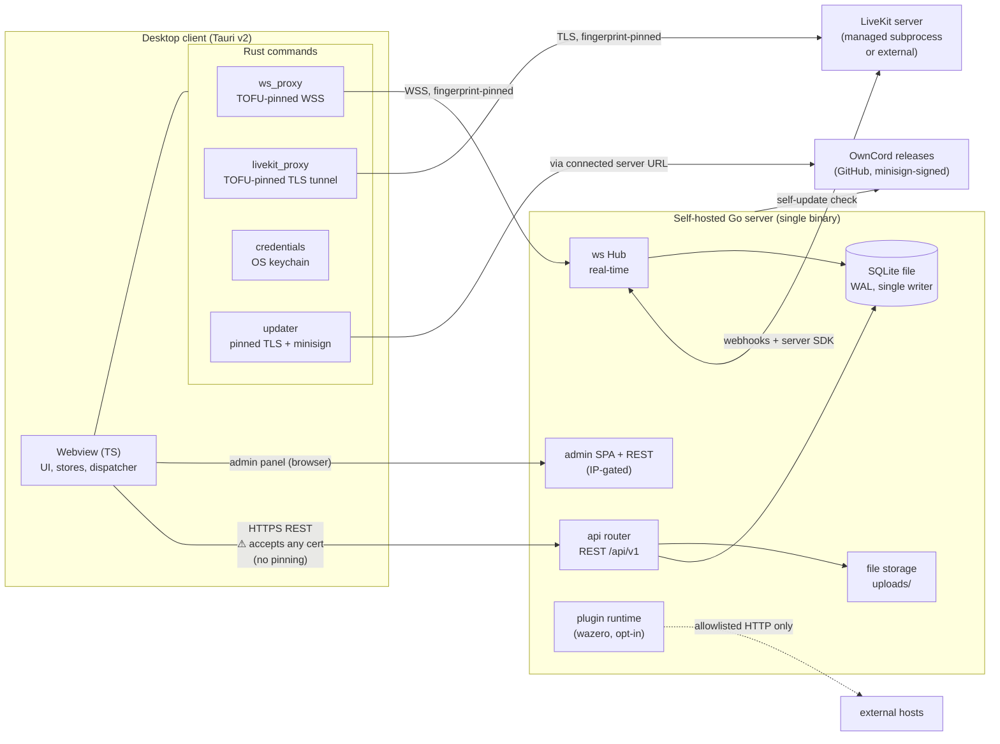
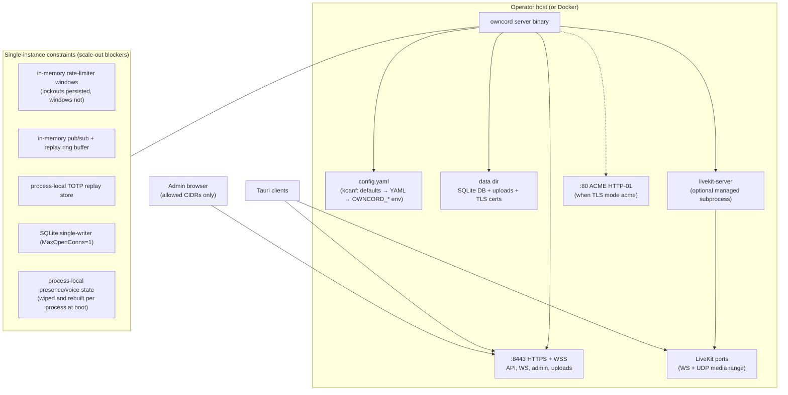

# System Overview

**Verified against:** commit `5630aa1`, 2026-08-04

OwnCord is a self-hosted chat stack: one Go server binary per community, a Tauri
desktop client that can hold profiles for many servers (one active connection at
a time), LiveKit for voice/video media, and an embedded web admin panel.

## D1 — System context and trust boundaries

**What this shows.** Three transport paths leave the client and only two are
certificate-pinned: the app WebSocket and the LiveKit tunnel go through Rust
proxies that pin a trust-on-first-use SHA-256 fingerprint per host; the HTTP
REST path currently accepts any certificate (an acknowledged gap tracked in the
audit). The admin panel is served by the same binary but gated to configured
CIDRs (private ranges by default), with bearer admin auth on top for the plugin
endpoints. Plugins run in a WASM sandbox whose HTTP capability is allowlisted
per manifest. Both the server self-updater and the client updater verify
minisign signatures against pinned embedded public keys.

## D8 — Deployment topology

**What this shows.** The deployment unit is one process per community —
TLS (self-signed, custom, or ACME), the DB, uploads, the admin panel, and
optionally LiveKit are all owned by that process. The design is explicitly
single-instance: rate-limit windows, pub/sub, the replay ring buffer, the
TOTP replay store, and presence/voice state (derived from live hub membership
and cold-reset at every boot) are process-local, and SQLite runs with a
single writer — enforced by an OS-level lock beside the database file, so a
second process fails fast instead of silently fighting the first over that
state. Horizontal scaling is out of scope today; the constraint boxes name
exactly what would have to move to shared infrastructure if that ever
changes. A 15-minute maintenance goroutine (expired sessions, orphaned
attachments, scheduled backups, with a circuit breaker) and graceful drain on
SIGINT/SIGTERM round out the process lifecycle.

A note on client platforms while the deployment story is in view: the desktop
client ships for Windows and Linux (x86_64 + ARM64) only. macOS is a
deliberate scope decision, not an oversight — a trustworthy macOS build
requires Apple notarization (paid developer enrollment plus CI signing
secrets), and an unsigned bundle would train users to bypass Gatekeeper.
Revisit when that commitment is on the table.

**Source of truth:** `Server/main.go`, `Server/config/config.go`,
`Server/docker-compose.yml`, `docs/deployment.md`, `docs/server-configuration.md`,
`Client/tauri-client/src-tauri/src/lib.rs`.
