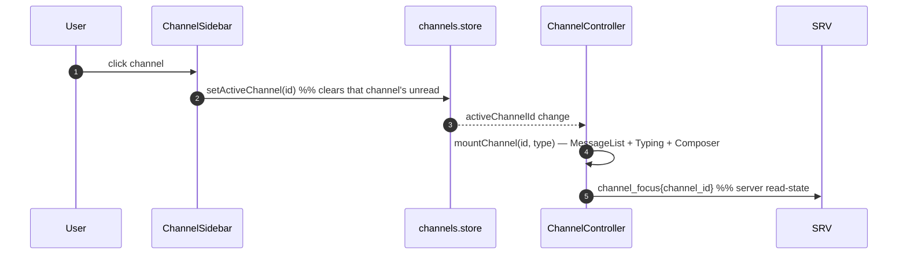
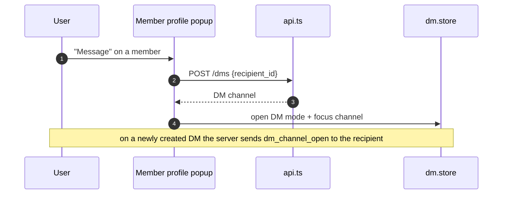

# Channels, Members & Direct Messages — target UX

**Verified against:** commit `5630aa1`, 2026-08-04
Part of the [Client UX Specification](README.md).

Covers the sidebar surfaces: the channel list (switch, categories, reorder,
announcement affordance), the member list (presence, typing, roles), and DMs
(open/close, blocking).

---

## 1. Channel sidebar

Renders from `channels.store` (`channels` map, `activeChannelId`), grouped by
category, sorted by position. The sidebar has two modes (`ui.store.sidebarMode`):
`channels` and `dms`.

| State | Trigger | Target reaction |
|-------|---------|-----------------|
| `ready` | Channels loaded from `ready` | Grouped, collapsible category list |
| `empty` | Zero channels | "No channels yet" + hint (already the empty-state branch of `renderChannels()`, `components/ChannelSidebar.ts`) |
| category collapsed | User toggles | Persisted per-server in localStorage (`ui.toggleCategory`); chevron reflects state |
| active channel | `setActiveChannel` | Highlighted; unread cleared |
| unread | `chat_message` in a non-active channel | Unread pill; badge on the channel |

### 1.1 Channel type affordances

Each channel type gets a distinct icon and interaction:

| Type | Icon | Click behavior |
|------|------|----------------|
| `text` | hash | Focus → load messages |
| `announcement` | megaphone (D1) | Focus → load messages; **composer read-only unless MANAGE_MESSAGES** (see [messaging.md §2](messaging.md)) |
| `voice` | speaker | Join voice (see [voice-and-e2ee.md](voice-and-e2ee.md)); shows the participant roster inline |
| `dm` | — | Not in the channel list; lives in DM mode |

### 1.1a Per-channel notification mutes

The channel context menu offers "Mute Channel" / "Unmute Channel"
(the Mute Channel item in `attachChannelContextMenu()`, `components/channel-sidebar/context-menu.ts`, backed by `lib/channel-mutes.ts`).
Discord semantics, deliberately: a mute silences the channel's *noise* — no
desktop notification, no chime — while the unread badge still counts but
renders dimmed, and a message that mentions you still notifies and shows the
red mention badge. It is a client-side preference on purpose (stored in
`localStorage` under `mutedChannels`): the server has no per-user channel
settings table, and "which of my devices bothers me" is a property of the
device, not the account.

### 1.2 Channel switching

**Target rules:**
- Switching is instantaneous from cache; the message area shows its own loading
  state for uncached history ([messaging.md §1](messaging.md)), never a global block.
- If the active channel is **deleted** server-side (`channel_delete`), redirect to
  the first text channel by position and toast "This channel was deleted."
  (**✓ implemented 2026-08** — the `channel_delete` handler in
  `wireDispatcher()`, `lib/dispatcher.ts`, redirects and toasts; a non-active
  deletion stays silent).

### 1.3 Reorder & CRUD (admin)

Drag-reorder and create/edit/delete are admin affordances — see
[settings-and-admin.md §3](settings-and-admin.md). **Target:** reorder should be
optimistic (position updates locally, then `PATCH` per moved channel) and roll
back on failure.

---

## 2. Member list

Renders from `members.store` (`members` map + `typingUsers`). Shows presence and
role grouping.

| State | Trigger | Target reaction |
|-------|---------|-----------------|
| `ready` | `ready.members` | Grouped by role, sorted; presence dot per member |
| `empty` | No online members | "No members online" (already the empty-state branch of `renderList()`, `components/MemberList.ts`) |
| presence change | `presence` event | Live dot update; offline members styled distinctly |
| role change | `member_update` | Re-group live |
| profile change | `user_update` | Name/avatar update; if it's us, also patch `auth.store` (already the `user_update` handler in `wireDispatcher()`, `lib/dispatcher.ts`) |
| join/leave/ban | `member_join`/`member_leave`/`member_ban` | Add/remove with no reflow flash |

### 2.1 Typing indicator

`typing` events populate `members.typingUsers` with a 5 s auto-clear timer.
**Target:** show "X is typing…" / "X and Y are typing…" / "Several people are
typing…" below the message list, excluding the current user (already
`formatTypingText()` in `components/TypingIndicator.ts`). The client emits `typing_start` while composing
(debounced), never per-keystroke.

### 2.2 Member actions (context menu)

Right-click / long-press a member → context menu (roles, kick, ban) — moderation
affordances covered in [settings-and-admin.md §3](settings-and-admin.md). Actions
the user lacks permission for are **not shown** (menu items gated by the actor's
role), consistent with the affordance principle.

> **✓ Resolved 2026-07-20 — single role store.** Roles live only in
> `channels.store` (`roles`/`getRoleIdByName`), the store the dispatcher writes on
> `ready` (`dispatcher.ts`). `SidebarMemberSection.ts` now reads from it, and the
> parallel, never-updated `roles.store` has been deleted — so the member context
> menu can no longer mis-map a role name→id from stale data.

---

## 3. Direct messages

DM mode (`sidebarMode: "dms"`) renders from `dm.store` (`channels` list, each with
recipient, last-message preview, unread).

| State | Trigger | Target reaction |
|-------|---------|-----------------|
| `ready` | `ready.dm_channels` | DM list sorted by recency |
| `empty` | No DMs | "No direct messages yet" + "Start one from a member's profile" |
| open DM | `dm_channel_open` | Prepend/move-to-top, dedup (already `addDmChannel()`, `stores/dm.store.ts`) |
| close DM | `dm_channel_close` | Remove from list |
| new DM message | `chat_message` in a DM | `updateDmLastMessage` (unread bump + reorder) if not focused; `updateDmLastMessagePreview` (no bump) if own/active |
| last-message empty | Never messaged | "No messages yet" fallback (already the `lastMessage` fallback in `buildDmConversations()`, `pages/main-page/SidebarDmHelpers.ts`) |

### 3.1 Opening a DM

### 3.1a Group DMs

One picker covers 1:1 and group creation
(`pages/main-page/MemberPickerModal.ts`): selecting a single member opens a
1:1 DM, selecting two or more creates a group (cap
the `MAX_GROUP_DM_PARTICIPANTS = 10` constant in `lib/constants.ts`) — "new conversation"
is one intent, so the user is not asked to choose DM-vs-group up front. Group
DMs are `channels` rows with `type='dm'` and `is_group=1` server-side
(migration 028), so leaving a two-person group does not collapse it back into
a 1:1. "Rename Group" / "Leave Group" affordances live in the DM row context
menu (the contextmenu handler in `renderDmItem()`, `components/DmSidebar.ts`; leave doubles as "Close DM" for 1:1s);
ring/incoming calls work the same as 1:1 DMs (`call_ring` fans out to every
other participant).

### 3.2 Blocking

Blocking gates DM delivery server-side (a blocked user can't post into the DM,
and `IsEitherBlocked` is bidirectional). **Target UX:**

| Action | Reaction |
|--------|----------|
| Block user | Confirm → block; DM composer becomes read-only with "You've blocked this user. Unblock to send messages." |
| Being blocked | Composer read-only with a neutral "You can't message this user right now." (do not reveal the block state explicitly — the server returns a generic refusal) |
| Unblock | Composer re-enables |

> **✅ Wired (composer gating).** DM block state now drives the same
> disabled-with-reason composer mode (see [messaging.md §2](messaging.md)) via
> `blocks.store`. `blockedByMe` is loaded authoritatively from `GET /blocks` on
> every `ready` (`dispatcher.ts`) → the explicit "You've blocked this user…"
> reason. `blockedByThem` is inferred from a refused DM send (`ErrBlocked` →
> `FORBIDDEN`, bidirectional) → the neutral "You can't message this user right
> now." reason, and is cleared on the next `ready` so a reconnect re-evaluates.
> `ChannelController` reads `dmComposerBlockReason(recipientId)` and subscribes to
> `blocks.store`, so an unblock (shrunken `GET /blocks`) re-enables the composer
> live. `blockedByMe` takes precedence when both directions apply.
>
> **✓ Implemented (2026-07/08).** The in-client **Block/Unblock** affordance now
> lives in the member context menu (`AdminActions.ts` renders the item;
> `MemberList.ts` passes it through; the `onToggleBlock` handler in `createSidebarMemberSection()` (`pages/main-page/SidebarMemberSection.ts`) calls
> `api.blockUser`/`api.unblockUser`, updates `blocks.store` via
> `setUserBlockedByMe` for an instant local un-gate, and confirms with a
> success toast — or an error toast on failure).

---

## Source of truth

`src/components/ChannelSidebar.ts` (+ `channel-sidebar/`),
`src/components/MemberList.ts`, `src/components/TypingIndicator.ts`,
`src/components/DmSidebar.ts`, `src/components/DmProfileSidebar.ts`,
`src/pages/main-page/SidebarArea.ts`, `SidebarMemberSection.ts`,
`SidebarDmSection.ts`, `SidebarDmHelpers.ts`, `src/stores/channels.store.ts`,
`members.store.ts`, `dm.store.ts`, `src/lib/dispatcher.ts`;
server `Server/service/channel.go`, `dm.go`, `block.go`.
