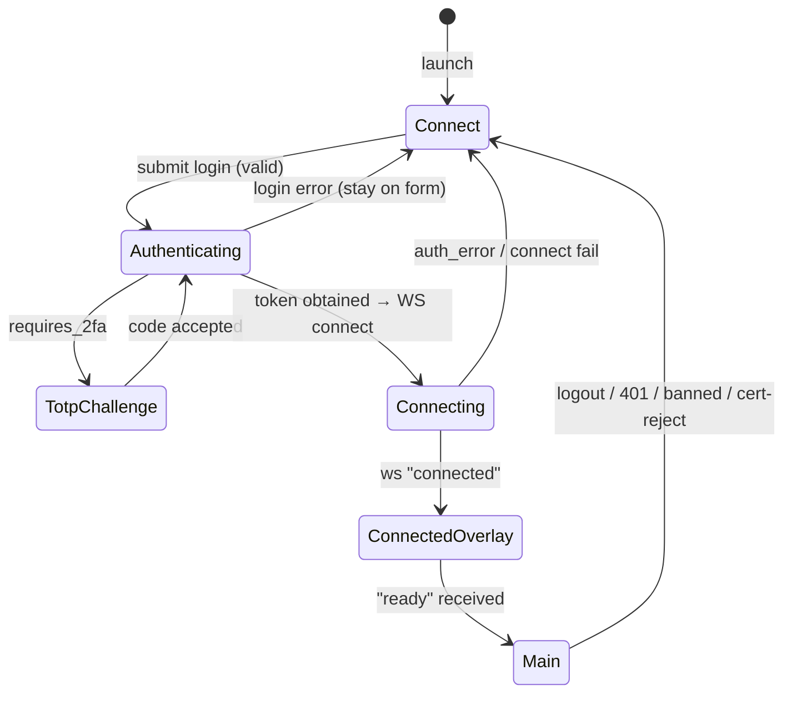
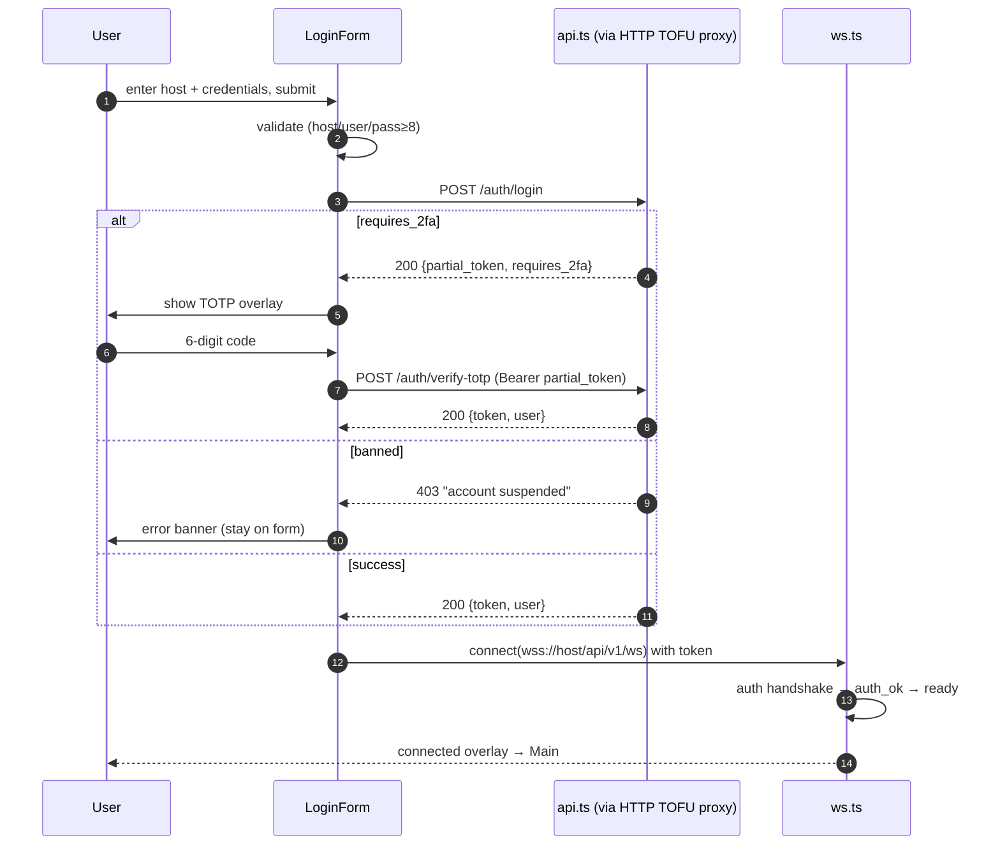
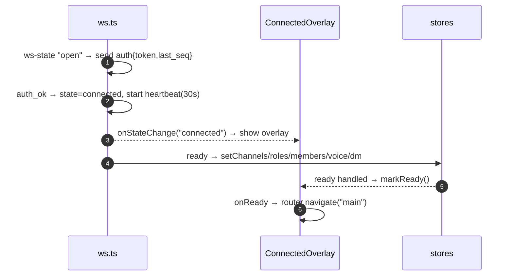
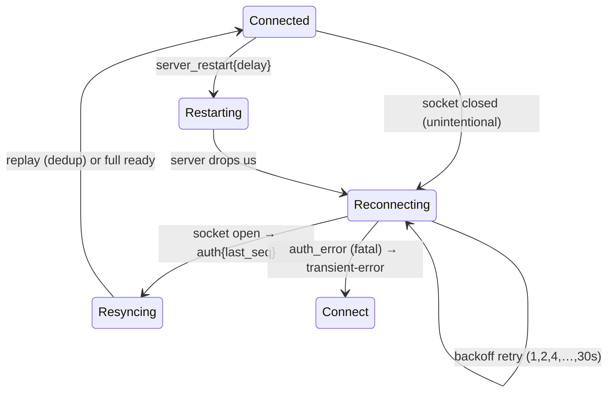
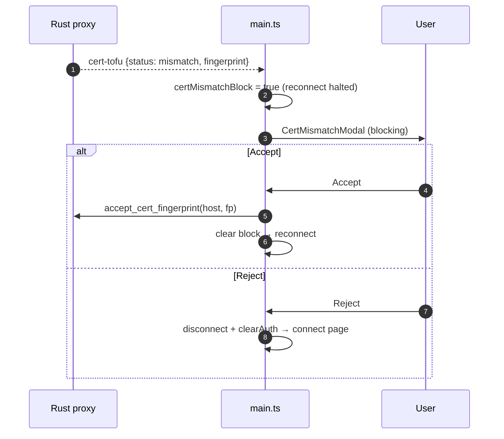

# Connection & Authentication — target UX

**Verified against:** commit `da4acc5`, 2026-07-19
Part of the [Client UX Specification](README.md). Shared vocabulary, feedback
primitives, and the error matrix live in the [README](README.md) and are not
repeated here.

Covers: app boot → server-profile selection → health → login / TOTP /
register-by-invite → the connected handshake → reconnect → cert-TOFU trust.

---

## 1. Boot & page model

The app is a two-page state machine (`lib/router.ts`: `connect | main`). The
router only tracks the page; `main.ts:renderPage` mounts/destroys the page DOM.

**Target rule:** the transition `Connect → Main` is gated by the **connected
overlay**, which resolves only on the `ready` event — never navigate to Main on a
bare socket-open. (Already the case: `main.ts:270-286`.) This guarantees Main
never renders against empty stores.

---

## 2. Connect page

Three regions: **server panel** (profiles + health), **login form**, and a
status area. Settings are reachable unauthenticated (for appearance/advanced).

### 2.1 Server profiles & health

| State | Trigger | Target reaction |
|-------|---------|-----------------|
| `loading` | Profile list resolving from the Rust store (`owncord:profiles`) | Skeleton rows; no flash of "no servers" |
| `ready` | Profiles loaded | List with per-profile health dot |
| `empty` | No saved profiles | "Add a server to get started" with an inline add affordance |
| health: reachable | `GET /api/v1/health` ok within 3 s | Green dot + server name/MOTD preview |
| health: unreachable | timeout/opaque error | Amber "unreachable" dot; **do not** block selecting it (user may still try) |

Health polls every 15 s (`profiles.ts`); auto-connect, if enabled for the active
profile, drives the login form's `auto-connecting` state.

### 2.2 Login form — state machine

The form is an explicit FSM: `idle | loading | totp | connecting | error |
auto-connecting` (`LoginForm.ts:12`). This is the model other views should
follow.

| State | Presentation | Exit |
|-------|--------------|------|
| `idle` | Enabled fields; Login/Register toggle | submit → validate |
| `loading` | Submit shows spinner, fields disabled (`LoginForm.ts:232-235,443-446`) | `auth.login` resolves |
| `totp` | 6-digit overlay, Verify/Cancel | code → `verifyTotp` |
| `connecting` | "Connecting…" while WS handshakes | ws `connected` |
| `auto-connecting` | Dedicated spinner card for saved-profile auto-login | any key/click cancels to `idle` |
| `error` | Shake-animated banner, server message capped 200 chars (`LoginForm.ts:590-606`) | user edits → `idle` |

**Client-side validation before any request** (`LoginForm.ts:536-560`): host,
username, password required; password ≥ 8; register mode also requires the invite
code. Validation failures never hit the network.

### 2.3 Login sequence

**Auth branches → reaction** (server `auth_handler.go`):

| Server result | Target reaction |
|---------------|-----------------|
| `200 {token, user}` | Proceed to WS connect |
| `200 {partial_token, requires_2fa}` | TOTP overlay; on cancel, clear the partial token (already cleared in `finally`, `main.ts:377-380`) |
| `403` banned/suspended | Error banner with the server message; remain on the form |
| `403` require-2FA-but-none-set | Error banner directing the user to set up 2FA on the web panel |
| `400` invalid input | Inline field error |
| `429` rate-limited | "Too many attempts — wait a moment." Keep entered username; re-enable after cooldown |

### 2.4 Register-by-invite

Same form, register mode reveals the invite field. `POST /auth/register` returns
a token directly → straight to WS connect (no separate login round-trip). Closed
registration / require-2FA policy → `403` shown as an error banner.

> **Note — first-run owner setup is not in this client.** `POST /admin/api/setup`
> is server-web-panel only; the Tauri client has no owner-setup UI
> (`admin/setup_handler.go`). If the target is to support standing up a server
> from the desktop app, that is a **new flow** (detect `GET /admin/api/setup/status`
> = no users → offer an owner-creation form) — currently out of scope, flagged
> here so the omission is a decision.

---

## 3. The connected handshake

**Target rule:** the ready overlay is the *only* full-screen blocker in the app.
It exists specifically so Main never renders mid-populate. Everything else
(message load, member load) uses in-region loading, not a global block.

---

## 4. Reconnect UX

The WS client auto-reconnects with exponential backoff (base 1 s, cap 30 s, no
jitter/cap; `ws.ts:123-126`), preserving `last_seq` for replay. The user-facing
contract:

| Phase | Target reaction |
|-------|-----------------|
| `reconnecting` | `ServerBanner.showReconnecting()` (already `MainPage.ts:199-211`); **live-only controls disable** via connection status (§3 of README); drafted input preserved |
| replay resync | Silent when the ring buffer covers `last_seq`; deduped so no double-render (`ws.ts:212-231`); unread suppressed during replay (`dispatcher.ts:195`) |
| full resync | If `last_seq` predates buffer coverage, server replays from the events table or forces a full `ready`; the UI simply re-populates — no user action |
| `server_restart` | `ServerBanner.showRestart(delay_seconds)` with a live countdown (`ServerBanner.ts:28-43`) |
| fatal (`auth_error`) | `intentionalClose`, transient-error store → connect page |

**Target rule:** reconnection is invisible on the happy path and honest on the
sad path. The user should never wonder whether the app is live — the banner and
the disabled live-controls answer it. This is where consolidating connection
status onto `ui.store` (README §3) pays off: the composer, voice controls, and
presence picker all disable *reactively* while reconnecting, instead of accepting
a click and failing.

---

## 5. Cert trust (TOFU) prompts

The Rust proxies pin the server cert on first use and emit `cert-tofu` events.
The HTTP proxy usually establishes the pin first (login precedes WS).

| Event | Target reaction | Current |
|-------|-----------------|---------|
| `trusted_first_use` | 8 s informational banner "Trusting this server's certificate" | Implemented ad hoc in `main.ts:105-129` |
| `trusted` | No UI (silent, expected) | — |
| `mismatch` | **Blocking** `CertMismatchModal`: explain the fingerprint changed; **Accept** re-pins (`accept_cert_fingerprint`) + reconnects; **Reject** disconnects, `clearAuth()`, → connect page | Implemented `main.ts:133-164`; reconnect blocked until resolved (`certMismatchBlock`) |

**Target rule:** a cert mismatch is the one moment the client must *stop and ask*
— never auto-accept, never silently reconnect. This is correct today; the spec
locks it.

---

## 6. Logout & session lifecycle

| Trigger | Target behavior |
|---------|-----------------|
| User logout | best-effort `POST /auth/logout` (fire-and-forget) → `clearAuth()` → leave voice, disconnect WS, delete stored credential for the host, → connect page |
| 401 anywhere | Same as logout, with "Your session expired — sign in again." |
| WS `BANNED` | Transient-error → connect page, no reconnect |
| Cert reject | Disconnect → connect page |

> **✓ Resolved 2026-07-20 — server session revoked on logout.** User-initiated
> logout now calls `api.logout()` (`POST /auth/logout`) via the `logout()` helper
> (`src/lib/logout.ts`), wired into the settings Log Out button
> (`MainPage.ts` → `logout(api)`). The revocation is strictly best-effort:
> fire-and-forget with its rejection swallowed, so a slow/offline/rejecting
> server never blocks or delays the local teardown — `clearAuth()` always runs
> synchronously. The credential is still deleted locally (`main.ts`), and the
> server token is now invalidated too.

---

## Source of truth

`src/lib/router.ts`, `src/main.ts`, `src/pages/ConnectPage.ts`,
`src/pages/connect-page/LoginForm.ts`, `src/lib/ws.ts`, `src/lib/api.ts`,
`src/lib/httpProxy.ts`, `src/components/ConnectedOverlay.ts`,
`src/components/ServerBanner.ts`, `src/components/CertMismatchModal.ts`,
`src-tauri/src/ws_proxy.rs`, `src-tauri/src/http_proxy.rs`;
server `Server/api/auth_handler.go`, `Server/api/totp_handler.go`.
