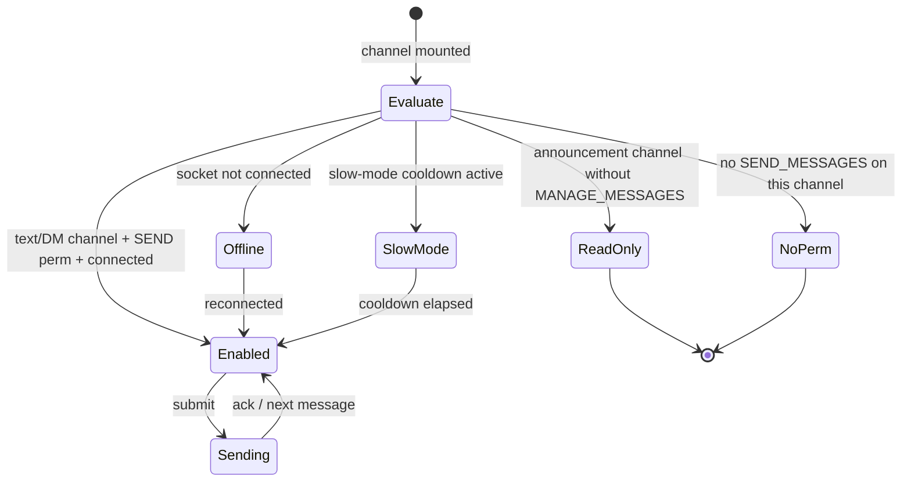
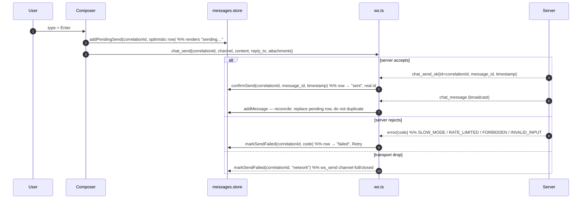

# Messaging — target UX

**Verified against:** commit `da4acc5`, 2026-07-19
Part of the [Client UX Specification](README.md). Shared vocabulary and the error
matrix live in the [README](README.md).

Covers the chat surface: loading history, the composer, sending (optimistic),
edit/delete, reactions, attachments, replies, pins, search, read/unread,
slow-mode, and announcement read-only gating.

---

## 1. Message list — states

The list renders from `messages.store` (`messagesByChannel`, capped 500/channel).

| State | Trigger | Target reaction |
|-------|---------|-----------------|
| `loading` | Channel opened, history fetch in flight, nothing cached | **In-region loading placeholder** in the message area |
| `ready` | Messages present | Virtualized list |
| `empty` | Loaded, zero messages | "This is the beginning of #channel." welcome state (already `MessageList.ts:109-125`) |
| `loading older` | Scroll-to-top with `hasMore` | Top spinner while `prependMessages` resolves (already `MessageList.ts:459-468`) |
| `error` | History fetch failed | **Inline section error + Retry** in the message area |

> **⚠ Current gap — no loading state on history fetch.** `MessageController.loadMessages`
> fetches silently; there is no placeholder in the message slot, only the
> post-render empty state or a toast on failure (`MessageController.ts:73-97`).
> Target: show an in-region loading placeholder while the first page loads, and
> an inline **Retry** on failure instead of a transient toast.

---

## 2. Composer — permission & connection gating

This is the spec's canonical example of **permission-as-affordance**. The
composer must reflect, *before the user types or sends*, whether posting is
possible.

| Composer state | Presentation | Reason shown |
|----------------|--------------|--------------|
| `enabled` | Editable textarea, attach + pickers active | — |
| `read-only` (announcement, no MANAGE_MESSAGES) | Textarea replaced by a disabled bar | "Only moderators can post in announcement channels." |
| `no-permission` | Disabled bar | "You don't have permission to send messages here." |
| `offline` | Disabled, "Reconnecting…" | connection status (README §3) |
| `slow-mode` | Disabled with a live countdown | "Slow mode: wait Ns." |
| `uploading` | Send disabled until uploads settle (already `MessageInput.ts:138-141`) | per-attachment spinner |

> **✓ Implemented (2026-07).** The server sends an authoritative per-channel
> `can_send` in the ready payload (`ws/serve.go` `channelCanSend`, mirroring
> `MessageService.checkSendPermission`: READ|SEND, plus MANAGE_MESSAGES for
> announcement, admin bypass, channel overrides). `channels.store` carries it as
> `Channel.canSend`; `MessageInput.setDisabled(reason)` disables the composer
> with a visible reason, and `ChannelController` derives that reason from
> `can_send` + channel type + connection status. Older servers that omit
> `can_send` default permissive. Remaining: slow-mode countdown (see §8) and DM
> block-state gating (handled today via the failed-row path in §3).

---

## 3. Sending — optimistic lifecycle

**Target: send is optimistic.** On submit, the message renders immediately in a
`pending` state, then reconciles against the server.

| Optimistic state | Presentation | Transition |
|------------------|--------------|------------|
| `pending` | Row shown dimmed with a subtle "sending" affordance | `chat_send_ok` → `sent`; error → `failed` |
| `sent` | Normal row; the subsequent `chat_message` broadcast reconciles (same `id`), never duplicates | — |
| `failed` | Row marked failed with **Retry** and **Delete draft**; content preserved | Retry re-sends with a new correlation id |

**Reconciliation contract:** the correlation id (`ws.ts` per-send UUID, echoed as
`chat_send_ok.id`) is the join key. `addMessage` from the broadcast must detect an
existing pending/sent row for that id and replace-in-place rather than append.

> **✓ Implemented (2026-07).** `messages.store` now has `addOptimisticMessage`
> (pending row), `confirmSend` (stamps the real id + "sent" on the `chat_send_ok`
> ack), `markSendFailed`, and `removeOptimistic`; `addMessage` reconciles the
> broadcast by real id (idempotent, replay-safe) with a defensive author match.
> `ChannelController.performSend` renders the pending row and `MessageList`
> shows pending (dimmed) and failed (reason + **Retry** / **Delete**) states.
> Failures are precise: the server now echoes the request id on error replies
> (`ws/handlers.go` → `buildErrorMsgWithID`), so the dispatcher's `error` handler
> maps `SLOW_MODE` / `FORBIDDEN` / `RATE_LIMITED` / `BAD_REQUEST` to the exact
> row (`dispatcher.ts`), and an offline send is shown failed rather than dropped.

---

## 4. Edit / delete

| Action | Target UX |
|--------|-----------|
| Edit (own message) | Inline edit in the composer (`startEdit`, `MessageInput.ts`); optimistic content swap; `chat_edited` reconciles + stamps "edited"; failure rolls back with a toast |
| Delete (own / moderator) | **Two-click confirm** on the row (`PendingDeleteManager`, `MessageController.ts:32-54`); optimistic tombstone; `chat_deleted` confirms; failure restores the row + toast |
| Delete (no permission) | The delete affordance is not offered on others' messages unless the user has MANAGE_MESSAGES |

Deleted messages are soft-deleted (kept as a tombstone in the array, `deleted:true`)
so surrounding context and reply references stay intact.

---

## 5. Reactions

| Action | Target UX |
|--------|-----------|
| Add/remove reaction | Optimistic pill toggle + count adjustment, reflecting `me`; `reaction_update` echo reconciles; failure rolls the pill back |
| Emoji picker | `EmojiPicker` with recent-emoji memory (`owncord:recent-emoji`) |

> Current: reactions render only from the server `reaction_update` echo
> (`messages.store.ts:282`); there is no local optimistic toggle. Target adds the
> optimistic toggle for immediacy, consistent with §3.

---

## 6. Attachments

The composer supports file attach with client-side validation and per-item
upload state (already thorough — `MessageInput.ts`).

| State | Presentation |
|-------|--------------|
| selected | Thumbnail/chip per file |
| validating | Reject oversize/disallowed type inline via `showUploadError` (`MessageInput.ts:114-129`) |
| uploading | Per-item spinner; **send disabled** until all settle (`MessageInput.ts:243-247`) |
| uploaded | Chip ready; ids attached to the `chat_send` payload |
| failed | Inline error on the chip with remove/retry |

Upload goes through `POST /uploads` (multipart). **Target:** `uploadFile` should
honor the global 401 handler like other calls (today it does not — `api.ts:380-383`).

---

## 7. Replies, pins, search, read/unread

| Feature | Target UX |
|---------|-----------|
| Reply | Reply target chip above the composer (`setReplyTo`/`clearReply`); `reply_to` sent; rendered as a quoted preview |
| Pin/unpin | Optimistic (`setMessagePinned`, already optimistic `messages.store.ts:226-240`); pinned panel lists them, empty state "No pinned messages" (already `PinnedMessages.ts:81-89`) |
| Search | Overlay with a status line cycling *type-N-chars → searching → results → no results → failed* (already thorough `SearchOverlay.ts:123-145`); abort in-flight on new query |
| Read/unread | Unread badge per channel; cleared on focus (`setActiveChannel`); incremented only for non-active, non-own, non-replay messages (`dispatcher.ts:195`); focus emits `channel_focus` for server read-state |

**Read-state target rule:** unread counts must be suppressed during reconnect
replay (already handled via `isReplaying()`), so catching up 500 buffered
messages doesn't light every channel red.

---

## 8. Slow-mode

Server enforces per-channel slow-mode. **Target:** after a successful send in a
slow-mode channel, disable the composer with a live countdown (derived from the
channel's `slow_mode` seconds) and re-enable at zero; on a WS `SLOW_MODE`
rejection, snap the composer to the countdown state without dropping the drafted
text.

> **Partially implemented (2026-07).** `SLOW_MODE` errors are now surfaced: they
> mark the optimistic row failed with a "Slow mode — wait before sending again"
> reason and a **Retry** (via the request-id error correlation in §3). The live
> **countdown** in the composer is still outstanding — it needs the channel's
> `slow_mode` seconds, which the ready payload does not yet carry.

---

## Note — effective per-channel permissions (resolved)

§2's composer gating needs the user's **effective permission on the active
channel** (base role ± channel overrides, with the announcement MANAGE_MESSAGES
rule). This was resolved by **option (a)**: the server sends an authoritative
per-channel `can_send` in the ready payload, computed by `channelCanSend`
(`ws/serve.go`) as a mirror of `MessageService.checkSendPermission`. The client
consumes it directly rather than re-deriving permission math, so overrides and
the announcement rule are always correct. The delete affordance (§4) remains
role-name based; tightening it to effective per-channel permission could reuse
the same signal in future.

---

## Source of truth

`src/components/MessageList.ts` (+ `message-list/`), `src/components/MessageInput.ts`
(+ `message-input/`), `src/pages/main-page/ChannelController.ts`,
`src/pages/main-page/MessageController.ts`, `src/pages/main-page/ReactionController.ts`,
`src/stores/messages.store.ts`, `src/lib/dispatcher.ts`, `src/lib/ws.ts`,
`src/components/SearchOverlay.ts`, `src/components/PinnedMessages.ts`;
server `Server/service/message.go`, `Server/ws/handlers_chat.go`.
