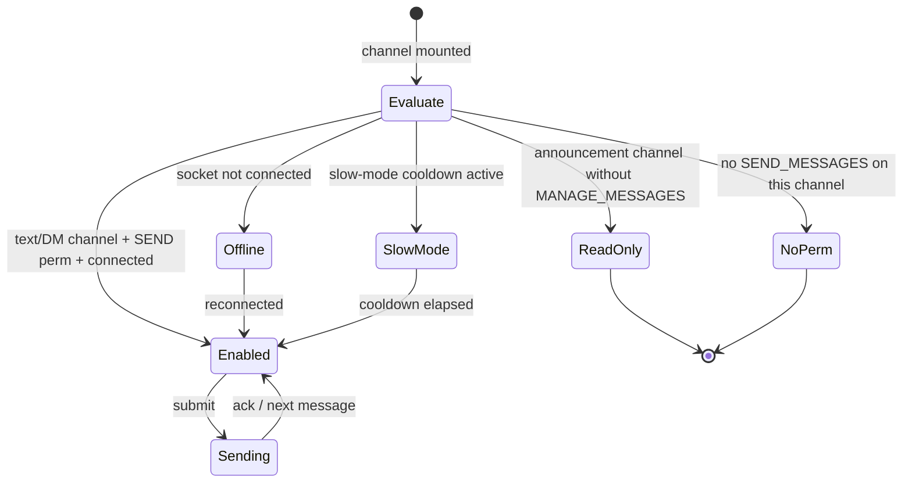

# Messaging — target UX

**Verified against:** commit `5630aa1`, 2026-08-04
Part of the [Client UX Specification](README.md). Shared vocabulary and the error
matrix live in the [README](README.md).

Covers the chat surface: loading history, the composer, sending (optimistic),
edit/delete, reactions, attachments, replies, pins, search, read/unread,
slow-mode, and announcement read-only gating.

---

## 1. Message list — states

The list renders from `messages.store` (`messagesByChannel`, capped 500/channel).

| State | Trigger | Target reaction |
|-------|---------|-----------------|
| `loading` | Channel opened, history fetch in flight, nothing cached | **In-region loading placeholder** in the message area |
| `ready` | Messages present | Virtualized list |
| `empty` | Loaded, zero messages | "This is the beginning of #channel." welcome state (already `renderEmptyState()`, `components/MessageList.ts`) |
| `loading older` | Scroll-to-top with `hasMore` | Top spinner while `prependMessages` resolves (already the scroll-top `hasMore` branch of `handleScroll()`, `components/MessageList.ts`) |
| `error` | History fetch failed | **Inline section error + Retry** in the message area |

> **✓ Implemented (2026-07).** `messages.store` tracks a per-channel
> `historyLoadState` (`loading` / `error`, absent = idle); `loadMessages` sets it
> synchronously before the fetch and `setMessages` clears it. With no rows,
> `MessageList` renders the matching region state: a `.messages-loading` spinner
> placeholder, or `.messages-load-error` with an inline **Retry** button
> (`onRetryLoad` re-invokes `loadMessages`) — no toast. The welcome/empty state
> renders only once the channel is actually loaded and empty.

---

## 2. Composer — permission & connection gating

This is the spec's canonical example of **permission-as-affordance**. The
composer must reflect, *before the user types or sends*, whether posting is
possible.



| Composer state | Presentation | Reason shown |
|----------------|--------------|--------------|
| `enabled` | Editable textarea, attach + pickers active | — |
| `read-only` (announcement, no MANAGE_MESSAGES) | Textarea replaced by a disabled bar | "Only moderators can post in announcement channels." |
| `no-permission` | Disabled bar | "You don't have permission to send messages here." |
| `offline` | Disabled — "Reconnecting…" while retrying, "Not connected" when disconnected | connection status (README §3) |
| `slow-mode` | Disabled with a live countdown | "Slow mode: wait Ns." |
| `uploading` | Send disabled until uploads settle (already the `pendingUploadCount` guard in `handleSend()`, `components/MessageInput.ts`) | per-attachment spinner |

> **✓ Implemented (2026-07).** The server sends an authoritative per-channel
> `can_send` in the ready payload (`ws/serve.go` `channelCanSend`, mirroring
> `MessageService.checkSendPermission`: READ|SEND, plus MANAGE_MESSAGES for
> announcement, admin bypass, channel overrides). `channels.store` carries it as
> `Channel.canSend`; `MessageInput.setDisabled(reason)` disables the composer
> with a visible reason, and `ChannelController` derives that reason from
> `can_send` + channel type + connection status. Older servers that omit
> `can_send` default permissive. The slow-mode countdown has since shipped too
> (see §8); DM block-state gating is handled via `dmComposerBlockReason` in the
> same composer-reason derivation.

---

## 3. Sending — optimistic lifecycle

**Target: send is optimistic.** On submit, the message renders immediately in a
`pending` state, then reconciles against the server.

```mermaid
sequenceDiagram
    autonumber
    participant U as User
    participant C as Composer
    participant S as messages.store
    participant WS as ws.ts
    participant SRV as Server
    U->>C: type + Enter
    C->>S: addPendingSend(correlationId, optimistic row)  %% renders "sending…"
    C->>WS: chat_send{correlationId, channel, content, reply_to, attachments}
    alt server accepts
        SRV-->>WS: chat_send_ok{id=correlationId, message_id, timestamp}
        WS->>S: confirmSend(correlationId, message_id, timestamp)  %% row → "sent", real id
        SRV-->>WS: chat_message (broadcast)
        WS->>S: addMessage — reconcile: replace pending row, do not duplicate
    else server rejects
        SRV-->>WS: error{code}  %% SLOW_MODE / RATE_LIMITED / FORBIDDEN / INVALID_INPUT
        WS->>S: markSendFailed(correlationId, code)  %% row → "failed", Retry
    else transport drop
        WS-->>S: markSendFailed(correlationId, code)  %% channel full → "NETWORK"; closed/not-open → "OFFLINE"
    end
```

| Optimistic state | Presentation | Transition |
|------------------|--------------|------------|
| `pending` | Row shown dimmed with a subtle "sending" affordance | `chat_send_ok` → `sent`; error → `failed` |
| `sent` | Normal row; the subsequent `chat_message` broadcast reconciles (same `id`), never duplicates | — |
| `failed` | Row marked failed with **Retry** and **Delete draft**; content preserved | Retry re-sends with a new correlation id |

**Reconciliation contract:** the correlation id (`ws.ts` per-send UUID, echoed as
`chat_send_ok.id`) is the join key. `addMessage` from the broadcast must detect an
existing pending/sent row for that id and replace-in-place rather than append.

> **✓ Implemented (2026-07).** `messages.store` now has `addOptimisticMessage`
> (pending row), `confirmSend` (stamps the real id + "sent" on the `chat_send_ok`
> ack), `markSendFailed`, and `removeOptimistic`; `addMessage` reconciles the
> broadcast by real id (idempotent, replay-safe) with a defensive author match.
> `ChannelController.performSend` renders the pending row and `MessageList`
> shows pending (dimmed) and failed (reason + **Retry** / **Delete**) states.
> Failures are precise: the server now echoes the request id on error replies
> (`ws/handlers.go` → `buildErrorMsgWithID`), so the dispatcher's `error` handler
> maps `SLOW_MODE` / `FORBIDDEN` / `RATE_LIMITED` / `BAD_REQUEST` to the exact
> row (`dispatcher.ts`), and an offline send is shown failed rather than dropped.
> The transport-drop arm is wired too: `ws.ts` notifies `onSendFailure(id, code)`
> when `ws_send` fails locally (channel full → `NETWORK`, closed/not-open →
> `OFFLINE`), and the dispatcher fails the matching pending row — fire-and-forget
> sends (typing, presence) have no pending entry and stay silent by design.

---

## 4. Edit / delete

| Action | Target UX |
|--------|-----------|
| Edit (own message) | Inline edit in the composer (`startEdit`, `MessageInput.ts`); optimistic content swap; `chat_edited` reconciles + stamps "edited"; failure rolls back with a toast |
| Delete (own / moderator) | **Two-click confirm** on the row (`createPendingDeleteManager()`, `pages/main-page/MessageController.ts`); optimistic tombstone; `chat_deleted` confirms; failure restores the row + toast |
| Delete (no permission) | The delete affordance is not offered on others' messages unless the user has MANAGE_MESSAGES |

Deleted messages are soft-deleted (kept as a tombstone in the array, `deleted:true`)
so surrounding context and reply references stay intact.

---

## 5. Reactions

| Action | Target UX |
|--------|-----------|
| Add/remove reaction | Optimistic pill toggle + count adjustment, reflecting `me`; `reaction_update` echo reconciles; failure rolls the pill back |
| Emoji picker | `EmojiPicker` with recent-emoji memory (`owncord:recent-emoji`) |

> **✓ Implemented (2026-08).** The pill toggles on the click:
> `ReactionController.sendReaction` applies the toggle locally
> (`addOptimisticReaction`, `stores/messages.store.ts`) under the send's WS
> envelope id — the same correlation scheme as §3's optimistic rows.
> `updateReaction` consumes the matching self-echo instead of re-applying it
> (the delta arithmetic would double-count), other users' echoes apply
> normally, and an error reply or transport failure rolls back exactly that
> toggle (`rollbackReaction`, wired in the dispatcher's error and
> send-failure handlers). The pill reverting is the failure feedback — no
> toast on top.

**Who reacted (✓ implemented 2026-08):** hovering (or focusing) a reaction pill
for 300 ms fetches the reactor list and shows a tooltip reading
*"alice, bob, carol and 4 others reacted with 👍"*. The debounce mirrors
`lib/streamPreview.ts` so a pointer crossing a row of pills fires no requests.
The list comes from `GET /channels/{id}/messages/{messageId}/reactions/{emoji}/users`
(oldest first, capped at 100 server-side) and is cached per message+emoji in
`message-list/reaction-tooltip.ts`; a `reaction_update` for that message evicts
every one of its lists, since the event names only the emoji that changed.
Usernames are inserted as text nodes — never markup.

---

## 6. Attachments

The composer supports file attach with client-side validation and per-item
upload state (already thorough — `MessageInput.ts`).

| State | Presentation |
|-------|--------------|
| selected | Thumbnail/chip per file |
| validating | Reject oversize/disallowed type inline via `showUploadError` (the `MAX_FILE_SIZE`/`ALLOWED_TYPES` validation in `handlePasteFile()`, `components/MessageInput.ts`) |
| uploading | Per-item spinner; **send disabled** until all settle (the per-item uploading preview in `handlePasteFile()` + the `handleSend()` upload guard, `components/MessageInput.ts`) |
| uploaded | Chip ready; ids attached to the `chat_send` payload |
| failed | Inline error on the chip with remove/retry |

Upload goes through `POST /uploads` (multipart). **✓ Implemented (2026-07):**
`uploadFile` now honors the global 401 handler like every other call — a 401
calls `onUnauthorized` (clearAuth → connect page with "Your session expired —
sign in again.") and throws `ApiClientError(401)`.

**Inline players (✓ implemented 2026-08):** a received attachment renders by MIME
family, not as a download chip for everything but images:

| MIME | Rendering |
|------|-----------|
| `image/*` except `image/svg+xml` | Inline `` (existing) |
| `video/mp4`, `video/webm`, `video/ogg` | Inline `<video controls preload="metadata">` in the same max box as an image, with the download button on hover |
| `audio/mpeg`/`mp3`, `audio/ogg`, `audio/opus`, `audio/wav`, `audio/webm` | Inline `<audio controls preload="metadata">` row with filename, size and download |
| anything else, including `image/svg+xml` | Download chip |

Both player families are allowlists, not `video/`/`audio/` prefix tests: an
unknown container gets a chip rather than a player that fails to decode. SVG is
excluded from every inline path because it can carry script.

`/api/v1/files/{id}` is permission-checked, so a player cannot point at the raw
URL. The source is fetched through the same cert-pinned proxy with the session
bearer token that images use, then handed over as a `blob:` URL — deliberately
not the image path's base64 data URI, which would inflate a 50 MB video into a
string and park it in the LRU + IndexedDB caches.

---

## 7. Replies, pins, search, read/unread

| Feature | Target UX |
|---------|-----------|
| Reply | Reply target chip above the composer (`setReplyTo`/`clearReply`); `reply_to` sent; rendered as a quoted preview |
| Pin/unpin | Optimistic (`setMessagePinned()`, already optimistic in `stores/messages.store.ts`); pinned panel lists them, empty state "This channel doesn't have any pinned messages… yet!" (already `renderEmptyState()`, `components/PinnedMessages.ts`) |
| Search | Overlay with a status line cycling *type-N-chars → searching → results → no results → failed* (already thorough: `doSearch()`/`setStatus()` in `components/SearchOverlay.ts`); abort in-flight on new query |
| Read/unread | Unread badge per channel; cleared on focus (`setActiveChannel`); incremented only for non-active, non-own, non-replay messages (the `chat_message` handler in `wireDispatcher()`, `lib/dispatcher.ts`); focus emits `channel_focus` for server read-state |

**Read-state target rule:** unread counts must be suppressed during reconnect
replay (already handled via `isReplaying()`), so catching up 500 buffered
messages doesn't light every channel red.

**New-messages divider (✓ implemented 2026-08):** opening a channel that had
unread messages renders a red **NEW** line above the first one. Opening the
channel clears the badge, which destroys the only record of where the reader had
got to, so `setActiveChannel` snapshots the count first
(`channels.store.getUnreadOnOpen`); MessageList reads it once at mount and places
the line above the last *N* loaded messages. Consequences of that derivation: the
line is suppressed while the message window is detached (a slice around some old
message is not the tail), and it clears on the next visit, when the snapshot is 0.
The message under the line never renders as a grouped continuation of the one
above it.

**Explicit mark-as-read (✓ implemented 2026-08):** the channel context menu gains
**Mark as Read** (disabled when the channel is already read, absent for voice
channels), and the sidebar's server header gains **Mark All as Read**, which
appears only while something is unread. Both go through `lib/read-state.ts`,
which sends the `mark_read` WS message and clears the local badges. `mark_read`
rather than `channel_focus`: focus also rebinds the connection's focused channel,
which would misroute unread bookkeeping for the channel actually on screen.

**DM badges (✓ implemented 2026-08):** the DM sidebar renders the real unread
count (and a red mention count that outranks it) instead of a bare dot. The ready
payload's `dm_channels[]` now carries `mention_count` — `GetChannelUnreadCounts`
includes the caller's DM rows — so a DM mention badge survives a reconnect
instead of resetting to 0.

---

## 7a. Jumping to a message

Every affordance that can jump — a search hit, a pinned entry, the quoted
reply bar above a reply, an `owncord://message/…` permalink pasted into chat or
opened from the OS — goes through one path (`lib/message-navigation.ts`
registry → `main-page/MessageJump.ts`), so they behave identically.

| Step | Target UX |
|------|-----------|
| Target loaded | Scroll to the row and flash it (`.highlight-flash`, 1.5s) |
| Target not loaded | Fetch `GET /channels/{id}/messages/around/{messageId}`, replace the channel's window with it, then scroll + flash |
| Target in another channel | Open that channel first, then the above — the jumper owns the switch so the fetch is sequenced after it, not racing it |
| Channel not visible / message deleted | Toast and stay put; never blank the chat area on an unresolvable link |

**Detached windows.** An around-window whose `has_more_after` is true is
*detached*: the bottom of the list is history, not "now". While detached the
store refuses to append live broadcasts (they belong below a gap, and splicing
them on would be a lie about ordering) and the message list shows a **Jump to
Present** pill. Clicking it reattaches and refetches the live tail. Scrolling
further up (`prependMessages`) keeps the window detached; only a fresh tail
fetch reattaches.

**Permalinks.** The hover action bar's *Copy Message Link* yields
`owncord://message/{channelId}/{messageId}`. Pasted back into chat, that link
renders as a compact chip (channel name + *Jump*) rather than a bare URL; a
link to a channel the reader cannot see stays plain text.

---

## 7b. Mentions

The server resolves mentions at send time and ships `mentions` (user IDs) +
`mentions_everyone` on `chat_message`, `chat_edited` and REST history, plus a
per-channel `mention_count` in `ready`. The client treats those fields as
authoritative and only falls back to parsing `@tokens` locally when an older
server omits them.

| Surface | Target UX |
|---------|-----------|
| `@username` | Highlighted **only** when it resolves — against the server's `mentions` list or `membersStore` (case-insensitive). An unresolvable `@nobody`, an email local part (`mail@example`) or an address-shaped `@bob@example.com` stays plain text |
| `@everyone` / `@here` | Highlighted only when `mentions_everyone` is true; a sender without `MENTION_EVERYONE` produces ordinary text with no mention semantics anywhere in the client |
| Mention of *you* | The `@token` gets `.mention-self` **and** the whole row gets `.mentioned` (left accent + tinted background) |
| `#channel-name` | Rendered as a clickable chip when the name resolves in `channelsStore` (DM channels excluded); click / Enter routes through `navigateToChannel`, the same activation path the sidebar and quick switcher use |
| Channel badge | `mentionCount` per channel, seeded from `ready`, incremented on an incoming `chat_message` that mentions you, cleared on activation alongside unread. The red `.mention-badge` replaces the plain unread badge — never both on one row |
| Notification | "*X* mentioned you in #channel" for a direct mention or an honoured `@everyone`. The **Suppress @everyone** preference drops only `mentions_everyone`-driven notifications; a message that also names you still notifies. DND still silences the popup and the chime |
| Composer | Typing `@` opens `MentionAutocomplete` (up/down/enter/tab/escape), filtered by username; `@everyone`/`@here` appear only when your role holds `MENTION_EVERYONE`. Selection inserts `@username ` and the popup owns Enter so a half-typed mention never sends |

**Editing rule:** an edit re-resolves mentions (the row's highlight follows the
new text) but never re-notifies and never re-increments a badge — that is
enforced server-side and mirrored here by never incrementing off `chat_edited`.

---

## 7c. Markdown

Message text is rendered as Discord-flavoured markdown. Parsing is entirely
client-side — the server stores and ships the raw text — and the renderer
builds DOM nodes only: `innerHTML` is never used with message content, and
every `href` passes `isSafeUrl` first.

| Construct | Syntax | Notes |
|-----------|--------|-------|
| Bold / italic / underline / strike | `**b**`, `*i*` or `_i_`, `__u__`, `~~s~~` | Nest freely (`**bold *and italic***`). `_` only opens on a word boundary, so `snake_case_names` stay literal |
| Spoiler | `\|\|hidden\|\|` | Obscured `role="button"` span with `aria-pressed`; revealing is per-span and one-way, and the revealing click is swallowed so a link underneath cannot open with it |
| Escape | `\*literal\*` | A backslash neutralises any markdown punctuation; escapes are inert inside code |
| Block quote | `> line` at line start | Contiguous `>` lines merge into one quote; `>>>` quotes the rest of the message. Quotes may contain other blocks, one level deep |
| Heading | `# `, `## `, `### ` at line start | h1–h3; the space is required, so `#nospace` and `#channel` are untouched |
| Lists | `- ` / `* ` bullets, `1. ` ordered | Contiguous items form one list; two leading spaces nest a single level; an ordered list keeps its starting number |
| Masked link | `[text](url)` | `http(s)` absolute URLs only — `javascript:`, `data:` and relative URLs render as literal source text. Shows `title=url`, and produces **no** link embed (an author who hid the address does not get it previewed back) |
| Inline code | `` `code` ``, ``` ``code`` ``` | Markdown, mentions and autolinking are all dead inside |
| Code fence | ` ```lang ` … ` ``` ` | The tag renders as a label and selects a lightweight highlighter (js/ts, go, python, rust, json, bash, css, html — anything else falls back to plain). Copy button unchanged |

Bare URLs are still autolinked, and mention/`#channel` chips render inside
styled spans — a URL's own `_` and `*` are treated as address, not markup.

**Composer:** Ctrl+B / Ctrl+I / Ctrl+U wrap the selection in `**`, `*` and
`__` (and unwrap it when it is already wrapped); with an empty selection the
markers are inserted around the caret. The composer stops propagation on those
keys, so Ctrl+U formats while typing and only opens the file picker when the
message box does not have focus.

---

## 8. Slow-mode

Server enforces per-channel slow-mode. **Target:** after a successful send in a
slow-mode channel, disable the composer with a live countdown (derived from the
channel's `slow_mode` seconds) and re-enable at zero; on a WS `SLOW_MODE`
rejection, snap the composer to the countdown state without dropping the drafted
text.

> **✓ Implemented (2026-07/08).** `SLOW_MODE` errors mark the optimistic row
> failed with a "Slow mode — wait before sending again" reason and a **Retry**
> (via the request-id error correlation in §3). The live countdown exists too:
> the ready payload carries per-channel `slow_mode` seconds
> (`Channel.slowMode` in `channels.store`), and `ChannelController`'s
> `startSlowMode`/`computeComposerReason` disable the composer with a ticking
> "Slow mode — Ns" reason after each accepted send (`chat_send_ok`) and snap
> to the full window on a `SLOW_MODE` rejection — without dropping the drafted
> text (the draft stays in the textarea). Moderators (`canManageMessages`)
> bypass the client gate exactly as they bypass the server's limiter.

---

## Note — effective per-channel permissions (resolved)

§2's composer gating needs the user's **effective permission on the active
channel** (base role ± channel overrides, with the announcement MANAGE_MESSAGES
rule). This was resolved by **option (a)**: the server sends an authoritative
per-channel `can_send` in the ready payload, computed by `channelCanSend`
(`ws/serve.go`) as a mirror of `MessageService.checkSendPermission`. The client
consumes it directly rather than re-deriving permission math, so overrides and
the announcement rule are always correct. The delete affordance (§4) remains
role-name based; tightening it to effective per-channel permission could reuse
the same signal in future.

---

## Source of truth

`src/components/MessageList.ts` (+ `message-list/`), `src/components/MessageInput.ts`,
`src/pages/main-page/ChannelController.ts`,
`src/pages/main-page/MessageController.ts`, `src/pages/main-page/ReactionController.ts`,
`src/stores/messages.store.ts`, `src/lib/dispatcher.ts`, `src/lib/ws.ts`,
`src/components/SearchOverlay.ts`, `src/components/PinnedMessages.ts`,
`src/components/MentionAutocomplete.ts`, `src/lib/mentions.ts`,
`src/components/message-list/content-parser.ts` (+ `markdown.ts`,
`syntax-highlight.ts`),
`src/lib/channel-navigation.ts`, `src/lib/notifications.ts`;
server `Server/service/message.go`, `Server/service/mentions.go`,
`Server/ws/handlers_chat.go`.
