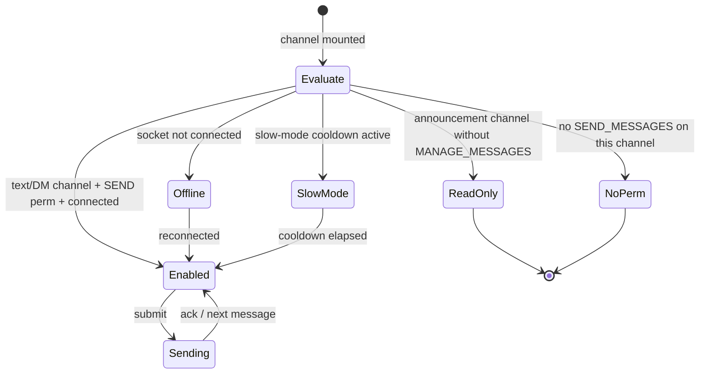
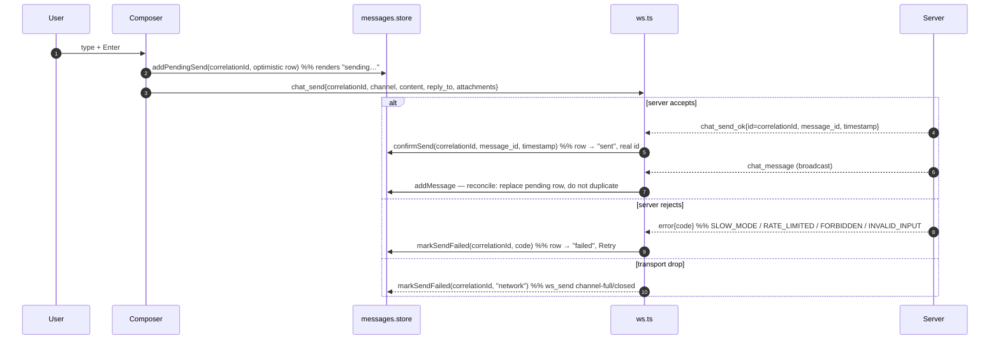

# Messaging — target UX

**Verified against:** commit `da4acc5`, 2026-07-19
Part of the [Client UX Specification](README.md). Shared vocabulary and the error
matrix live in the [README](README.md).

Covers the chat surface: loading history, the composer, sending (optimistic),
edit/delete, reactions, attachments, replies, pins, search, read/unread,
slow-mode, and announcement read-only gating.

---

## 1. Message list — states

The list renders from `messages.store` (`messagesByChannel`, capped 500/channel).

| State | Trigger | Target reaction |
|-------|---------|-----------------|
| `loading` | Channel opened, history fetch in flight, nothing cached | **In-region loading placeholder** in the message area |
| `ready` | Messages present | Virtualized list |
| `empty` | Loaded, zero messages | "This is the beginning of #channel." welcome state (already `MessageList.ts:109-125`) |
| `loading older` | Scroll-to-top with `hasMore` | Top spinner while `prependMessages` resolves (already `MessageList.ts:459-468`) |
| `error` | History fetch failed | **Inline section error + Retry** in the message area |

> **⚠ Current gap — no loading state on history fetch.** `MessageController.loadMessages`
> fetches silently; there is no placeholder in the message slot, only the
> post-render empty state or a toast on failure (`MessageController.ts:73-97`).
> Target: show an in-region loading placeholder while the first page loads, and
> an inline **Retry** on failure instead of a transient toast.

---

## 2. Composer — permission & connection gating

This is the spec's canonical example of **permission-as-affordance**. The
composer must reflect, *before the user types or sends*, whether posting is
possible.

| Composer state | Presentation | Reason shown |
|----------------|--------------|--------------|
| `enabled` | Editable textarea, attach + pickers active | — |
| `read-only` (announcement, no MANAGE_MESSAGES) | Textarea replaced by a disabled bar | "Only moderators can post in announcement channels." |
| `no-permission` | Disabled bar | "You don't have permission to send messages here." |
| `offline` | Disabled, "Reconnecting…" | connection status (README §3) |
| `slow-mode` | Disabled with a live countdown | "Slow mode: wait Ns." |
| `uploading` | Send disabled until uploads settle (already `MessageInput.ts:138-141`) | per-attachment spinner |

> **⚠ Current gap — the composer has no permission/read-only mode.**
> `MessageInput` always renders an enabled textarea (`MessageInput.ts:379-384`);
> the only disabled control is the attach button when uploads aren't wired. There
> is **no** client gating for announcement channels, missing `SEND_MESSAGES`, or
> slow-mode — even though the server enforces all three (announcement requires
> MANAGE_MESSAGES since D1; `ChannelType` `"announcement"` is already threaded to
> `mountChannel`, `ChannelController.ts:114`, but unused). Today the only
> send-time block is "not connected", surfaced as a toast *after* the click
> (`ChannelController.ts:200-204`). Target: derive composer state from
> `permissions` + channel type + connection status and disable with a reason,
> so a forbidden send is never attempted. This needs the client to know the
> user's effective per-channel permission — see the note at the end.

---

## 3. Sending — optimistic lifecycle

**Target: send is optimistic.** On submit, the message renders immediately in a
`pending` state, then reconciles against the server.

| Optimistic state | Presentation | Transition |
|------------------|--------------|------------|
| `pending` | Row shown dimmed with a subtle "sending" affordance | `chat_send_ok` → `sent`; error → `failed` |
| `sent` | Normal row; the subsequent `chat_message` broadcast reconciles (same `id`), never duplicates | — |
| `failed` | Row marked failed with **Retry** and **Delete draft**; content preserved | Retry re-sends with a new correlation id |

**Reconciliation contract:** the correlation id (`ws.ts` per-send UUID, echoed as
`chat_send_ok.id`) is the join key. `addMessage` from the broadcast must detect an
existing pending/sent row for that id and replace-in-place rather than append.

> **⚠ Current gap — sending is not optimistic and acks are dropped.** The send
> path fires `chat_send` and does nothing locally; the message appears only when
> the server's `chat_message` broadcast arrives (`ChannelController.ts:199-214`,
> `dispatcher.ts:174-218`). The `pendingSends`/`addPendingSend`/`confirmSend`
> machinery already exists in `messages.store.ts` (`:243-258`) but `addPendingSend`
> has **zero callers**, and `confirmSend` discards the real `message_id`/`timestamp`
> (`messages.store.ts:252`). Transport backpressure ("channel full") is dropped
> silently (`ws.ts:432-437`), and rejection codes other than
> RATE_LIMITED/FORBIDDEN/BANNED are ignored (`dispatcher.ts:433-436`). Target:
> wire the existing pending-send machinery into an optimistic row with
> pending/sent/failed states and a Retry — the store scaffolding is already there.

---

## 4. Edit / delete

| Action | Target UX |
|--------|-----------|
| Edit (own message) | Inline edit in the composer (`startEdit`, `MessageInput.ts`); optimistic content swap; `chat_edited` reconciles + stamps "edited"; failure rolls back with a toast |
| Delete (own / moderator) | **Two-click confirm** on the row (`PendingDeleteManager`, `MessageController.ts:32-54`); optimistic tombstone; `chat_deleted` confirms; failure restores the row + toast |
| Delete (no permission) | The delete affordance is not offered on others' messages unless the user has MANAGE_MESSAGES |

Deleted messages are soft-deleted (kept as a tombstone in the array, `deleted:true`)
so surrounding context and reply references stay intact.

---

## 5. Reactions

| Action | Target UX |
|--------|-----------|
| Add/remove reaction | Optimistic pill toggle + count adjustment, reflecting `me`; `reaction_update` echo reconciles; failure rolls the pill back |
| Emoji picker | `EmojiPicker` with recent-emoji memory (`owncord:recent-emoji`) |

> Current: reactions render only from the server `reaction_update` echo
> (`messages.store.ts:282`); there is no local optimistic toggle. Target adds the
> optimistic toggle for immediacy, consistent with §3.

---

## 6. Attachments

The composer supports file attach with client-side validation and per-item
upload state (already thorough — `MessageInput.ts`).

| State | Presentation |
|-------|--------------|
| selected | Thumbnail/chip per file |
| validating | Reject oversize/disallowed type inline via `showUploadError` (`MessageInput.ts:114-129`) |
| uploading | Per-item spinner; **send disabled** until all settle (`MessageInput.ts:243-247`) |
| uploaded | Chip ready; ids attached to the `chat_send` payload |
| failed | Inline error on the chip with remove/retry |

Upload goes through `POST /uploads` (multipart). **Target:** `uploadFile` should
honor the global 401 handler like other calls (today it does not — `api.ts:380-383`).

---

## 7. Replies, pins, search, read/unread

| Feature | Target UX |
|---------|-----------|
| Reply | Reply target chip above the composer (`setReplyTo`/`clearReply`); `reply_to` sent; rendered as a quoted preview |
| Pin/unpin | Optimistic (`setMessagePinned`, already optimistic `messages.store.ts:226-240`); pinned panel lists them, empty state "No pinned messages" (already `PinnedMessages.ts:81-89`) |
| Search | Overlay with a status line cycling *type-N-chars → searching → results → no results → failed* (already thorough `SearchOverlay.ts:123-145`); abort in-flight on new query |
| Read/unread | Unread badge per channel; cleared on focus (`setActiveChannel`); incremented only for non-active, non-own, non-replay messages (`dispatcher.ts:195`); focus emits `channel_focus` for server read-state |

**Read-state target rule:** unread counts must be suppressed during reconnect
replay (already handled via `isReplaying()`), so catching up 500 buffered
messages doesn't light every channel red.

---

## 8. Slow-mode

Server enforces per-channel slow-mode. **Target:** after a successful send in a
slow-mode channel, disable the composer with a live countdown (derived from the
channel's `slow_mode` seconds) and re-enable at zero; on a WS `SLOW_MODE`
rejection, snap the composer to the countdown state without dropping the drafted
text.

> **⚠ Current gap.** `SLOW_MODE` errors are received but ignored
> (`dispatcher.ts:433-436`); there is no countdown UI. Part of the composer-state
> work in §2.

---

## Note — the client needs effective per-channel permissions

Several targets here (§2 composer gating, §4 delete affordance) require the client
to know the user's **effective permission on the active channel** (base role bits
± channel overrides, with the announcement-channel MANAGE_MESSAGES rule). The
client currently receives roles (`ready.roles`) and member roles but does **not**
compute effective per-channel permissions the way the server does
(`Server/permissions`). Delivering the gated composer cleanly likely means either
(a) the server sending a per-channel `can_send`/`permissions` hint (e.g. on
`ready`/`channel_focus`), or (b) porting the permission-bit evaluation to the
client. This is a prerequisite decision for §2 and is flagged as such rather than
hand-waved.

---

## Source of truth

`src/components/MessageList.ts` (+ `message-list/`), `src/components/MessageInput.ts`
(+ `message-input/`), `src/pages/main-page/ChannelController.ts`,
`src/pages/main-page/MessageController.ts`, `src/pages/main-page/ReactionController.ts`,
`src/stores/messages.store.ts`, `src/lib/dispatcher.ts`, `src/lib/ws.ts`,
`src/components/SearchOverlay.ts`, `src/components/PinnedMessages.ts`;
server `Server/service/message.go`, `Server/ws/handlers_chat.go`.
