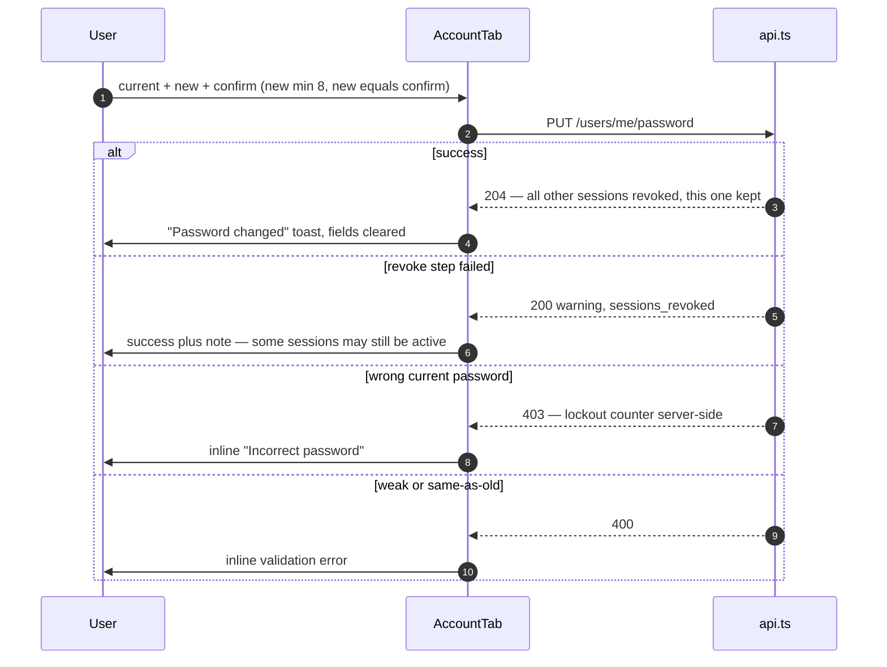
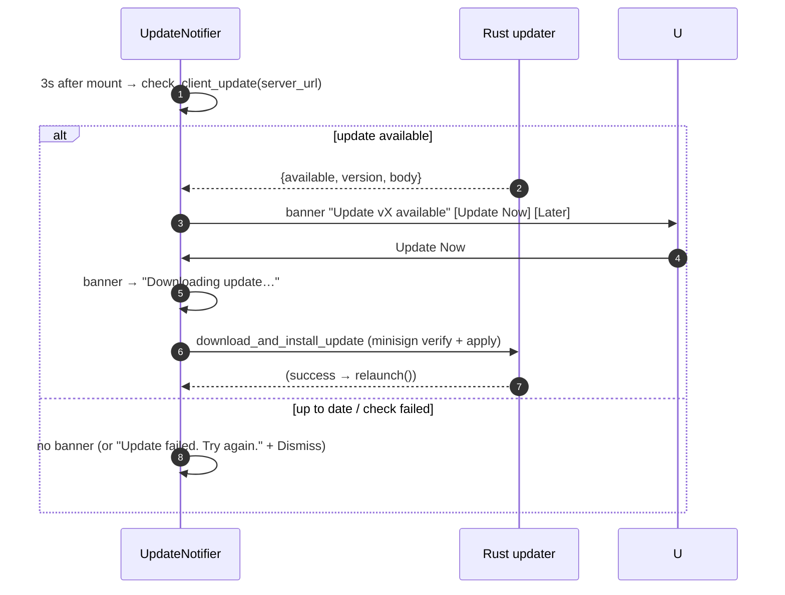

# Settings & Admin — target UX

**Verified against:** commit `5630aa1`, 2026-08-04
Part of the [Client UX Specification](README.md).

Covers: the settings overlay and its tabs, account operations (profile, password,
2FA, delete), appearance/theming, the client's **inline** admin surface (ban/kick/
roles, channel CRUD, invites), and the updater. It also marks the boundary
between what the desktop client does and what lives only on the server web panel.

---

## 1. Settings overlay

A tabbed overlay (`SettingsOverlay`) available both authenticated (in Main) and
unauthenticated (on Connect, for appearance/advanced). Tabs: Account,
Appearance, Notifications, Text & Images, Accessibility, Voice & Audio, Keybinds,
Advanced, Logs.

**Target rules:**

- Every save is confirmed: a toast on success, an inline error on failure. No
  silent saves.
- Preference writes are immediate and local (localStorage `owncord:settings:*`),
  broadcast via the `owncord:pref-change` event so open views re-read live (e.g.
  theme, message density) without a restart.
- Structural/durable data (server profiles, window geometry, per-user volumes)
  persists through the Rust key-allowlisted store (`settings.json`); lightweight
  UI prefs through localStorage. This split is intentional; the spec preserves it.

---

## 2. Account operations

The Account tab holds the identity-sensitive flows. All require the current
password for sensitive changes and are rate-limited server-side.

### 2.1 Profile edit

| Step                 | Reaction                                                                                                                  |
| -------------------- | ------------------------------------------------------------------------------------------------------------------------- |
| Edit username/avatar | `PATCH /users/me`; optimistic `auth.updateUser`; server broadcasts `user_update` so the member list + own bar update live |
| Failure              | Inline field error + rollback                                                                                             |

### 2.2 Change password (with session revocation)

**Target rule (the W2-2 contract, surfaced to the user):** once the password is
committed, the operation is a **success** even if the session-revocation step
fails — the UI must never present a committed change as an error (that would walk
the user into the confirm-lockout). The partial-success `200 {warning}` maps to a
success message with a soft note, never a red error. (Server contract:
`handleUpdateProfile()` in `Server/api/profile_handler.go`; client already toasts success, the `onUpdateProfile` handler in `pages/MainPage.ts`.)

### 2.3 Two-factor (TOTP)

| Flow    | Steps                                                                                                                                                                                                                    |
| ------- | ------------------------------------------------------------------------------------------------------------------------------------------------------------------------------------------------------------------------ |
| Enable  | Password prompt → `POST /totp/enable` → render QR URI + backup codes → 6-digit confirm → `POST /totp/confirm` → "Enabled" badge, `auth` user `totp_enabled:true`                                                         |
| Disable | Password confirm → `DELETE /totp`; a `403`/"required" is rewritten to "2FA is required by this server and cannot be disabled" (already the 403 rewrite in `buildTotpDisableView()`, `components/settings/AccountTab.ts`) |

**Target rule:** backup codes are shown exactly once, with an explicit "Save these
now — you won't see them again" and a copy affordance.

### 2.4 Sessions & delete account

| Action           | Reaction                                                                                                                          |
| ---------------- | --------------------------------------------------------------------------------------------------------------------------------- |
| List sessions    | `GET /users/me/sessions`; show device/IP/last-used; current session marked                                                        |
| Revoke a session | `DELETE /users/me/sessions/{id}`; optimistic removal + toast                                                                      |
| Delete account   | **Modal with password confirm** (irreversible — stronger than a two-click); `DELETE /auth/account` → `clearAuth()` → connect page |

---

## 3. Inline admin surface (client)

The desktop client exposes a **subset** of admin operations inline, gated by the
actor's role. Everything here must (a) only appear for users who can perform it,
and (b) confirm destructive actions.

| Operation        | Affordance                      | REST                                                 | Reaction                                                              |
| ---------------- | ------------------------------- | ---------------------------------------------------- | --------------------------------------------------------------------- |
| Change role      | Member context menu → submenu   | `PATCH /admin/api/users/{id}` `{role_id}`            | Toast; `member_update` reflects live                                  |
| Kick             | Member menu, two-click confirm  | `DELETE /admin/api/users/{id}/sessions`              | Toast "Kicked {user}"; the target's sockets drop → `presence` offline |
| Ban              | Member menu, two-click confirm  | `PATCH /admin/api/users/{id}` `{banned, ban_reason}` | Toast; `member_ban` removes them                                      |
| Create channel   | Sidebar → modal                 | `POST /admin/api/channels`                           | Modal closes on success; `channel_create`                             |
| Edit channel     | Channel menu → modal            | `PATCH /admin/api/channels/{id}`                     | `channel_update`                                                      |
| Delete channel   | Channel menu, two-click confirm | `DELETE /admin/api/channels/{id}`                    | `channel_delete`; redirect if active                                  |
| Reorder channels | Drag                            | `PATCH …/{id}` `{position}` per moved                | Optimistic; roll back on failure                                      |
| Invites          | Invite manager modal            | `GET/POST/DELETE /invites`                           | List with masked codes, copy, revoke; empty state "No active invites" |

**Target rules:**

- **✓ Destructive admin actions show an in-flight state (2026-08).**
  `withConfirmation` (`AdminActions.ts`) keeps the item in a pending
  label/class while the promise settles and ignores further clicks, so a slow
  ban no longer looks ignored; unblock, ban submit, purge, and the role-change
  submenu carry their own equivalent guards (a role change in flight also
  inerts the other role options — `currentRole` only updates when the
  `member_update` echoes).
- **✓ Ban collects a reason (2026-07/08).** The ban flow renders an inline
  reason input plus a duration choice (`appendBanFlow()` in `components/AdminActions.ts`),
  and the menu passes both through
  (the `onBan` handler in `createSidebarMemberSection()`, `pages/main-page/SidebarMemberSection.ts` → `api.adminBanMember(userId, reason,
durationHours)`), so temporary bans and stored reasons work from the client.

### 3.1 What is _not_ in the client (by design)

The full admin panel — user list, audit log, server settings, channel
permissions, plugin management, backups, updates, first-run setup — is the
**server-rendered web panel** under `/admin`, gated by IP restriction + admin
auth. The Tauri client has **no** REST methods for these (confirmed: no plugin/
audit/settings/permissions/setup calls in `api.ts`). The one bridge the client
does have is a deep-link: `lib/admin-panel.ts` opens
`https://{host}/admin#{section}` in the OS browser (wired from
the Audit Log button handler in `createSidebarArea()`, `pages/main-page/SidebarArea.ts`, gated by
`lib/permissions.ts::canViewAuditLog`).

> **Decision point.** If the target is for admins to manage the server from the
> desktop app (audit log, settings, plugins) rather than the web panel, that is a
> **new surface** to build, not a gap in an existing flow. Flagged here so the
> boundary is explicit; the current split (inline moderation in the client, full
> administration on the web) may well be the intended design.

---

## 4. Appearance & theming

Themes are CSS custom properties (`styles/tokens.css`), 4 built-ins
(`dark | neon-glow | midnight | light`) plus custom overrides. **Target:** theme
changes apply **live** — `ui.setTheme` + the `owncord:pref-change` event re-skin
open views without reload. Appearance is editable pre-login (on the connect page)
so the app respects the user's theme before they authenticate.

---

## 5. Updater

Self-hosted: the update endpoint derives from the connected server URL, over
TOFU-pinned (or system) TLS, minisign-verified inside the Tauri updater plugin.

| State       | Presentation                                                                                                                         |
| ----------- | ------------------------------------------------------------------------------------------------------------------------------------ |
| checking    | Silent (no UI until a result)                                                                                                        |
| available   | Non-modal banner with version + Update Now / Later (already `createUpdateNotifier()`/`showBanner()`, `components/UpdateNotifier.ts`) |
| downloading | Banner "Downloading update… N%" (or "… N.N MB" until Content-Length is known)                                                        |
| applied     | App relaunches automatically                                                                                                         |
| failed      | "Update failed. Please try again later." + Dismiss                                                                                   |

> **✅ Wired — download progress.** The Rust download callback
> (`download_and_install_update` in `update_commands.rs`) accumulates received
> bytes and emits an `update-progress` event (`{ received, total }`) to the
> webview. `downloadAndInstallUpdate(serverUrl, onProgress)` (`updater.ts`) listens
> for it and forwards to `UpdateNotifier`, whose `formatDownloadProgress` renders a
> percentage when `total` is known and falls back to bytes (MB) otherwise, so the
> banner never looks hung. (Rust change is minimal and CI-gated only.)

---

## 6. System tray

The tray icon (`src-tauri/src/tray.rs`) is a parallel presence/window surface:
**Show/Hide** toggles the main window, a **Status** submenu
(Online / Idle / Do Not Disturb / Offline) emits a `status-change` event that
the TS side applies through the same presence path as the user-bar picker
(`lib/userStatus.ts` / `components/StatusPicker.ts`), and **Quit** exits the
app.

---

## Source of truth

`src/components/SettingsOverlay.ts` (+ `settings/*`), `src/components/AdminActions.ts`,
`src/components/InviteManager.ts`, `CreateChannelModal.ts`, `EditChannelModal.ts`,
`DeleteChannelModal.ts`, `src/components/UpdateNotifier.ts`, `src/lib/updater.ts`,
`src/lib/api.ts`, `src/lib/themes.ts`, `src/lib/preferences.ts`,
`src/pages/main-page/SidebarArea.ts`, `SidebarMemberSection.ts`,
`OverlayManagers.ts`, `src-tauri/src/commands.rs`, `src-tauri/src/update_commands.rs`;
server `Server/admin/api.go`, `Server/api/profile_handler.go`, `totp_handler.go`.
