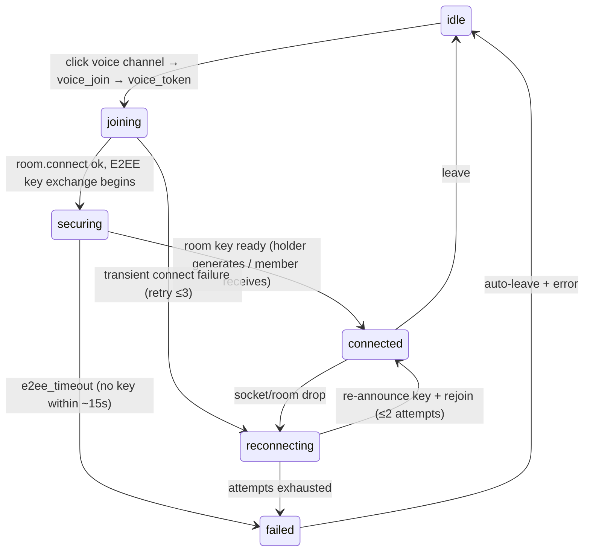

# Voice, Video & E2EE — target UX

**Verified against:** commit `da4acc5`, 2026-07-19
Part of the [Client UX Specification](README.md). The signaling/crypto mechanics
are mapped structurally in [../voice-e2ee.md](../voice-e2ee.md); this document
specifies the **user-facing** states and reactions.

Covers: joining/leaving voice, mute/deafen/camera/screenshare, push-to-talk, the
active-speaker display, and — the main gap — the E2EE "securing / secured"
indicators.

---

## 1. Two state machines, one status

Internally there are **two** FSMs:

- The **WS connection** FSM (`ws.ts`: `disconnected…connected`) — the socket.
- The **voice session** FSM (`livekitSession.ts`: `idle | connecting |
  connected | reconnecting`) — the LiveKit room.

Plus the user-facing booleans in `voice.store` (`localMuted`, `localDeafened`,
`localCamera`, `localScreenshare`, `listenOnly`, `joinedAt`) and the per-user
roster (`voiceUsers` with per-user `speaking/muted/deafened/camera/screenshare`).

**Target:** expose the voice session as one observable `voiceStatus` the widgets
read — `idle | joining | securing | connected | reconnecting | failed` — rather
than inferring it from `isVoiceConnected()` alone.

> **⚠ Current gap.** The voice session FSM is internal; the only UI-observable
> connection signal is `isVoiceConnected()` (`livekitSession.ts:1713`, true only
> in `connected`). There is **no** store-backed `joining`/`securing`/`reconnecting`
> indicator, so the UI can't distinguish "connecting to the room" from "securing
> the encryption" from "reconnecting". Target adds an explicit status field.

---

## 2. Join / leave

| Status | Presentation | Notes |
|--------|--------------|-------|
| `joining` | Voice widget shows "Connecting…"; channel roster shows self pending | `handleVoiceToken` → `connectAndSetup` |
| `securing` | "Securing connection…" indicator (lock, in-progress) | Non-key-holders block here until a room key arrives (10 s + 5 s retry, `livekitSession.ts:860-902`) |
| `connected` | "Voice connected · secured 🔒" + elapsed timer (from `joinedAt`) | E2EE active; per-user tiles live |
| `reconnecting` | "Reconnecting voice…"; controls frozen, not torn down | Keypair regenerated for forward secrecy (`livekitSession.ts:451-468`) |
| `failed` | Toast "Voice connection lost" / "Couldn't secure the call"; auto-leave | `onErrorCallback` fires |

**Target rules:**
- The "connecting" vs "securing" distinction is user-visible: while a non-key-holder
  waits for the room key, show **securing**, not a generic spinner — an E2EE call
  that's still exchanging keys is not yet private.
- Leaving is immediate and local (`leaveVoice`): tear down tracks, clear E2EE
  state, reset camera/screenshare, `idle`.

> **⚠ Current gap — E2EE has no visible indicator.** Key exchange produces only
> log lines; the sole user-facing effects are (a) the join *blocking* while the
> key is fetched and (b) an `"e2ee_timeout"` error string on failure
> (`livekitSession.ts:893`). There is no "securing" state and no persistent
> "secured 🔒" affirmation once connected. Target: a `voiceStatus: "securing"`
> phase + a secured indicator on the connected widget, so users can *see* the
> call is end-to-end encrypted (and see when it isn't yet).

---

## 3. Local controls

All four are optimistic with rollback; each also emits a WS control message.

| Control | Local state | WS message | Rollback |
|---------|-------------|-----------|----------|
| **Mute** | `localMuted` (`setLocalMuted`) — fully unpublishes the mic track | `voice_mute{muted}` | n/a (local-authoritative) |
| **Deafen** | `localDeafened` + forces mute | `voice_deafen` + `voice_mute` | implies mute |
| **Camera** | `localCamera` set optimistically, rolled back on device failure (`screenShare.ts:177,204`) | `voice_camera{enabled}` | revert on failure + toast |
| **Screenshare** | `localScreenshare` optimistic, rollback on failure (`screenShare.ts:265,311`); rate-limited | `voice_screenshare{enabled}` | revert + toast |

| Control state | Presentation |
|---------------|--------------|
| mic muted | Mic-slash icon on self tile + control bar |
| deafened | Headphone-slash; implies muted styling |
| listen-only | Badge "Listen only — no microphone" with a **Retry mic** affordance (`retryMicPermission`) |
| camera on | Self video tile in the grid |
| screenshare on | Screen tile; a stop-share affordance always visible |
| speaking | Green ring on the speaking user's tile/avatar (from `voice_speakers` / ActiveSpeakers) |

**Mic-permission failure** (`restoreLocalVoiceState`): on denied/absent mic, set
`listenOnly` and surface the specific reason ("Microphone permission denied" /
"No microphone found") as a toast with a retry — already wired to
`onErrorCallback` (`livekitSession.ts:734-743`); the spec makes the **Retry mic**
control a permanent part of the listen-only badge.

---

## 4. Push-to-talk

PTT is a Rust key-poller (`ptt.rs`, 20 ms) emitting `ptt-state{pressed}` →
`setMuted(!pressed)` only while in a channel (`ptt.ts:98-105`). **Target UX:**

| State | Presentation |
|-------|--------------|
| PTT bound, released | Muted; hint "Hold {key} to talk" |
| PTT pressed | Unmuted + speaking ring |
| binding a key | Keybinds tab: "Press a key…" (10 s capture window, `ptt_listen_for_key`); reject text keys with "Pick a non-text key" |
| PTT thread error | Toast "Push-to-talk stopped unexpectedly" on `ptt-error`, offer re-enable |

---

## 5. Voice roster (per channel)

The channel's voice roster renders from `voiceUsers`. Each participant tile
reflects their `speaking/muted/deafened/camera/screenshare`. **Target:**

| Signal | Tile reaction |
|--------|---------------|
| `voice_state` | Add/update the participant with their flags |
| `voice_leave` | Remove the tile; if it's us (kick/disconnect), clear local voice state (already `dispatcher.ts:364-367`) |
| `voice_speakers` | Speaking ring on the listed users |
| key-holder change | Invisible to users (re-election is automatic on leave); no UI churn |

Per-user volume is adjustable and persisted (`userVolume_{id}` in the Rust store).

---

## 6. Token refresh & reconnect (invisible)

Token refresh (23 h timer) and voice reconnect (≤2 attempts, 3 s apart) should be
**invisible on success**. Only exhaustion surfaces: "Voice connection lost —
failed to reconnect" + auto-leave. The 60 s token-refresh response guard and the
forward-secrecy keypair rotation on reconnect are mechanics the user never sees.

---

## Source of truth

`src/lib/livekitSession.ts`, `src/stores/voice.store.ts`, `src/lib/screenShare.ts`,
`src/lib/ptt.ts`, `src/lib/roomEventHandlers.ts`, `src/components/VoiceWidget.ts`,
`VoiceChannel.ts`, `VideoGrid.ts`, `src-tauri/src/livekit_proxy.rs`,
`src-tauri/src/ptt.rs`, `src/lib/e2eeCrypto.ts`; and the structural map in
[../voice-e2ee.md](../voice-e2ee.md).
