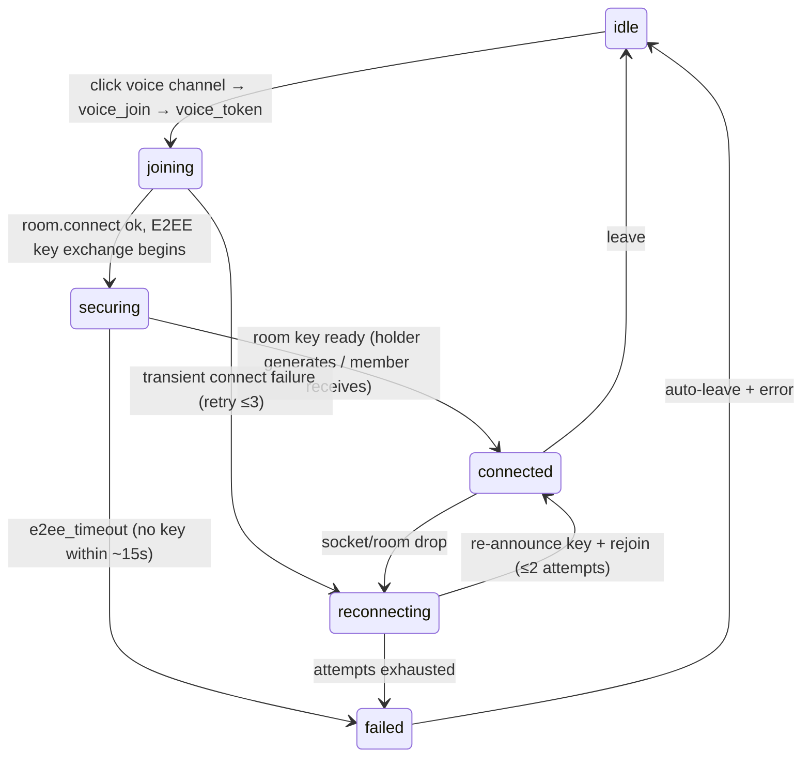

# Voice, Video & E2EE — target UX

**Verified against:** commit `5630aa1`, 2026-08-04
Part of the [Client UX Specification](README.md). The signaling/crypto mechanics
are mapped structurally in [../voice-e2ee.md](../voice-e2ee.md); this document
specifies the **user-facing** states and reactions.

Covers: joining/leaving voice, mute/deafen/camera/screenshare, push-to-talk, the
active-speaker display, and — the main gap — the E2EE "securing / secured"
indicators.

---

## 1. Two state machines, one status

Internally there are **two** FSMs:

- The **WS connection** FSM (`ws.ts`: `disconnected…connected`) — the socket.
- The **voice session** FSM (`livekitSession.ts`: `idle | connecting |
  connected | reconnecting`) — the LiveKit room.

Plus the user-facing booleans in `voice.store` (`localMuted`, `localDeafened`,
`localCamera`, `localScreenshare`, `listenOnly`, `joinedAt`) and the per-user
roster (`voiceUsers` with per-user `speaking/muted/deafened/camera/screenshare`).

**Target:** expose the voice session as one observable `voiceStatus` the widgets
read — `idle | joining | securing | connected | reconnecting` — rather than
inferring it from `isVoiceConnected()` alone.

> **✓ Implemented (2026-07).** `voice.store.voiceStatus`
> (`idle | joining | securing | connected | reconnecting`) is now the observable
> voice-session status. `livekitSession.ts` is the single writer: `joining` at the
> start of `connectAndSetup`, `securing` when the ECDH key exchange begins,
> `connected` on the atomic `connected` transition (both the initial join and a
> successful auto-reconnect), `reconnecting` when the room drops and the reconnect
> loop forms its state, and `idle` on `leaveVoice`. `joinVoiceChannel` seeds
> `joining` optimistically on click so the widget reacts before the `voice_token`
> round-trip. The VoiceWidget reads it to distinguish "connecting to the room"
> from "securing the encryption" from "reconnecting". `failed` is not a persisted
> status: an E2EE-timeout / connection error auto-leaves to `idle` and surfaces a
> toast via `onErrorCallback` (§2).

---

## 2. Join / leave

| Status | Presentation | Notes |
|--------|--------------|-------|
| `joining` | Voice widget shows "Connecting…"; channel roster shows self pending | `handleVoiceToken` → `connectAndSetup` |
| `securing` | "Securing connection…" indicator (lock, in-progress) | Non-key-holders block here until a room key arrives (10 s + 5 s retry, `livekitSession.ts:860-902`) |
| `connected` | "Voice connected · secured 🔒" + elapsed timer (from `joinedAt`) | E2EE active; per-user tiles live |
| `reconnecting` | "Reconnecting voice…"; controls frozen, not torn down | Keypair regenerated for forward secrecy (`livekitSession.ts:451-468`) |
| `failed` | Toast "Voice connection lost" / "Couldn't secure the call"; auto-leave | `onErrorCallback` fires |

**Target rules:**
- The "connecting" vs "securing" distinction is user-visible: while a non-key-holder
  waits for the room key, show **securing**, not a generic spinner — an E2EE call
  that's still exchanging keys is not yet private.
- Leaving is immediate and local (`leaveVoice`): tear down tracks, clear E2EE
  state, reset camera/screenshare, `idle`.

> **✓ Implemented (2026-07).** The VoiceWidget header now renders the E2EE phase
> from `voiceStatus`: a "Securing…" label (amber) while the key exchange runs and
> a persistent "🔒 Secured" badge once the room key is ready and the room is
> connected — replacing the log-line-only feedback. `joining` shows "Connecting…"
> and `reconnecting` shows "Reconnecting voice…", neither showing the secured
> badge. An E2EE-timeout still surfaces its `"e2ee_timeout"` toast and auto-leaves
> (`livekitSession.ts` `connectAndSetup`). **Code vs. diagram note:** the client
> actually runs the ECDH key exchange *before* `room.connect()`, so `securing`
> spans the key wait and the media connect; the state diagram below draws them in
> the reverse order for readability. The distinction users see is unchanged:
> non-key-holders sit in `securing` until a room key arrives.

---

## 3. Local controls

All four are optimistic with rollback; each also emits a WS control message.

| Control | Local state | WS message | Rollback |
|---------|-------------|-----------|----------|
| **Mute** | `localMuted` (`setLocalMuted`) — fully unpublishes the mic track | `voice_mute{muted}` | n/a (local-authoritative) |
| **Deafen** | `localDeafened` + forces mute — unsubscribes remote *voice* audio only; screen-share/stream audio keeps playing (it has its own per-tile mute/volume) | `voice_deafen` + `voice_mute` | implies mute |
| **Camera** | `localCamera` set optimistically, rolled back on device failure (`screenShare.ts:177,204`) | `voice_camera{enabled}` | revert on failure + toast |
| **Screenshare** | `localScreenshare` optimistic, rollback on failure (`screenShare.ts:265,311`); rate-limited | `voice_screenshare{enabled}` | revert + toast |

| Control state | Presentation |
|---------------|--------------|
| mic muted | Mic-slash icon on self tile + control bar |
| deafened | Headphone-slash; implies muted styling |
| listen-only | Badge "Listen only — no microphone" with a **Retry mic** affordance (`retryMicPermission`) |
| camera on | Self video tile in the grid |
| screenshare on | Screen tile; a stop-share affordance always visible |
| speaking | Green ring on the speaking user's tile/avatar (from `voice_speakers` / ActiveSpeakers) |

**Mic-permission failure** (`restoreLocalVoiceState`): on denied/absent mic, set
`listenOnly` and surface the specific reason ("Microphone permission denied" /
"No microphone found") as a toast with a retry — already wired to
`onErrorCallback` (`livekitSession.ts:734-743`); the spec makes the **Retry mic**
control a permanent part of the listen-only badge.

---

## 4. Push-to-talk

PTT is a Rust key-poller (`ptt.rs`, 20 ms) emitting `ptt-state{pressed}` →
`setMuted(!pressed)` only while in a channel (`ptt.ts:98-105`). **Target UX:**

| State | Presentation |
|-------|--------------|
| PTT bound, released | Muted; hint "Hold {key} to talk" |
| PTT pressed | Unmuted + speaking ring |
| binding a key | Keybinds tab: "Press a key…" (10 s capture window, `ptt_listen_for_key`); reject text keys with "Pick a non-text key" |
| PTT thread error | Toast "Push-to-talk stopped unexpectedly" on `ptt-error`, offer re-enable |

---

## 5. Voice roster (per channel)

The channel's voice roster renders from `voiceUsers`. Each participant tile
reflects their `speaking/muted/deafened/camera/screenshare`. **Target:**

| Signal | Tile reaction |
|--------|---------------|
| `voice_state` | Add/update the participant with their flags |
| `voice_leave` | Remove the tile; if it's us (kick/disconnect), clear local voice state (already `dispatcher.ts:364-367`) |
| `voice_speakers` | Speaking ring on the listed users |
| key-holder change | Invisible to users (re-election is automatic on leave); no UI churn |

Per-user volume is adjustable and persisted (`userVolume_{id}` in the Rust store).

---

## 6. Token refresh & reconnect (invisible)

Token refresh (23 h timer) and voice reconnect (≤2 attempts, 3 s apart) should be
**invisible on success**. Only exhaustion surfaces: "Voice connection lost —
failed to reconnect" + auto-leave. The 60 s token-refresh response guard and the
forward-secrecy keypair rotation on reconnect are mechanics the user never sees.

---

## 7. E2EE identity verification surface

Peer identity state lives in `voice.store` (per-participant
`status: verified | unverified | mismatch` + `safetyNumber`), written by
`lib/livekitE2EE.ts` as announces are verified against the pinned identity
keys (`lib/identity.ts`).

| State | Roster badge (`ChannelSidebar.ts:45-60`) | Interaction |
|-------|------------------------------------------|-------------|
| `verified` | Green shield; title "Identity verified · Safety number: {n}" | none needed |
| `unverified` | Neutral shield; no pinned key yet | none — pins on first verified announce |
| `mismatch` | Red shield-alert; title "Identity key changed — click to review and re-pin" | Click → blocking identity-mismatch modal |

The mismatch modal (`createIdentityMismatchModal`, `CertMismatchModal.ts:221`;
opened from `ChannelSidebar.ts:84-135`) shows the **new key's fingerprint** so
the user can verify it out-of-band before trusting. "Trust New Key" re-pins
via `rePinPeerIdentity` — deliberately pinning the exact key whose fingerprint
was displayed, not a fresh store read, so a malicious server cannot swap the
key during the human verification window (TOCTOU). Reject leaves the peer
blocked for E2EE media. A stripped or malformed published key disables the
trust action entirely (a blind accept is refused).

## 8. Media processing & devices

- **Noise suppression:** RNNoise WASM worklet (`lib/noise-suppression.ts`,
  assets `public/rnnoise.wasm` + `public/rnnoise-worklet.js`), toggled in
  Settings → Voice & Audio; falls back to a ScriptProcessorNode pipeline when
  AudioWorklet is unavailable (`noise-suppression.ts:121-205`).
- **Input volume & VAD:** `lib/audioPipeline.ts` applies input gain and
  voice-activity gating ahead of publish.
- **Device hot-swap:** `lib/deviceManager.ts` follows OS device
  plug/unplug and re-routes the active input/output without rejoining.
- **Stream preview:** `lib/streamPreview.ts` renders the pre-share preview in
  the screen-share picker.

## 9. DM calls (ring)

DM voice is the same voice machinery on the DM's voice channel, plus a ring
layer (no server-side call state — presence in the DM voice channel *is* the
call):

| Event | Reaction |
|-------|----------|
| Outgoing: user clicks Call | `call_ring` sent (rate-limited 1/3 s server-side); caller joins the DM voice channel |
| Incoming: `call_incoming` | `components/IncomingCallBanner.ts` banner + ring chime (`lib/notifications.ts`), driven by the `lib/call-ring.ts` state machine (30 s auto-timeout) |
| Accept | Join the DM voice channel; banner clears |
| Decline | `call_decline` sent → other participants' ringing stops via `call_declined` |
| Timeout / caller leaves | Banner clears silently |

`call_incoming` / `call_declined` are page-scoped listeners in `MainPage.ts`,
not dispatcher handlers (see [README §4](README.md)).

---

## Source of truth

`src/lib/livekitSession.ts`, `src/lib/livekitE2EE.ts`,
`src/stores/voice.store.ts`, `src/lib/screenShare.ts`,
`src/lib/ptt.ts`, `src/lib/roomEventHandlers.ts`, `src/components/VoiceWidget.ts`,
`src/components/ChannelSidebar.ts` (voice rows, join freeze on WS reconnect,
and the E2EE verification badge), `src/components/VideoGrid.ts`,
`src-tauri/src/livekit_proxy.rs`, `src-tauri/src/ptt.rs`,
`src/lib/e2eeCrypto.ts`, `src/lib/identity.ts`; and the structural map in
[../voice-e2ee.md](../voice-e2ee.md).
