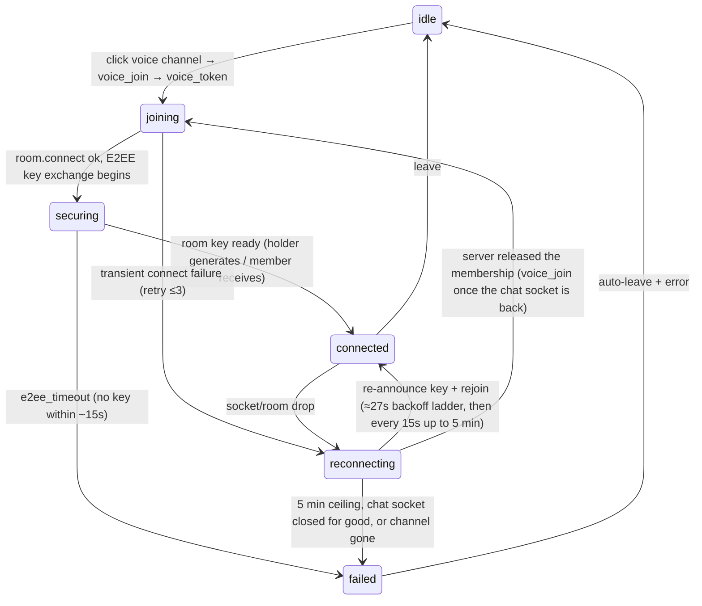

# Voice, Video & E2EE — target UX

**Verified against:** commit `5630aa1`, 2026-08-04 — except the mute/deafen and
`streamPreview` rows, re-measured at `a3a0a49b`, 2026-09-18.
Part of the [Client UX Specification](README.md). The signaling/crypto mechanics
are mapped structurally in [../voice-e2ee.md](../voice-e2ee.md); this document
specifies the **user-facing** states and reactions.

Covers: joining/leaving voice, mute/deafen/camera/screenshare, push-to-talk, the
active-speaker display, and — the main gap — the E2EE "securing / secured"
indicators.

---

## 1. Two state machines, one status

Internally there are **two** FSMs:

- The **WS connection** FSM (`ws.ts`: `disconnected…connected`) — the socket.
- The **voice session** FSM (`livekitSession.ts`, types in
  `features/voice/sessionState.ts`: `idle | connecting |
connected | reconnecting`) — the LiveKit room.

Plus the user-facing booleans in `voice.store` (`localMuted`, `localDeafened`,
`localCamera`, `localScreenshare`, `listenOnly`, `joinedAt`) and the per-user
roster (`voiceUsers` with per-user `speaking/muted/deafened/camera/screenshare`).

**Target:** expose the voice session as one observable `voiceStatus` the widgets
read — `idle | joining | securing | connected | reconnecting` — rather than
inferring it from `isVoiceConnected()` alone.

> **✓ Implemented (2026-07).** `voice.store.voiceStatus`
> (`idle | joining | securing | connected | reconnecting`) is now the observable
> voice-session status. The voice session (`livekitSession.ts` and its
> `features/voice/` modules) is the single writer: `joining` at the
> start of `connectAndSetup`, `securing` when the ECDH key exchange begins,
> `connected` on the atomic `connected` transition (both the initial join and a
> successful auto-reconnect), `reconnecting` when the room drops and the reconnect
> loop forms its state, and `idle` on `leaveVoice`. `joinVoiceChannel` seeds
> `joining` optimistically on click so the widget reacts before the `voice_token`
> round-trip. The VoiceWidget reads it to distinguish "connecting to the room"
> from "securing the encryption" from "reconnecting". `failed` is not a persisted
> status: an E2EE-timeout / connection error auto-leaves to `idle` and surfaces a
> toast via `onErrorCallback` (§2).

---

## 2. Join / leave

```mermaid
stateDiagram-v2
    idle --> joining: click voice channel → voice_join → voice_token
    joining --> securing: room.connect ok, E2EE key exchange begins
    securing --> connected: room key ready (holder generates / member receives)
    securing --> failed: e2ee_timeout (no key within ~15s)
    joining --> reconnecting: transient connect failure (retry ≤3)
    connected --> reconnecting: socket/room drop
    reconnecting --> connected: re-announce key + rejoin (≈27s backoff ladder, then every 15s up to 5 min)
    reconnecting --> joining: server released the membership (voice_join once the chat socket is back)
    reconnecting --> failed: 5 min ceiling, chat socket closed for good, or channel gone
    connected --> idle: leave
    failed --> idle: auto-leave + error
```

| Status         | Presentation                                                           | Notes                                                                                                                                                                                                                                                                                                                                                                                                                                                                                                                                                                                                                                                                                                                                                                                                                                                                                                                                                                                                                                                                                                                                                                                                                                                                                                                                                                         |
| -------------- | ---------------------------------------------------------------------- | ----------------------------------------------------------------------------------------------------------------------------------------------------------------------------------------------------------------------------------------------------------------------------------------------------------------------------------------------------------------------------------------------------------------------------------------------------------------------------------------------------------------------------------------------------------------------------------------------------------------------------------------------------------------------------------------------------------------------------------------------------------------------------------------------------------------------------------------------------------------------------------------------------------------------------------------------------------------------------------------------------------------------------------------------------------------------------------------------------------------------------------------------------------------------------------------------------------------------------------------------------------------------------------------------------------------------------------------------------------------------------- |
| `joining`      | Voice widget shows "Connecting…"; channel roster shows self pending    | `handleVoiceToken` → `connectAndSetup`                                                                                                                                                                                                                                                                                                                                                                                                                                                                                                                                                                                                                                                                                                                                                                                                                                                                                                                                                                                                                                                                                                                                                                                                                                                                                                                                        |
| `securing`     | "Securing connection…" indicator (lock, in-progress)                   | Non-key-holders block here until a room key arrives (10 s + 5 s retry, the "securing" key-exchange block in `connectAndSetup` (`features/voice/joinOrchestration.ts`) / `E2EEManager.setupKeyExchange` (`lib/livekitE2EE.ts`))                                                                                                                                                                                                                                                                                                                                                                                                                                                                                                                                                                                                                                                                                                                                                                                                                                                                                                                                                                                                                                                                                                                                                |
| `connected`    | "Voice Connected" + elapsed timer (from `joinedAt`); "Secured" chip    | E2EE active; per-user tiles live                                                                                                                                                                                                                                                                                                                                                                                                                                                                                                                                                                                                                                                                                                                                                                                                                                                                                                                                                                                                                                                                                                                                                                                                                                                                                                                                              |
| `reconnecting` | "Reconnecting voice…"; controls frozen, not torn down                  | Keypair regenerated for forward secrecy (`attemptAutoReconnect()` → `reannounceForReconnect()`, `lib/livekitSession.ts`). RT-9: five attempts with a 3 s-doubling backoff capped at 6 s (about 27 s) so the loop outlasts a companion LiveKit restart instead of ejecting the call; P2-T5 (D-4): then one every 15 s while the chat socket is connected or reconnecting and the channel exists, until 5 minutes after the drop, refreshing a token over 4 minutes old first. Before each attempt the loop checks the channel still exists and the voice roster still lists us; while the chat socket is not connected the roster cannot say, so attempts wait for it. Once the server has released the membership (RT-8 grace expiry, an RT-3 reap, a restart), it sends `voice_join` for the same channel as soon as the chat socket is connected and hands over to the ordinary join path (`connectAndSetup`), so others see a leave and rejoin; a self `voice_leave` is left to the loop while it owns the session (not while livekit-client retries on its own inside a connected one). A refused rejoin — the server refuses one for 60 s after any moderator kick or move — ends the call with the voice-lost toast. Also shown while livekit-client retries on its own (`RoomEvent.SignalReconnecting`/`Reconnecting` until `Reconnected`, `lib/roomEventHandlers.ts`) |
| `failed`       | Toast "Voice connection lost" / "Couldn't secure the call"; auto-leave | `onErrorCallback` fires                                                                                                                                                                                                                                                                                                                                                                                                                                                                                                                                                                                                                                                                                                                                                                                                                                                                                                                                                                                                                                                                                                                                                                                                                                                                                                                                                       |

**Target rules:**

- The "connecting" vs "securing" distinction is user-visible: while a non-key-holder
  waits for the room key, show **securing**, not a generic spinner — an E2EE call
  that's still exchanging keys is not yet private.
- Leaving is immediate and local (`leaveVoice`): tear down tracks, clear E2EE
  state, reset camera/screenshare, `idle`.

> **✓ Implemented (2026-07).** The VoiceWidget header now renders the E2EE phase
> from `voiceStatus`: a "Securing…" label (amber) while the key exchange runs and
> a persistent "Secured" chip (shield icon) once the room key is ready and the room is
> connected — replacing the log-line-only feedback. `joining` shows "Connecting…"
> and `reconnecting` shows "Reconnecting voice…", neither showing the secured
> badge. An E2EE-timeout still surfaces its `"e2ee_timeout"` toast and auto-leaves
> (`features/voice/joinOrchestration.ts` `connectAndSetup`). **Code vs. diagram note:** the client
> actually runs the ECDH key exchange _before_ `room.connect()`, so `securing`
> spans the key wait and the media connect; the state diagram below draws them in
> the reverse order for readability. The distinction users see is unchanged:
> non-key-holders sit in `securing` until a room key arrives.

---

## 3. Local controls

All four are optimistic with rollback; each also emits a WS control message.

| Control         | Local state                                                                                                                                                                                                                                                                                                                           | WS message                    | Rollback                                     |
| --------------- | ------------------------------------------------------------------------------------------------------------------------------------------------------------------------------------------------------------------------------------------------------------------------------------------------------------------------------------- | ----------------------------- | -------------------------------------------- |
| **Mute**        | `localMuted` (`setLocalMuted`) — stops the mic capture track (`stopMicTrackOnMute` in the Room's `publishDefaults`, applied by `applyMicMuteState`, `features/voice/mediaControl.ts`), so the OS microphone in-use indicator goes out; the LiveKit publication is **not** removed — it stays muted, and unmute re-acquires the device | `voice_mute{muted}`           | n/a (local-authoritative)                    |
| **Deafen**      | `localDeafened` + forces mute — unsubscribes remote _voice_ audio only; screen-share/stream audio keeps playing (it has its own per-tile mute/volume)                                                                                                                                                                                 | `voice_deafen` + `voice_mute` | implies mute                                 |
| **Camera**      | `localCamera` set optimistically, rolled back on device failure (`enableCamera()` in `lib/screenShare.ts`)                                                                                                                                                                                                                            | `voice_camera{enabled}`       | revert on failure + toast                    |
| **Screenshare** | `localScreenshare` optimistic, rollback on failure (`enableScreenshare()` in `lib/screenShare.ts`); rate-limited                                                                                                                                                                                                                      | `voice_screenshare{enabled}`  | revert + toast; a dismissed picker is silent |

`stopMicTrackOnMute` carries the SDK's own documented tradeoff: with a Bluetooth
headset connected, stopping and re-acquiring the capture track makes the device
switch profiles (HFP to A2DP), which is audible in playback. Muting has to stop
the OS capture rather than only mute the publication, so the profile switch is
the accepted cost.

| Control state  | Presentation                                                                                                                                                                                                                                     |
| -------------- | ------------------------------------------------------------------------------------------------------------------------------------------------------------------------------------------------------------------------------------------------ |
| mic muted      | Mic-slash icon on self tile + control bar                                                                                                                                                                                                        |
| deafened       | Headphone-slash alone (deafen implies mute, so no mic-slash beside it); a moderator mute or deafen gives it the server-muted class and title                                                                                                     |
| server muted   | Distinct server-muted icon (title "Muted by a moderator"); the widget's own mute/deafen controls are disabled with the reason while the mute holds — `serverMuted`/`serverDeafened`, `components/ChannelSidebar.ts`, `components/VoiceWidget.ts` |
| listen-only    | Badge "Listen only — no microphone" with a **Retry mic** affordance (`retryMicPermission`); the mic button is disabled, dimmed and reads mic-off                                                                                                 |
| camera on      | Self video tile in the grid                                                                                                                                                                                                                      |
| screenshare on | Screen tile; a stop-share affordance always visible                                                                                                                                                                                              |
| speaking       | Green ring on the speaking user's tile/avatar (from LiveKit's ActiveSpeakers)                                                                                                                                                                    |

**Video tiles** (`components/VideoGrid.ts`, in guild voice and DM calls alike):
each tile is a button (click, Enter, Space) that opens it in focus view, with a
filmstrip for the rest and **Back to grid** to leave. Screen shares carry a
**LIVE** badge, and the speaking ring (`--text-positive`) and a mic-slash or
headphone-slash badge for a muted or deafened user are on camera tiles. A
**Show chat** control in the grid's header leaves the grid or focus view for
the chat without leaving the call.
A remote tile's volume slider is named for whose it is ("Otto stream volume"
for screen-share audio, 0–100 %; "Otto voice volume" for the mic, 0–200 %) and
shows its value. The tile menu (right-click, the Menu key, Shift+F10;
`components/video-grid/tile-menu.ts`, loaded on first use) keeps the two
volumes apart and offers Mute stream and **Stop watching**, which hides the
stream behind a **Watch stream** card (the track stays subscribed but receives
no video; opt-in watching is open question Q3). Your own screen share is covered by what
is going out (surface, resolution, fps, audio) with **Stop sharing** and
**Hide preview**. In a DM call, focus view stays inside the call panel and the
chat remains visible below it. **Full screen** (the button, F, or a
double-click) puts the tile in HTML full screen and the window with it
(`desktop.window.setFullscreen`, `core:window:allow-set-fullscreen`), since in
WebView2 HTML full screen fills only the webview; if the API is refused, a CSS
theatre view fills the window instead (Escape or F leaves it). A full-screen tile keeps mute, deafen and leave at hand. **Pop out**
is the platform's picture-in-picture, hidden where it is unavailable. The
stream you watch shows a quality chip ("1080p · 30 fps") with a stats popover
(resolution, frame rate, bitrate, codec, packet loss), polled every 2 s from
the receiver (`getRemoteVideoStats`); the Linux native room has no receiver
stats, so it shows the resolution only.
Each remote tile asks only for what it shows (`setRemoteVideoView`, since
`adaptiveStream` stays off for OC-0455): a tile no one can see (grid closed,
app hidden or minimised, Stop watching) receives no video, a small tile gets
the lower simulcast layer that fits it, and the stream you watch (focused,
full screen or popped out) gets the top one. An open sidebar stream preview
keeps its stream playing even while the grid is closed.

**Mic-permission failure** (`restoreLocalVoiceState`): on denied/absent mic, set
`listenOnly` and surface the specific reason ("Microphone permission denied" /
"No microphone found") as a toast with a retry — already wired to
`onErrorCallback` (the mic-unavailable branches of `restoreLocalVoiceState()`, `lib/livekitSession.ts`); the spec makes the **Retry mic**
control a permanent part of the listen-only badge.

---

## 4. Push-to-talk

PTT is a Rust key-poller (`ptt.rs`, 20 ms) emitting `ptt-state{pressed}` →
`setMuted(!pressed)` only while in a channel (the `ptt-state` listener inside `initPtt()`, `lib/ptt.ts`). **Target UX:**

| State               | Presentation                                                                                                                                                                                        |
| ------------------- | --------------------------------------------------------------------------------------------------------------------------------------------------------------------------------------------------- |
| PTT bound, released | Mic stays closed, but the mic button reads unmuted (it shows only your own mute) with the title "Push-to-talk — hold your key to talk"; toggling mute or deafen with the key up never opens the mic |
| PTT pressed         | Unmuted + speaking ring                                                                                                                                                                             |
| binding a key       | Keybinds tab: "Press a key…" (10 s capture window, `ptt_listen_for_key`); reject text keys with "Pick a non-text key"                                                                               |
| PTT thread error    | Toast "Push-to-talk stopped unexpectedly" on `ptt-error`, offer re-enable                                                                                                                           |
| PTT unsupported     | macOS or a Wayland session (`ptt_polling_supported` false): the Keybinds tab says the key can never gate the mic and disables capturing a key (Clear stays, to remove an older binding)             |

---

## 5. Voice roster (per channel)

The channel's voice roster renders from `voiceUsers`. Each participant tile
reflects their `speaking/muted/deafened/camera/screenshare`. **Target:**

| Signal            | Tile reaction                                                                                                                       |
| ----------------- | ----------------------------------------------------------------------------------------------------------------------------------- |
| `voice_state`     | Add/update the participant with their flags                                                                                         |
| `voice_leave`     | Remove the tile; if it's us (kick/disconnect), clear local voice state (already `handleVoiceLeave`, `features/voice/wsHandlers.ts`) |
| key-holder change | Invisible to users (re-election is automatic on leave); no UI churn                                                                 |

Per-user volume is adjustable and persisted (`userVolume_{id}` in the Rust store).

---

## 6. Token refresh & reconnect (invisible)

Token refresh (a 4 min timer against the 5 min token) and voice reconnect (five attempts, 3 s-doubling
backoff capped at 6 s, about 27 s, then every 15 s for up to 5 minutes) should be **invisible on success** beyond the
"Reconnecting voice…" badge while a reconnect runs. Only giving up surfaces:
"Voice connection lost — failed to reconnect" + auto-leave. The 60 s token-refresh response guard and the
forward-secrecy keypair rotation on reconnect are mechanics the user never sees.

**A planned restart returns the call (RT-12).** The hub wipes `voice_states` on
boot, so a client resumes chat but not voice. `handleRestartDrop`
(`features/connection/wsHandlers.ts`) records the channel the user is in when
the socket drops, and `ready` then sends one ordinary `voice_join` if that
channel is still a joinable voice channel or DM call. An `update`,
`backup_restore` or `setup` notice allows it when `ready` arrives within ten
minutes; a `shutdown` from outside the server (SIGTERM, a supervisor) allows it
only within a shorter two-minute window, so a quick restart returns the call
while a long maintenance stop ends it. A kick, move, ban or leave cancels the
pending rejoin, so the user is never put back into a call that was deliberately
ended.

---

## 7. E2EE identity verification surface

Peer identity state lives in `voice.store` (per-participant
`status: verified | changed | unverified | mismatch | unknown` + `safetyNumber`), written by
`features/voice/e2eePeerState.ts` (driven by `lib/livekitE2EE.ts`) as
announces are verified against the pinned identity keys (`lib/identity.ts`).

| State        | Roster badge (`verifyPresentation()`, `components/ChannelSidebar.ts`)                                                          | Interaction                               |
| ------------ | ------------------------------------------------------------------------------------------------------------------------------ | ----------------------------------------- |
| `verified`   | Green shield; title "Identity verified · Safety number: {n}"                                                                   | none needed                               |
| `changed`    | Amber shield-alert; title "Security key changed · Safety number: {n}"                                                          | none — the change already raised a notice |
| `unverified` | Neutral shield; no pinned key yet                                                                                              | none — pins on first verified announce    |
| `mismatch`   | Red shield-alert; title "Blocked — unverified: this participant's key is missing or its signature is invalid. Click to review" | Click → blocking identity-mismatch modal  |

A pinned peer whose published key changed is accepted automatically when the
announce verifies against the new key (`verifyPeerAnnounce` in
`features/voice/e2eePeerState.ts`): the pin is replaced, the change is logged
at warn, and a warning toast naming the peer stays until dismissed
(`showToast(…, "warning", Infinity)`). The peer keeps the `changed` badge
for the rest of the call. `mismatch` is now only a pinned peer whose key is no
longer delivered, or an announce that fails verification.

The mismatch modal (`createIdentityMismatchModal()`, `components/CertMismatchModal.ts`;
opened from `openIdentityMismatchModal()` in `components/ChannelSidebar.ts`) shows the **new key's fingerprint** so
the user can verify it out-of-band before trusting. "Trust New Key" re-pins
via `rePinPeerIdentity` — deliberately pinning the exact key whose fingerprint
was displayed, not a fresh store read, so a malicious server cannot swap the
key during the human verification window (TOCTOU). Reject leaves the peer
blocked for E2EE media. A stripped or malformed published key disables the
trust action entirely (a blind accept is refused).

## 8. Media processing & devices

- **Noise suppression:** RNNoise WASM worklet (`lib/noise-suppression.ts`,
  assets `public/rnnoise.wasm` + `public/rnnoise-worklet.js`), toggled in
  Settings → Voice & Audio; falls back to a ScriptProcessorNode pipeline when
  AudioWorklet is unavailable (`createScriptProcessorPipeline()` in `lib/noise-suppression.ts`).
- **Input volume & VAD:** `lib/audioPipeline.ts` applies input gain and
  voice-activity gating ahead of publish.
- **Device hot-swap:** `lib/deviceManager.ts` follows OS device
  plug/unplug and re-routes the active input/output without rejoining.
- **Stream preview:** `lib/streamPreview.ts` renders a hover/focus live preview
  of a **remote** participant's camera or screenshare in the voice channel
  sidebar (300 ms debounce, attached from `components/ChannelSidebar.ts`). There
  is no pre-share preview of your own stream in the app on Windows — that step
  is the OS `getDisplayMedia` picker dialog; on Linux it is the "Share your
  screen" dialog (`components/ScreenSharePicker.ts`).

## 9. DM calls (ring)

DM voice is the same voice machinery on the DM's voice channel, plus a ring
layer (no server-side call state — presence in the DM voice channel _is_ the
call):

| Event                      | Reaction                                                                                                                                                                                                                                                                                                   |
| -------------------------- | ---------------------------------------------------------------------------------------------------------------------------------------------------------------------------------------------------------------------------------------------------------------------------------------------------------- |
| Outgoing: user clicks Call | Caller joins the DM voice channel, then `call_ring` is sent (rate-limited 1/3 s server-side); the call panel shows "Calling…" and a 30 s no-answer window (`createOutgoingCall`, `lib/call-ring.ts`), except on a redial into a call someone else is already in, which only re-rings                       |
| Incoming: `call_incoming`  | Ring chime (`lib/notificationSound.ts`) driven by the `lib/call-ring.ts` state machine (30 s auto-timeout). With the ringing DM open, the call panel is the answer surface and the banner stays hidden; anywhere else, `components/IncomingCallBanner.ts`                                                  |
| Accept                     | Join the DM voice channel; ring clears. "Join with video" also turns the camera on once connected. Being in the room answers the ring however you got there: joining it another way clears the ring, and a `call_incoming` for the channel you are already in is ignored                                   |
| Decline                    | `call_decline` sent → the ringer's panel says "declined" in a 1:1, and in a group that callee drops off the ringing list. Another callee's ring stops only when its own ringer declines or leaves (`call_declined` / `voice_leave` from the ringer)                                                        |
| Timeout / caller leaves    | Timeout: the callee's ring clears silently, and the caller's panel says "didn't answer", draws only the caller's own tile, and stays in the call with Ring again / Leave call. Caller leaves: the call simply ends, the caller's outgoing ring clears, and the callees' rings clear once the room is empty |

Call is on the DM chat header and in another member's profile popup. The
popup's Call opens the 1:1 DM with that member (creating it if needed) and then
starts the call there through the same `startCall` (`onCallUser` in
`pages/main-page/SidebarArea.ts`).

The DM call panel (`components/DmCallPanel.ts`, between the chat header and the
messages) shows while the open DM has a ring in flight, an outgoing ring, or
anyone in its voice channel: outgoing, declined/no answer, incoming, a "Join
call" strip for a call you are not in, and the connected stage (collapsible to
one row). Its controls are the voice widget's callbacks; the widget's call name
links back to the DM, and the DM list shows a phone glyph on a DM with a live call.

While the open DM is the current call's DM, the panel is the call's only video
surface: `VideoModeController` moves the shared `VideoGrid` into the panel's
stage as soon as any camera or screen share is on (remote ones too, unlike the
guild-channel rule that only your own video opens the grid; your own also while
the call is still ringing or went unanswered), the chat stays visible below, and
everyone without a camera is an avatar tile. Collapsed, the panel never reopens
on its own; Expand shows the video. Anywhere else the grid behaves as in guild
voice.

`call_incoming` / `call_declined` are page-scoped listeners in `MainPage.ts`,
not dispatcher handlers (see [README §4](README.md)).

---

## Source of truth

`src/lib/livekitSession.ts`, `src/features/voice/`, `src/lib/livekitE2EE.ts`,
`src/stores/voice.store.ts`, `src/lib/screenShare.ts`,
`src/lib/ptt.ts`, `src/lib/roomEventHandlers.ts`, `src/components/VoiceWidget.ts`,
`src/components/ChannelSidebar.ts` (voice rows, join freeze on WS reconnect,
and the E2EE verification badge), `src/components/VideoGrid.ts`,
`src-tauri/src/livekit_proxy.rs`, `src-tauri/src/ptt.rs`,
`src/lib/e2eeCrypto.ts`, `src/lib/identity.ts`; and the structural map in
[../voice-e2ee.md](../voice-e2ee.md).
