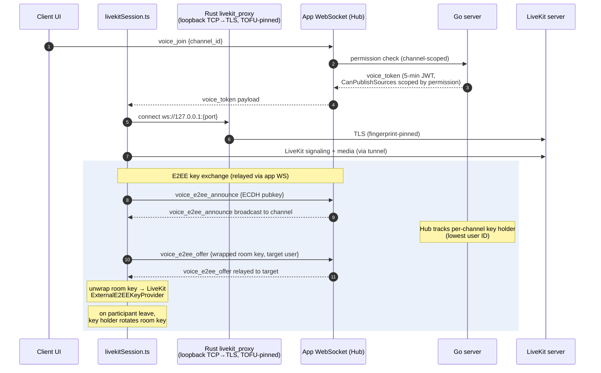

# Voice and End-to-End Encryption

**Verified against:** commit `ddc49f0`, 2026-07-19

Voice/video runs on LiveKit. The Go server issues short-lived scoped tokens and
relays E2EE key-exchange messages; media flows client↔LiveKit directly. On the
client, everything funnels through `src/lib/livekitSession.ts`, and — because
self-hosted servers commonly use self-signed certificates — the LiveKit
connection is tunneled through a local Rust TLS proxy pinned to the same TOFU
fingerprint as the main WebSocket.

## D6 — Voice join + E2EE key exchange

**What this shows.** The server never holds the room key — it only relays
announce/offer messages and tracks who the key holder is (deterministically the
lowest user ID in the channel). Keys are wrapped per-recipient via ECDH, and
the key holder rotates the room key when a participant leaves so departed
members cannot decrypt future media. Voice permission enforcement happens twice:
at `voice_join` (channel permission) and inside the LiveKit JWT itself
(`CanPublishSources` restricts camera/screenshare per role permission).

Supporting pieces:

- **Server:** `Server/ws/voice_e2ee.go` (relay + key-holder map),
  `Server/ws/livekit.go` (token minting), `Server/ws/livekit_process.go`
  (optional managed `livekit-server` subprocess),
  `Server/ws/livekit_webhook.go` (webhook validated by LiveKit JWT and
  admin-IP-restricted), `Server/api/livekit_proxy.go` (HTTP reverse proxy).
- **Client:** `src/lib/livekitSession.ts` (state machine: idle/connecting/
  connected/reconnecting with a monotonic `joinGeneration` to discard
  superseded joins), `src/lib/e2eeCrypto.ts` (ECDH, key wrap/unwrap),
  `src/lib/audioPipeline.ts` + `src/lib/noise-suppression.ts` (RNNoise WASM),
  `src/lib/screenShare.ts`, `src-tauri/src/livekit_proxy.rs` (tunnel),
  `src-tauri/src/ptt.rs` (push-to-talk key polling).

This message flow (`voice_e2ee_announce` / `voice_e2ee_offer` /
`voice_speakers`) is currently **absent from `docs/protocol.md`** — recorded as
spec drift in [audit-2026-07-19.md §2](../audit-2026-07-19.md).

**Source of truth:** `Server/ws/voice_e2ee.go`, `Server/ws/livekit.go`,
`Client/tauri-client/src/lib/livekitSession.ts`,
`Client/tauri-client/src/lib/e2eeCrypto.ts`,
`Client/tauri-client/src-tauri/src/livekit_proxy.rs`.
