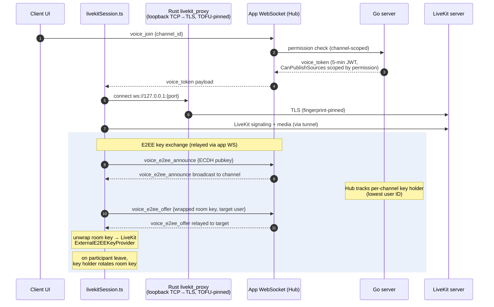

# Voice and End-to-End Encryption

**Verified against:** commit `5630aa1`, 2026-08-04

Voice/video runs on LiveKit. The Go server issues short-lived scoped tokens and
relays E2EE key-exchange messages; media flows client↔LiveKit directly. On the
client, everything funnels through `src/lib/livekitSession.ts` (a facade over
the `src/features/voice/` modules), and — because
self-hosted servers commonly use self-signed certificates — the LiveKit
connection is tunneled through a local Rust TLS proxy pinned to the same TOFU
fingerprint as the main WebSocket.

## D6 — Voice join + E2EE key exchange

**What this shows.** The server never holds the room key — it only relays
announce/offer messages and tracks who the key holder is (deterministically the
lowest user ID in the channel). Keys are wrapped per-recipient via ECDH, and
the key holder rotates the room key when a participant leaves so departed
members cannot decrypt future media. Voice permission enforcement happens twice:
at `voice_join` (channel permission) and inside the LiveKit JWT itself
(`CanPublishSources` restricts camera/screenshare per role permission).

Supporting pieces:

- **Server:** `Server/ws/voice_e2ee.go` (relay + key-holder map),
  `Server/ws/livekit.go` (token minting), `Server/ws/livekit_process.go`
  (optional managed `livekit-server` subprocess),
  `Server/ws/livekit_webhook.go` (webhook validated by LiveKit JWT and
  admin-IP-restricted), `Server/api/livekit_proxy.go` (HTTP reverse proxy).
- **Client:** `src/lib/livekitSession.ts` (facade owning the state machine:
  idle/connecting/connected/reconnecting), `src/features/voice/`
  (`joinOrchestration.ts` joins with a monotonic `joinGeneration` to discard
  superseded ones; `roomLifecycle.ts` Room + E2EE worker creation and
  teardown; `mediaControl.ts` mute/deafen/devices; `remoteTracks.ts`;
  `sessionState.ts` state types), `src/lib/livekitE2EE.ts` (`E2EEManager`
  facade: key-holder election, join/reconnect key exchange, announce handling,
  rotation-on-leave), its `src/features/voice/e2ee*.ts` modules
  (`e2eeIdentity.ts` identity signing and the ephemeral keypair;
  `e2eeEpoch.ts` room key, epoch and rotation; `e2eePeerState.ts` peer keys
  and TOFU pin verification; `e2eeWorker.ts` key provider write queue;
  `e2eeOffer.ts` room-key offers), `src/lib/e2eeCrypto.ts` (ECDH
  primitives, safety-number fingerprints, long-term identity keys),
  `src/lib/identity.ts` (OS-keyring identity key + peer identity pins),
  `src/lib/audioPipeline.ts` + `src/lib/noise-suppression.ts` (RNNoise WASM),
  `src/lib/screenShare.ts`, `src-tauri/src/livekit_proxy.rs` (tunnel),
  `src-tauri/src/ptt.rs` (push-to-talk key polling).

The wire flow (`voice_e2ee_announce` / `voice_e2ee_offer`)
is specified in [protocol.md](../protocol.md) (Voice End-to-End Encryption
section). Long-term identity: each user publishes an ECDSA identity public key
(`users.identity_public_key`, migration 017); peers pin it on first contact
and surface a blocking mismatch modal if it later changes (see
[ux/voice-and-e2ee.md](ux/voice-and-e2ee.md)).

**Source of truth:** `Server/ws/voice_e2ee.go`, `Server/ws/livekit.go`,
`Client/src/lib/livekitSession.ts`, `Client/src/features/voice/`,
`Client/src/lib/livekitE2EE.ts`, `Client/src/lib/e2eeCrypto.ts`,
`Client/src-tauri/src/livekit_proxy.rs`.

## Linux: native LiveKit in the Rust backend

No mainstream WebKitGTK build ships WebRTC — the system webview's
`RTCPeerConnection` is `undefined` on Ubuntu, Debian, Fedora, Arch and the
GNOME Flatpak runtime alike — so on Linux the `livekit-client` JS path cannot
run at all. Even a custom WebKitGTK build cannot do LiveKit E2EE, because its
GStreamer encoded-transform backend is a stub.

The fix is to run LiveKit's **Rust SDK** in the Tauri backend on Linux only,
with the webview kept as the UI and driven over IPC behind the same
`livekitSession` facade. The TS E2EE key exchange
(`livekitE2EE.ts` and `features/voice/e2ee*.ts`) stays unchanged; only the
final room key crosses IPC, so the frame format, KDF and cipher remain
byte-compatible with Windows clients. Windows keeps the current webview path
with no behaviour change.

The dependency is Linux-only (`[target.'cfg(target_os = "linux")'.dependencies]`
in `Client/src-tauri/Cargo.toml`); the backend lives in
`Client/src-tauri/src/native_voice/` (`session.rs` is the room, `video.rs`
the frame socket, `mod.rs` the Tauri commands and state). The build prerequisite — clang >= 21 and a prebuilt
libwebrtc — is documented in [contributing.md](../contributing.md#client-tauri-v2)
and installed by `Client/scripts/linux-webrtc-toolchain.sh`.

### Phase 1: audio

**Where the switch is.** `features/voice/native/platform.ts`'s
`isLinuxDesktop()` is the only platform check. `RoomLifecycle.createRoom`
returns a `NativeRoom` (`features/voice/native/nativeRoom.ts`) instead of a
livekit-client `Room` there, and `E2EEWorker.applyRoomKey` hands the key to the
backend instead of the browser key provider. Nothing else in the voice state
machine (`joinOrchestration`, `roomLifecycle`, `mediaControl`,
`roomEventHandlers`, the reconnect loop, `E2EEManager`) knows which backend it
is driving: `NativeRoom` implements the slice of `Room` those modules call —
`connect`/`disconnect`, the event emitter, `state`, the local participant's
microphone toggle, and the remote participants' audio publications for deafen —
over the `NativeVoice` platform contract (`platform/contracts/nativeVoice.ts`,
bound in `platform/desktop/nativeVoice.ts` + `nativeVoiceService.ts`). The
facade's own suite therefore stays the contract; `tests/unit/livekit-session-linux.test.ts`
runs the same facade with the switch on and pins the native command sequence,
and `tests/unit/platform/nativeVoice.suite.ts` pins the host contract.

**Commands and events.** `native_voice_set_key` (install/rotate),
`native_voice_clear_key` (leave), `native_voice_connect` → `{session, identity}`,
`native_voice_disconnect(session)`, `native_voice_set_microphone`,
`native_voice_set_subscribed` (deafen), `native_voice_set_volume` and
`native_voice_set_screenshare_volume` (per-user and screen-share audio volume,
see Audio parity below), `native_voice_debug_info`. Room events
arrive on one Tauri event, `native-voice`, tagged with the session id; the
adapter maps them onto `RoomEvent`s (`Disconnected`, `ActiveSpeakersChanged`,
`EncryptionError` for a non-`Ok` frame-cryptor state, participant join/leave).
No audio `TrackSubscribed` is raised: there is no browser track. Capture runs
in libwebrtc's audio device module (`PlatformAudio`) in the Rust process, with
its APM (AEC/NS/AGC from the same preferences the web path uses) standing in
for RNNoise on Linux by owner decision; playout runs through the session's own
mixer (Audio parity, below). Media never crosses IPC.

**E2EE byte-compatibility.** The web path calls
`ExternalE2EEKeyProvider.setKey(base64Text)`, which PBKDF2-derives from the
UTF-8 bytes of the base64 _text_. The backend receives that same text once per
set/rotate and uses its bytes as the shared key (`session::shared_key_material`),
with `ratchet_window_size: 0`, `failure_tolerance: -1`, the default salt and
PBKDF2, `EncryptionType::Gcm`, and key index 0 only (`KEY_INDEX`; rust-sdks
#1280 aborts on an out-of-range index). A wrong key yields silence, not
plaintext: the interop test's negative control asserts it. Keys are never
logged; the backend zeroes its copy on clear.

**Lifecycle (B7-11).** Sessions are numbered so a superseded attempt's
`disconnect()` closes only its own room; the Tauri subscription is registered
per connect and released in `disconnect()` with the late-resolve guard; the key
is forgotten when the E2EE state is cleared on leave, queued on the
`E2EEWorker` key write queue so it can never land after the next join's key.
Mute keeps the microphone publication and mutes it in place (stopping ADM
capture), so a mute toggle costs no renegotiation and no new frame cryptor.
`getSessionDebugInfo().native` reports open native rooms, registered listeners
and the backend's resource snapshot (rooms, local tracks, ADM refs, process
threads); each read requests a fresh `native_voice_debug_info` snapshot, which
the next read reports.

**Interop test (CI).** `Client/tests/e2e/native-voice/interop.spec.ts`, run by
ci.yml's `rust-tests` job: `examples/native_voice_interop.rs` drives the app's
`NativeSession` (a synthetic 440 Hz sine as the microphone, since the runner
has no sound server) against livekit-client in Chromium, over a local
`livekit-server`, both holding the same key. Measured 2026-09-22 (livekit
0.9.1, libwebrtc 0.3.48, livekit-server 1.13.5): the browser decodes the
native sine at its exact RMS (0.1726) with 0 encryption errors; the native side
decodes Chromium's fake microphone; with a different key the browser measures
RMS 0 and counts decryption errors, and the native side hears silence.

**Known SDK risks, measured.**

- rust-sdks #1408 (a leaked thread per FrameCryptor): 5 join/leave cycles with
  one remote participant grew the process from 17 to 27 threads — **+2 per
  cycle**, idle. The interop test pins that rate as the ceiling. Long sessions
  with many joins accumulate them; a patch or an SDK fix is the follow-up.
  Mute/unmute creates no cryptor: the interop test's ten mute cycles must
  leave the thread count flat.
- #1187 (bundled BoringSSL vs a dynamic OpenSSL): `cargo tree -i openssl-sys`
  and `-i native-tls` match nothing — the client is rustls-only.
- Not exercised: real ADM capture and playout. Every box this was built on has
  no sound server; `PlatformAudio::new()` failing is handled (listen-only, the
  existing toast) but the happy path on PulseAudio/PipeWire is untested here.

### Phase 1b: devices, detection, and what stays out

**Platform detection is by host.** `isLinuxDesktop()` is true only inside the
Tauri app (`__TAURI_INTERNALS__` present) on a Linux, non-Android user agent,
whether or not that WebKitGTK exposes `RTCPeerConnection` — a build with
WebRTC still cannot do LiveKit E2EE. A Linux browser has no Tauri host and
keeps the web path; the browser e2e suites still pin a desktop Chrome user
agent.

**Device selection.** `native_voice_list_devices` enumerates the device
module's capture devices (through the live session's module, or a
transient one outside a call) and the output devices (see Audio parity,
below), and `native_voice_set_device(session, kind, id)` switches in place; an
empty id is the default (the first device listed).
`NativeRoom.switchActiveDevice` forwards `audioinput`/`audiooutput`, so the
saved-device switches at join and the settings tab's selectors work unchanged;
`features/voice/native/devices.ts` gives the settings tab and the device
manager the native list on Linux (capture ids are the module's device names —
the Linux device modules report no GUIDs — not the webview's; a switch
resolves the name to the module's index, first match wins, and an unknown
name falls back to the default and reports it) and is null everywhere else, leaving the web enumeration untouched.
Hot-plug (`devicechange`) still comes from the webview; on Linux it triggers a
re-list through the native backend and re-applies both saved selections
(and a saved default output, see Audio parity below),
which refreshes a device-module index the hot-plug shifted (an
unchanged index or output device leaves the running stream alone). Unmuting
(`set_microphone(true)`) also re-resolves the saved capture name before the
stopped stream restarts.

**Connect no longer holds the backend lock**: a leave, a key rotation or a
device switch during a slow join proceeds, and a connect that a newer one
superseded closes its own room and reports it.

**Still out, by owner decision (2026-09-22).** Input volume and the
sensitivity (VAD) gate: the device-module track is a plain libwebrtc
`LocalAudioSource`, which never hands capture frames to a sink, so neither a
gain stage nor a level gate can be applied on the native capture path without
either the app's own capture pipeline (capture → gain/VAD → APM with a reverse
stream → `NativeAudioSource`, the report's 1b sketch) or a patched
`webrtc-sys`. Linux relies on the engine's automatic gain control and Opus DTX
instead, and the settings tab hides the Input Volume, Input Sensitivity and Enhanced
Noise Suppression controls there with a note pointing at the system mixer; the
three APM toggles stay and apply at the next join. Per-user and output volume
came later (Audio parity, below); camera and remote video are phase 2 (below),
screen share phase 3. rust-sdks #1408
stays a tracked leak: the upstream fix is an 11-line `webrtc-sys` C++ change
(PR livekit/rust-sdks#1408, open, CLA unsigned) that detaches the frame
transformer in `FrameCryptor`'s destructor; carrying it means a vendored
`webrtc-sys` under `[patch.crates-io]`, which is the follow-up if the soak
needs it before upstream lands.

### Phase 2: camera and remote video

**Frames never cross IPC.** On WebKitGTK the invoke path serialises binary as
JSON (one 720p I420 frame took 53 ms, about 19 fps at best), so each native
session binds its own **frame socket**: a WebSocket listener on `127.0.0.1`
with a random 256-bit token (`video.rs`). Its URL, token included, reaches
the webview only as the `native_voice_connect` result
(`NativeVoiceConnected.frames`); the handshake is refused unless the request
path starts with the token (compared in constant time), so no other local
process or web page can read or inject frames. Closing the session drops the
server, which aborts the listener and every connection it accepted. Two
routes:

- `/<token>/remote/<track sid>`: one subscribed remote video track's decoded
  frames, native to webview, as width, height and the three I420 planes
  packed tightly. The renderer acknowledges each frame (an empty message)
  once drawn, and the backend sends the next only after that ack, keeping
  just the latest decoded frame meanwhile, so a slow renderer drops frames
  instead of queueing them (the webview's socket reads eagerly, so TCP
  backpressure alone would not hold them back). The remote track table is updated
  from the room's events before they are forwarded, so the webview never asks
  for a track the socket does not know.
- `/<token>/camera`: the local camera, webview to native: a header (format,
  size, plane offsets and strides) and the `VideoFrame.copyTo` bytes. RGBA,
  RGBX, BGRA, BGRX, I420 and NV12 are converted to I420 with libyuv, after a
  bounds check (libyuv itself only checks `stride × rows`). A frame with no
  CPU layout is read back through a 2D canvas as RGBA.

**Remote video.** On `trackSubscribed` for a video track, `NativeRoom` opens a
`NativeVideoRenderer` (`features/voice/native/videoRenderer.ts`): it draws each
frame with a WebGL2 I420→RGB shader (BT.601 limited range) and exposes the
canvas as a `MediaStreamTrack` (`canvas.captureStream()`). The adapter raises
`RoomEvent.TrackSubscribed` with that track, so `roomEventHandlers`, the video
grid, stream previews and `getRemoteVideoStream` consume a MediaStream exactly
as they do on Windows. `trackUnsubscribed`, `trackUnpublished` and a
participant leaving dispose the renderer and raise `TrackUnsubscribed`
(before `ParticipantDisconnected`, as livekit-client does); `disconnect()`
disposes every renderer.

**Camera.** `getUserMedia` works in WebKitGTK (only WebRTC is missing), so the
shared `enableCamera` runs unchanged: livekit-client's `createLocalVideoTrack`
captures in the webview (the saved device, permissions, and the self-view
preview are that track), and `NativeRoom.localParticipant.publishTrack` calls
`native_voice_publish_camera` with the track's size and the web path's bitrate,
framerate and simulcast options. The backend publishes a `NativeVideoSource`
(VP8, as livekit-client defaults to) and a `CameraUplink`
(`features/voice/native/cameraUplink.ts`) pumps the webview track's frames up
the camera route. It drops rather than queues: one copy in flight, nothing
sent while the socket has unsent bytes, and no faster than the max
framerate. `native_voice_publish_camera` returns the publication's sid, and
camera off names that sid (`native_voice_unpublish_camera`), as the web path
unpublishes its own track, so remote tiles close the same way; a late
unpublish of a camera a newer publish already replaced is a no-op. The
backend unpublishes the camera's live publication, which follows the SDK's
republish (a new sid) after a full reconnect. A republish that continues no
live camera (camera off, or a newer camera published, while the SDK was
between its unpublish and republish) is unpublished rather than left
published with no frames. Screen share is phase 3 (below).

**E2EE covers video exactly as audio.** The camera is published into the same
room, whose single key provider and `KEY_INDEX` 0 already cover every sender
and receiver cryptor; nothing video-specific touches keys. The interop test
proves it both ways (below).

**Lifecycle (B7-11).** The renderer and the uplink are owned by `NativeRoom`
and disposed with their track or in `disconnect()`. `getSessionDebugInfo().native`
also reports `videoRenderers` and `cameraUplinks` (TS) and the backend's
`videoSockets` (open frame-socket connections), and the backend's
`localTracks` counts the camera. No lifecycle-inventory entries were added:
the socket and GL listeners live on objects the renderer owns, and the frame
callback is cancelled in `dispose()`.

**Interop test (CI), video.** Two more cases in `interop.spec.ts`. With
`--video 640x360`, the example publishes moving bars as the camera through the
frame socket's camera route, as RGBA, which is the path the webview's frames
take, and reads every subscribed remote video track back through the remote
route. Measured 2026-09-22: Chromium decodes the native camera at 640×360,
about 28 fps (143 frames in 5 s), with 0 encryption errors; the native side
reads Chromium's fake camera through the socket at about 20 fps (the fake
device's rate); the socket is bound to 127.0.0.1, refuses a reversed or
missing token, and is gone after close. **Negative control:** with a
different key, Chromium decodes **0** video frames and counts decryption
errors, and the native side, which subscribed and opened its socket, reads
**0** frames of Chromium's camera.

**CPU at 720p (measured 2026-09-22).** Harness: a release build of the
interop example as the app's native session (`--video 1280x720
--external-camera`), a second native peer publishing 720p30 moving bars, and a
WebKitGTK 2.52.6 view (python-gi, the system webview the app uses) running the
app's own `NativeVideoRenderer` and `CameraUplink` (the TS modules, bundled)
against that session's frame socket, with WebKit's mock 1280×720 camera. The
host was 16 vCPUs of a Ryzen 9 5900X, under Xvfb **with no GPU**: WebGL and
compositing ran in software (llvmpipe). Figures are % of one core over 15 s:

| Scenario                                                     | Native session | WebKitWebProcess | WebKitNetworkProcess | Xvfb | Total |
| ------------------------------------------------------------ | -------------- | ---------------- | -------------------- | ---- | ----- |
| 720p30 remote → WebGL → captureStream tile (30.1 fps drawn)  | 21             | 116              | 9                    | 3    | 149   |
| same, canvas shown directly (no captureStream)               | 20             | 107              | 9                    | 3    | 139   |
| mock 720p camera + preview only (no upload, no remote drawn) | 18¹            | 60               | –                    | 2    | 80    |
| 720p30 remote + 720p camera preview + upload                 | 35             | 233              | 19                   | 6    | 293   |

¹ The native session still decodes the subscribed 720p remote video with no
renderer attached.

In the last row the remote still draws at 30.1 fps, the preview at 19.7 fps
(WebKit's mock camera delivers about 20 fps), and the other peer decodes the
uploaded camera at 20 fps and 1280×720, which is the uplink proven end to end
through WebKitGTK. Reading the rows: the native side costs about 20% for a
720p30 receive (VP8 decode, decrypt, pack) and about 15% more for the camera
(convert, encode, encrypt). `captureStream` adds about 8% over drawing the
canvas directly. The camera upload (`copyTo` of RGBA plus the socket send)
adds about 58% in the webview, and the WebSocket relay through WebKit's
network process adds about 10% per direction. Most of the webview figure is
software GL, which a desktop GPU takes over.

**Not exercised on real hardware:** a physical camera (WebKitGTK's GStreamer
capture from V4L2 or PipeWire, whose `VideoFrame`s are likely I420 or NV12
rather than the mock's RGBA; both conversions are unit-tested in `video.rs`),
GPU-accelerated WebGL, a real Wayland or X11 session, and the packaged Tauri
app driving the flow end to end (the unit tests cover `NativeRoom` and the
contract, and the harness covers the renderer and uplink against a real
session). CI exercises the native video path and E2EE with synthetic sources
only; the CPU harness is not in CI.

**Known leak, measured.** Every camera off/on republishes, and each publish is
a new sender: 5 cycles grew the process by **+3 idle threads per cycle**. That
is the sender's `FrameCryptor` thread (rust-sdks #1408) plus the
`VideoEncoderQueue` and `VideoFrameTransformer` threads it keeps alive. The
interop test pins that rate. Muting in place instead, as the microphone does,
would avoid it but would leave a frozen tile on remote clients where the web
path closes it. The #1408 fix (a vendored `webrtc-sys`, above) is the
follow-up.

### Phase 3: screen share

**Capture is native.** The webview has no `getDisplayMedia` worth using, so
the backend captures with libwebrtc's `DesktopCapturer`
(`src-tauri/src/native_voice/screen.rs`), which is two different mechanisms:

- **Wayland** (libwebrtc's own test: `XDG_SESSION_TYPE=wayland` and
  `WAYLAND_DISPLAY` set): the xdg-desktop-portal ScreenCast flow over
  PipeWire. The app cannot enumerate or choose anything; the portal's dialog is
  both the picker and the consent, and it is never bypassed.
  `native_voice_screen_sources` answers `portal: true`, the
  webview shows no picker of its own, and `native_voice_start_screen("portal")`
  raises the dialog. The portal's D-Bus replies complete on the default GLib
  main context, which the app's GTK loop runs, so livekit's `glib-main-loop`
  feature (a second loop on that context) stays off.
- **X11**: `native_voice_screen_sources` enumerates screens (XRandR monitors)
  and titled top-level windows, each with a thumbnail captured on the spot (a
  PNG at most 120×68, which keeps even an incompressible one under 33 KB as a
  data URL, so 30 sources cost about 1 MB of IPC), and the webview's picker
  (`features/voice/native/screenPicker.ts`) shows them, so what will be shared is visible before sharing starts.

**The shared path runs unchanged.** `lib/screenShare.ts`'s
`enableScreenshare` makes one Linux-only call: instead of
`createLocalScreenTracks` it asks the room for
`localParticipant.createScreenTracks`, which `NativeRoom` implements as pick,
then `native_voice_start_screen`. That resolves once the first frame arrives
(on Wayland, after the dialog), so the web path's generation guard around the
OS picker covers the portal dialog too; a cancelled or refused dialog rejects
and is reported as a `NotAllowedError`, as a cancelled browser picker is. The
returned `NativeScreenTrack` stands in for the browser track: its
`mediaStreamTrack` is the local preview (the frame socket's `/screen` route,
drawn by the same WebGL renderer as remote video), `publishTrack` publishes
the capture (`native_voice_publish_screen`, `TrackSource::Screenshare`,
screencast content, the web path's bitrate and frame rate), and `stop()` or
unpublish ends it (`native_voice_stop_screen`). The capture's frame rate and
size cap come from the same stream-quality presets as the web path. When the
capture ends on its own (the user pressed stop on the desktop's sharing
indicator, or the shared window closed), the backend sends
`screenCaptureEnded` and the track raises `ended`, which the shared code
already handles by stopping the share.

**Capture ids scope everything.** Each start returns a capture id; publish
and stop name it, and a stop naming a capture a newer start replaced is a
no-op, the camera's stale-unpublish rule; a republish after a full reconnect
follows the camera's rules too (the live sid is tracked, an orphan is
unpublished). The start waits for its first frame
without holding the session, so a leave or a stop while the portal dialog is
open ends the wait instead of queueing behind it.

**E2EE covers screen share exactly as the camera**: the same room, key
provider and `KEY_INDEX` 0. **Screen-share audio is not shipped on Linux:**
the desktop capturer has no audio, and capturing the system mix would need a
separate PipeWire/Pulse monitor capture that the SDK does not provide, so a
Linux share is video only. Remote screen shares (video and their audio) play
on Linux through the phase 1 and 2 paths already.

**Releasing it.** Each capture runs on its own thread, polling the capturer at
the capture frame rate. Stopping (or leaving) joins that thread, which drops
the capturer: that closes the X connection, or the portal session and its
PipeWire stream. `getSessionDebugInfo().native` reports the TS side's
`screenTracks` and the backend's `screenCaptures` (capture threads alive,
zero once every share has stopped); `localTracks` counts the published share
and `videoSockets` the preview socket. No lifecycle-inventory or guard
baseline entries were added: the picker's listeners live on its own modal,
which a `Disposable` owns.

**Proof.** The interop test (`tests/e2e/native-voice/interop.spec.ts`) shares
a synthetic 1280×720 source (moving bars, `--screen`) through the same
capture thread, preview route and publish: Chromium decodes it at 1280×720
with no decryption errors (measured 2026-09-23: 63–76 frames in 5 s at the
15 fps capture rate), the preview arrives on the frame socket, and five
stop/start cycles with a stale stop in each leave exactly the live capture.
The wrong-key control decodes **0** frames of the share, with decryption
errors. The X11 path was exercised on Xvfb (not in CI): enumeration found the
screen and a titled window, each with a thumbnail, both captured (the screen
scaled to the 1280×720 cap) — `screen.rs`'s ignored test,
`xvfb-run cargo test -- --ignored x11` — and, in a one-off probe, closing the
window ended its capture and released its thread.

**Known leak, measured.** Like a camera toggle, each share is a new sender:
five stop/start cycles grew the process by **+3.5 to +4.6 threads per
cycle** (20 cycles alone: +65) — per sender one `FrameCryptor` and one
`VideoFrameTransformer` thread and one or two `VideoEncoderQueue` threads
(the screencast encoder sometimes restarts once). None of it is the capture
thread, which is joined, and file descriptors stay flat (17 → 17 across 5
and 20 synthetic cycles; on Xvfb, listing and capturing every source leaves
the count unchanged, so each X connection closes with its capturer). Closing
the room releases the encoder and transformer threads but not the
`FrameCryptor` ones: after 20 cycles and close, 22 `FrameCryptor` threads
remained (one per share plus the microphone's and the first share's) —
rust-sdks #1408 itself, process-lifetime until the vendored fix. The interop
test pins five threads per cycle as the ceiling and flat descriptors.

**Not exercised:** the Wayland portal flow (no real Wayland desktop here or
in CI: the dialog, the consent, cancelling it, and stopping from the
desktop's indicator), X11 on a real desktop with a window manager, multiple
monitors, and the packaged app driving a share end to end. The binary-size
cost of linking libwebrtc's desktop-capture code is not measured here; the
release legs show it.

**Phase 0 verification.** The Linux client was built on GitHub-hosted
`ubuntu-22.04` and `ubuntu-22.04-arm` runners, before (`dev` at `dba68fe8`)
and after this change, with clang 21.1.8 from apt.llvm.org (package
`1:21.1.8~++20251221032842+2078da43e25a-1~exp1~20251221153008.77`) on both
architectures; all four legs passed
([run 35715158290](https://github.com/J3vb/OwnCord/actions/runs/35715158290)).
Stripped `owncord-client` sizes, in bytes:

| Arch  | Before     | After      | Delta    |
| ----- | ---------- | ---------- | -------- |
| x64   | 23,697,480 | 24,135,520 | +438,040 |
| arm64 | 21,311,640 | 21,629,784 | +318,144 |

Unstripped, x64 grew 35,109,848 → 35,977,288 (+867,440) and arm64 33,693,744 →
34,310,096 (+616,352); gzip-6 of the stripped binary grew by 162,390 (x64) and
52,288 (arm64). `Client/scripts/check-glibc-floor.sh` on the built binaries
reports a highest strong requirement of GLIBC_2.34 on both architectures,
within the Ubuntu 22.04 floor of 2.35.

### Audio parity: per-user volume

**Why an own mixer.** Per-user volume on the web path is livekit-client's
`RemoteParticipant.setVolume` (a gain node). The Rust SDK (livekit 0.9.1,
libwebrtc 0.3.48, and still 0.9.2 / 0.3.49) exposes no per-track gain: the
device module mixes every remote track itself, and libwebrtc's own per-receiver
`AudioSourceInterface::SetVolume` is not bound. So the session switches the
device module's playout to its synthetic mode
(`set_adm_playout_enabled(false)`, after `PlatformAudio` enables it) — which
still pumps the decode pipeline every 10 ms and still hands that mix to the
echo canceller as its reference — and plays remote audio itself
(`src-tauri/src/native_voice/playout.rs`): each subscribed remote audio track
is read as 48 kHz mono PCM through a `NativeAudioStream`, queued per track
(played once 30 ms is queued, oldest audio dropped past 200 ms), and a
`cpal` output stream (20 ms periods) mixes the queues with each participant's
gain. `cpal` uses its pure-Rust PulseAudio host (PulseAudio and
pipewire-pulse; no libpulse link) and falls back to ALSA.

**What follows the gain.** `native_voice_set_volume(session, identity,
volume)` sets the gain for that participant's microphone tracks (1 is unity;
the value `AudioElements` computes as per-user volume × output volume), kept
for the session so a gain set before the track arrives applies.
`native_voice_set_screenshare_volume(session, identity, volume)` does the same
for their screen-share audio, with the value the web path gives its
screen-share audio element: the stream tile's volume (0–1) × output volume,
clamped to 0–1, and 0 while the tile mutes it. Any other source plays at unity.
`NativeRoom` applies each participant's saved volumes when the participant
appears (the web path does it on the audio `TrackSubscribed`, which native
never raises), and `setUserVolume` / `setOutputVolume` reach it through the
shared `AudioElements` unchanged. The screen-share volume lives on
`AudioElements`' audio elements on the web path, which native never creates,
so `AudioElements` tells the native room when a tile's volume or mute or the
output volume changes (a listener only `RoomLifecycle.createNativeRoom` sets)
and the room re-sends every participant's gain. The volume menu, the tile's
stream volume and mute, and the settings tab's Output Volume slider (no
longer hidden on Linux) thus work as on Windows, persisted the same way
(`userVolume_<id>:<host>`, `outputVolume`).

**Output devices** now come from the output host, not the device module:
`native_voice_list_devices` lists `cpal`'s output devices (the host default
first, ids are `cpal`'s stable device ids, names the sink descriptions) and an
`audiooutput` switch reopens the output stream on the chosen device (an unknown
id falls back to the default and reports it; the device already playing is
left alone, and a device that fails to open leaves the current stream
playing). A sink that disappears mid-call is moved by the sound server itself;
the stream error is only logged. The stream is opened on a concrete sink, so
"System default" (an empty id) follows the default only through the
hot-plug re-apply above: a `devicechange` re-applies it, which reopens the
stream when the default sink has moved. **Follow-up:** a default changed in
the system mixer with no hot-plug leaves playout on the old sink until the
next device change, switch or join; closing it needs a default-sink watcher.

**Echo cancellation caveat.** The echo canceller's reference is the device
module's synthetic mix: every remote track at unity, on the pump's clock
rather than the sound card's. AEC3 estimates the delay and adapts to a
scaled echo path, so one user at a non-unity volume is a gain it tracks; two
users at different volumes talking at once is a mix the reference only
approximates. The follow-up RNNoise PR closes this: it moves capture to the
app's own pipeline, where the app owns the APM, and feeds the actual played
mix (post-gain, including the queue delay) as the AEC reverse stream.

**Proof.** `playout.rs`'s unit tests drive the mixer with synthetic tones
(gain per participant and per microphone or screen-share audio, other
participants and other audio untouched,
a gain set before its track, priming and drift). The interop test
(`--volume 0.5`) measures it end to end: the native peer pulls its session's
own playout mix at the device cadence and compares it with the direct decode
of the browser peer's E2EE audio — measured 2026-09-23: mixed RMS 1487 vs
direct 2962, a ratio of 0.50. `getSessionDebugInfo().native.rust.audioStreams`
counts the per-track readers. **Not exercised on real hardware:** the `cpal`
output stream itself (no sound server on the build box or the CI runner), the
PulseAudio host's device list and switching, and AEC with the synthetic
reference; they need a PipeWire or PulseAudio desktop.
