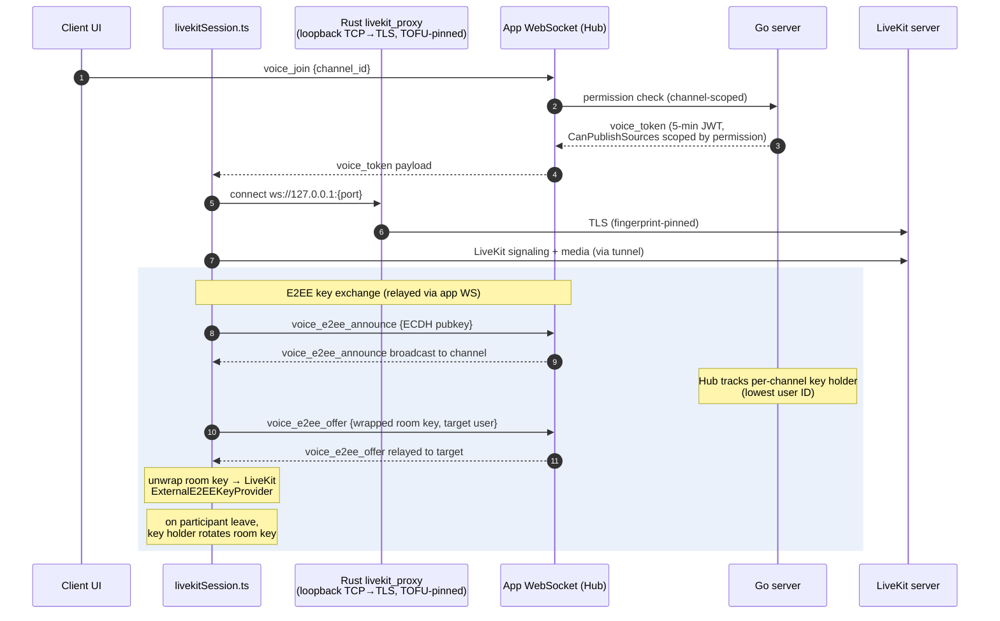

# Voice and End-to-End Encryption

**Verified against:** commit `5630aa1`, 2026-08-04

Voice/video runs on LiveKit. The Go server issues short-lived scoped tokens and
relays E2EE key-exchange messages; media flows client↔LiveKit directly. On the
client, everything funnels through `src/lib/livekitSession.ts` (a facade over
the `src/features/voice/` modules), and — because
self-hosted servers commonly use self-signed certificates — the LiveKit
connection is tunneled through a local Rust TLS proxy pinned to the same TOFU
fingerprint as the main WebSocket.

## D6 — Voice join + E2EE key exchange

**What this shows.** The server never holds the room key — it only relays
announce/offer messages and tracks who the key holder is (deterministically the
lowest user ID in the channel). Keys are wrapped per-recipient via ECDH, and
the key holder rotates the room key when a participant leaves so departed
members cannot decrypt future media. Voice permission enforcement happens twice:
at `voice_join` (channel permission) and inside the LiveKit JWT itself
(`CanPublishSources` restricts camera/screenshare per role permission).

Supporting pieces:

- **Server:** `Server/ws/voice_e2ee.go` (relay + key-holder map),
  `Server/ws/livekit.go` (token minting), `Server/ws/livekit_process.go`
  (optional managed `livekit-server` subprocess),
  `Server/ws/livekit_webhook.go` (webhook validated by LiveKit JWT and
  admin-IP-restricted), `Server/api/livekit_proxy.go` (HTTP reverse proxy).
- **Client:** `src/lib/livekitSession.ts` (facade owning the state machine:
  idle/connecting/connected/reconnecting), `src/features/voice/`
  (`joinOrchestration.ts` joins with a monotonic `joinGeneration` to discard
  superseded ones; `roomLifecycle.ts` Room + E2EE worker creation and
  teardown; `mediaControl.ts` mute/deafen/devices; `remoteTracks.ts`;
  `sessionState.ts` state types), `src/lib/livekitE2EE.ts` (`E2EEManager`
  facade: key-holder election, join/reconnect key exchange, announce handling,
  rotation-on-leave), its `src/features/voice/e2ee*.ts` modules
  (`e2eeIdentity.ts` identity signing and the ephemeral keypair;
  `e2eeEpoch.ts` room key, epoch and rotation; `e2eePeerState.ts` peer keys
  and TOFU pin verification; `e2eeWorker.ts` key provider write queue;
  `e2eeOffer.ts` room-key offers), `src/lib/e2eeCrypto.ts` (ECDH
  primitives, safety-number fingerprints, long-term identity keys),
  `src/lib/identity.ts` (OS-keyring identity key + peer identity pins),
  `src/lib/audioPipeline.ts` + `src/lib/noise-suppression.ts` (RNNoise WASM),
  `src/lib/screenShare.ts`, `src-tauri/src/livekit_proxy.rs` (tunnel),
  `src-tauri/src/ptt.rs` (push-to-talk key polling).

The wire flow (`voice_e2ee_announce` / `voice_e2ee_offer`)
is specified in [protocol.md](../protocol.md) (Voice End-to-End Encryption
section). Long-term identity: each user publishes an ECDSA identity public key
(`users.identity_public_key`, migration 017); peers pin it on first contact
and surface a blocking mismatch modal if it later changes (see
[ux/voice-and-e2ee.md](ux/voice-and-e2ee.md)).

**Source of truth:** `Server/ws/voice_e2ee.go`, `Server/ws/livekit.go`,
`Client/src/lib/livekitSession.ts`, `Client/src/features/voice/`,
`Client/src/lib/livekitE2EE.ts`, `Client/src/lib/e2eeCrypto.ts`,
`Client/src-tauri/src/livekit_proxy.rs`.

## Linux: native LiveKit in the Rust backend

No mainstream WebKitGTK build ships WebRTC — the system webview's
`RTCPeerConnection` is `undefined` on Ubuntu, Debian, Fedora, Arch and the
GNOME Flatpak runtime alike — so on Linux the `livekit-client` JS path cannot
run at all. Even a custom WebKitGTK build cannot do LiveKit E2EE, because its
GStreamer encoded-transform backend is a stub.

The fix is to run LiveKit's **Rust SDK** in the Tauri backend on Linux only,
with the webview kept as the UI and driven over IPC behind the same
`livekitSession` facade. The TS E2EE key exchange
(`livekitE2EE.ts` and `features/voice/e2ee*.ts`) stays unchanged; only the
final room key crosses IPC, so the frame format, KDF and cipher remain
byte-compatible with Windows clients. Windows keeps the current webview path
with no behaviour change.

The dependency is Linux-only (`[target.'cfg(target_os = "linux")'.dependencies]`
in `Client/src-tauri/Cargo.toml`), and the module and Tauri command live in
`Client/src-tauri/src/native_voice.rs`. The build prerequisite — clang >= 21
and a prebuilt libwebrtc — is documented in
[contributing.md](../contributing.md#client-tauri-v2) and installed by
`Client/scripts/linux-webrtc-toolchain.sh`.

**Status.** Phase 0 (this plumbing) is landed and links the SDK; it ships no
user-visible voice. The actual E2EE connect/audio/video path, and B7-17's Linux
release smoke, are later phases.
