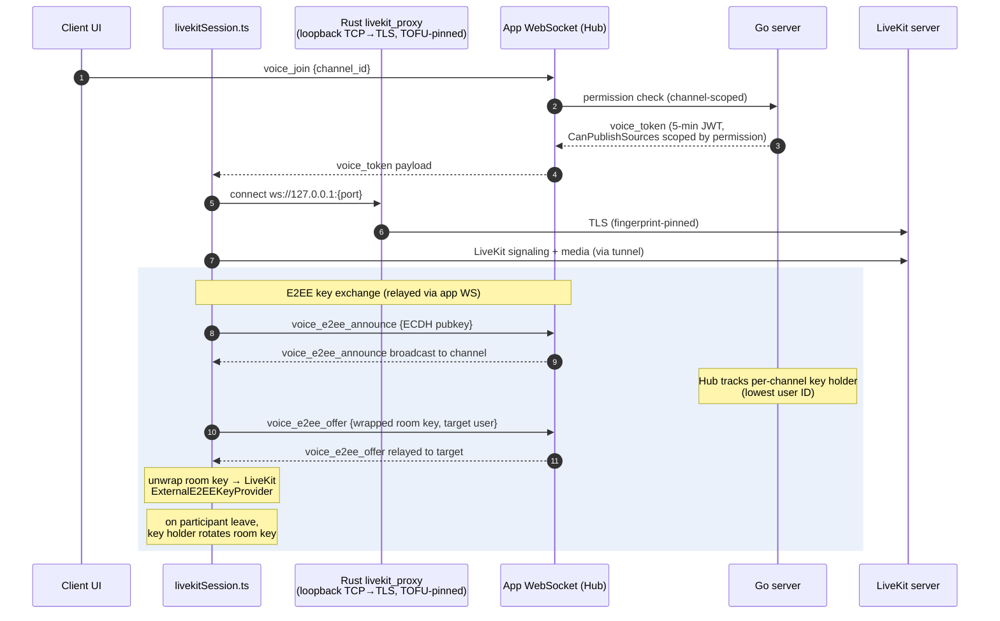

# Voice and End-to-End Encryption

**Verified against:** commit `5630aa1`, 2026-08-04

Voice/video runs on LiveKit. The Go server issues short-lived scoped tokens and
relays E2EE key-exchange messages; media flows client↔LiveKit directly. On the
client, everything funnels through `src/lib/livekitSession.ts` (a facade over
the `src/features/voice/` modules), and — because
self-hosted servers commonly use self-signed certificates — the LiveKit
connection is tunneled through a local Rust TLS proxy pinned to the same TOFU
fingerprint as the main WebSocket.

## D6 — Voice join + E2EE key exchange

**What this shows.** The server never holds the room key — it only relays
announce/offer messages and tracks who the key holder is (deterministically the
lowest user ID in the channel). Keys are wrapped per-recipient via ECDH, and
the key holder rotates the room key when a participant leaves so departed
members cannot decrypt future media. Voice permission enforcement happens twice:
at `voice_join` (channel permission) and inside the LiveKit JWT itself
(`CanPublishSources` restricts camera/screenshare per role permission).

Supporting pieces:

- **Server:** `Server/ws/voice_e2ee.go` (relay + key-holder map),
  `Server/ws/livekit.go` (token minting), `Server/ws/livekit_process.go`
  (optional managed `livekit-server` subprocess),
  `Server/ws/livekit_webhook.go` (webhook validated by LiveKit JWT and
  admin-IP-restricted), `Server/api/livekit_proxy.go` (HTTP reverse proxy).
- **Client:** `src/lib/livekitSession.ts` (facade owning the state machine:
  idle/connecting/connected/reconnecting), `src/features/voice/`
  (`joinOrchestration.ts` joins with a monotonic `joinGeneration` to discard
  superseded ones; `roomLifecycle.ts` Room + E2EE worker creation and
  teardown; `mediaControl.ts` mute/deafen/devices; `remoteTracks.ts`;
  `sessionState.ts` state types), `src/lib/livekitE2EE.ts` (`E2EEManager`
  facade: key-holder election, join/reconnect key exchange, announce handling,
  rotation-on-leave), its `src/features/voice/e2ee*.ts` modules
  (`e2eeIdentity.ts` identity signing and the ephemeral keypair;
  `e2eeEpoch.ts` room key, epoch and rotation; `e2eePeerState.ts` peer keys
  and TOFU pin verification; `e2eeWorker.ts` key provider write queue;
  `e2eeOffer.ts` room-key offers), `src/lib/e2eeCrypto.ts` (ECDH
  primitives, safety-number fingerprints, long-term identity keys),
  `src/lib/identity.ts` (OS-keyring identity key + peer identity pins),
  `src/lib/audioPipeline.ts` + `src/lib/noise-suppression.ts` (RNNoise WASM),
  `src/lib/screenShare.ts`, `src-tauri/src/livekit_proxy.rs` (tunnel),
  `src-tauri/src/ptt.rs` (push-to-talk key polling).

The wire flow (`voice_e2ee_announce` / `voice_e2ee_offer`)
is specified in [protocol.md](../protocol.md) (Voice End-to-End Encryption
section). Long-term identity: each user publishes an ECDSA identity public key
(`users.identity_public_key`, migration 017); peers pin it on first contact
and surface a blocking mismatch modal if it later changes (see
[ux/voice-and-e2ee.md](ux/voice-and-e2ee.md)).

**Source of truth:** `Server/ws/voice_e2ee.go`, `Server/ws/livekit.go`,
`Client/src/lib/livekitSession.ts`, `Client/src/features/voice/`,
`Client/src/lib/livekitE2EE.ts`, `Client/src/lib/e2eeCrypto.ts`,
`Client/src-tauri/src/livekit_proxy.rs`.

## Linux: native LiveKit in the Rust backend

No mainstream WebKitGTK build ships WebRTC — the system webview's
`RTCPeerConnection` is `undefined` on Ubuntu, Debian, Fedora, Arch and the
GNOME Flatpak runtime alike — so on Linux the `livekit-client` JS path cannot
run at all. Even a custom WebKitGTK build cannot do LiveKit E2EE, because its
GStreamer encoded-transform backend is a stub.

The fix is to run LiveKit's **Rust SDK** in the Tauri backend on Linux only,
with the webview kept as the UI and driven over IPC behind the same
`livekitSession` facade. The TS E2EE key exchange
(`livekitE2EE.ts` and `features/voice/e2ee*.ts`) stays unchanged; only the
final room key crosses IPC, so the frame format, KDF and cipher remain
byte-compatible with Windows clients. Windows keeps the current webview path
with no behaviour change.

The dependency is Linux-only (`[target.'cfg(target_os = "linux")'.dependencies]`
in `Client/src-tauri/Cargo.toml`); the backend lives in
`Client/src-tauri/src/native_voice/` (`session.rs` is the room, `mod.rs` the
Tauri commands and state). The build prerequisite — clang >= 21 and a prebuilt
libwebrtc — is documented in [contributing.md](../contributing.md#client-tauri-v2)
and installed by `Client/scripts/linux-webrtc-toolchain.sh`.

### Phase 1: audio

**Where the switch is.** `features/voice/native/platform.ts`'s
`isLinuxDesktop()` is the only platform check. `RoomLifecycle.createRoom`
returns a `NativeRoom` (`features/voice/native/nativeRoom.ts`) instead of a
livekit-client `Room` there, and `E2EEWorker.applyRoomKey` hands the key to the
backend instead of the browser key provider. Nothing else in the voice state
machine (`joinOrchestration`, `roomLifecycle`, `mediaControl`,
`roomEventHandlers`, the reconnect loop, `E2EEManager`) knows which backend it
is driving: `NativeRoom` implements the slice of `Room` those modules call —
`connect`/`disconnect`, the event emitter, `state`, the local participant's
microphone toggle, and the remote participants' audio publications for deafen —
over the `NativeVoice` platform contract (`platform/contracts/nativeVoice.ts`,
bound in `platform/desktop/nativeVoice.ts` + `nativeVoiceService.ts`). The
facade's own suite therefore stays the contract; `tests/unit/livekit-session-linux.test.ts`
runs the same facade with the switch on and pins the native command sequence,
and `tests/unit/platform/nativeVoice.suite.ts` pins the host contract.

**Commands and events.** `native_voice_set_key` (install/rotate),
`native_voice_clear_key` (leave), `native_voice_connect` → `{session, identity}`,
`native_voice_disconnect(session)`, `native_voice_set_microphone`,
`native_voice_set_subscribed` (deafen), `native_voice_debug_info`. Room events
arrive on one Tauri event, `native-voice`, tagged with the session id; the
adapter maps them onto `RoomEvent`s (`Disconnected`, `ActiveSpeakersChanged`,
`EncryptionError` for a non-`Ok` frame-cryptor state, participant join/leave).
No `TrackSubscribed` is raised: there is no browser track, capture and playout
run in libwebrtc's audio device module (`PlatformAudio`) in the Rust process,
with its APM (AEC/NS/AGC from the same preferences the web path uses) standing
in for RNNoise on Linux by owner decision. Media never crosses IPC.

**E2EE byte-compatibility.** The web path calls
`ExternalE2EEKeyProvider.setKey(base64Text)`, which PBKDF2-derives from the
UTF-8 bytes of the base64 _text_. The backend receives that same text once per
set/rotate and uses its bytes as the shared key (`session::shared_key_material`),
with `ratchet_window_size: 0`, `failure_tolerance: -1`, the default salt and
PBKDF2, `EncryptionType::Gcm`, and key index 0 only (`KEY_INDEX`; rust-sdks
#1280 aborts on an out-of-range index). A wrong key yields silence, not
plaintext: the interop test's negative control asserts it. Keys are never
logged; the backend zeroes its copy on clear.

**Lifecycle (B7-11).** Sessions are numbered so a superseded attempt's
`disconnect()` closes only its own room; the Tauri subscription is registered
per connect and released in `disconnect()` with the late-resolve guard; the key
is forgotten in the same `leaveVoice` teardown. `getSessionDebugInfo().native`
reports open native rooms, registered listeners and the backend's last resource
snapshot (rooms, local tracks, ADM refs, process threads).

**Interop test (CI).** `Client/tests/e2e/native-voice/interop.spec.ts`, run by
ci.yml's `rust-tests` job: `examples/native_voice_interop.rs` drives the app's
`NativeSession` (a synthetic 440 Hz sine as the microphone, since the runner
has no sound server) against livekit-client in Chromium, over a local
`livekit-server`, both holding the same key. Measured 2026-09-22 (livekit
0.9.1, libwebrtc 0.3.48, livekit-server 1.13.5): the browser decodes the
native sine at its exact RMS (0.1726) with 0 encryption errors; the native side
decodes Chromium's fake microphone; with a different key the browser measures
RMS 0 and counts decryption errors, and the native side hears silence.

**Known SDK risks, measured.**

- rust-sdks #1408 (a leaked thread per FrameCryptor): 5 join/leave cycles with
  one remote participant grew the process from 17 to 27 threads — **+2 per
  cycle**, idle. The interop test pins that rate as the ceiling. Long sessions
  with many joins accumulate them; a patch or an SDK fix is the follow-up.
- #1187 (bundled BoringSSL vs a dynamic OpenSSL): `cargo tree -i openssl-sys`
  and `-i native-tls` match nothing — the client is rustls-only.
- Not exercised: real ADM capture and playout. Every box this was built on has
  no sound server; `PlatformAudio::new()` failing is handled (listen-only, the
  existing toast) but the happy path on PulseAudio/PipeWire is untested here.

**Not in phase 1** (tracked as 1b and later): input/output device selection
(`switchActiveDevice` is a no-op on the native room), input volume and the
VAD gate, per-user volume (the ADM mixes with no per-track gain), camera and
screen share (`setCameraEnabled`/`publishTrack` reject on Linux).

**Phase 0 verification.** The Linux client was built on GitHub-hosted
`ubuntu-22.04` and `ubuntu-22.04-arm` runners, before (`dev` at `dba68fe8`)
and after this change, with clang 21.1.8 from apt.llvm.org (package
`1:21.1.8~++20251221032842+2078da43e25a-1~exp1~20251221153008.77`) on both
architectures; all four legs passed
([run 35715158290](https://github.com/J3vb/OwnCord/actions/runs/35715158290)).
Stripped `owncord-client` sizes, in bytes:

| Arch  | Before     | After      | Delta    |
| ----- | ---------- | ---------- | -------- |
| x64   | 23,697,480 | 24,135,520 | +438,040 |
| arm64 | 21,311,640 | 21,629,784 | +318,144 |

Unstripped, x64 grew 35,109,848 → 35,977,288 (+867,440) and arm64 33,693,744 →
34,310,096 (+616,352); gzip-6 of the stripped binary grew by 162,390 (x64) and
52,288 (arm64). `Client/scripts/check-glibc-floor.sh` on the built binaries
reports a highest strong requirement of GLIBC_2.34 on both architectures,
within the Ubuntu 22.04 floor of 2.35.
