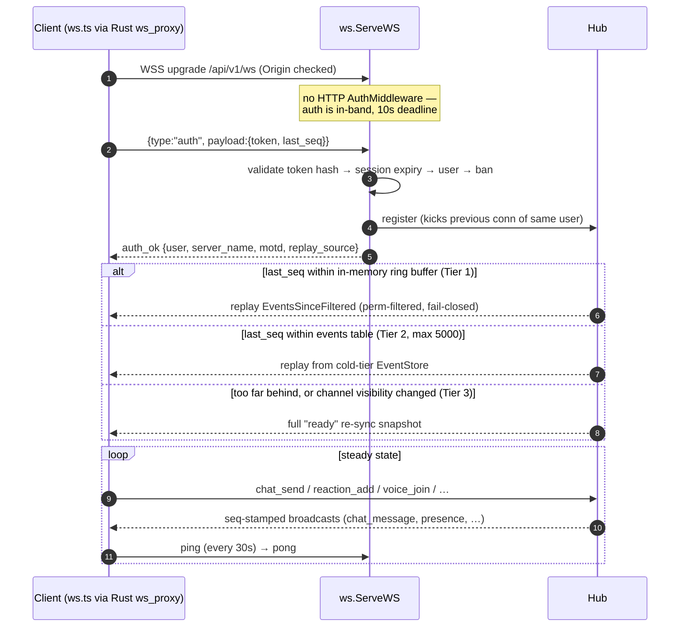
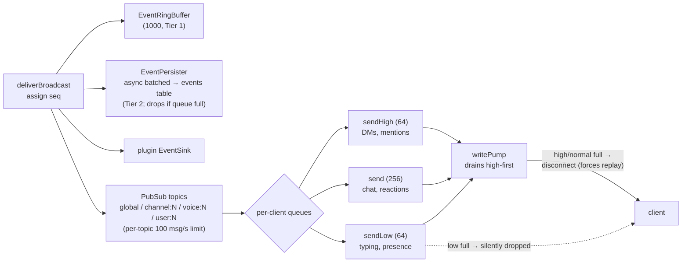
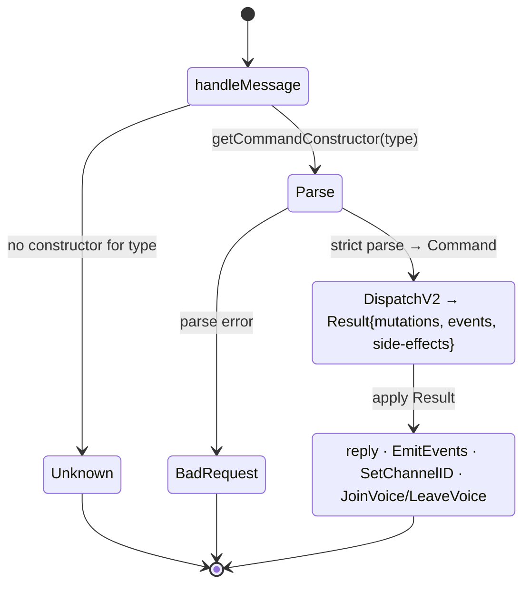

# WebSocket / Real-time Engine

**Verified against:** commit `ddc49f0`, 2026-07-19

The `Server/ws` package (~6.9k LOC, the largest in the server) implements the
real-time engine: a single `Hub` owning all client connections, a topic-based
pub/sub, a monotonic sequence counter, a 3-tier reconnect replay pipeline, and a
single typed (V2) command dispatch. Message-type constants live in
`Server/ws/message_types.go` (client↔server) and mirror
`Client/tauri-client/src/lib/protocolTypes.ts`.

> Both files claim to be "Generated from docs/protocol-schema.json — single
> source of truth", but **no such file exists in the repository** — the
> constants are maintained by hand on both sides. See
> [audit-2026-07-19.md §3](../audit-2026-07-19.md).

## D4a — Connect, authenticate, replay

**What this shows.** Auth is deliberately in-band (the WS route mounts without
`AuthMiddleware`). Every broadcast is assigned a monotonic `seq` under a
dedicated mutex; the client reports its `last_seq` on reconnect and the hub
picks the cheapest replay tier. A `visibilityChangeSeq` watermark forces a full
re-sync whenever channel visibility changed while the client was away, so
permission changes can never be replayed around. `auth_ok.replay_source`
(`none|buffer|db`) reports which tier served the reconnect and feeds the
`ws_reconnect_tier_total` metric.

## D4b — Broadcast fanout and backpressure

**What this shows.** Overflow policy is intentional: dropping a chat message
would corrupt state, so a full normal/high queue disconnects the client and the
replay pipeline restores consistency; typing/presence are lossy by design. The
global `broadcast` channel (1024) drops with a `broadcastDrops` counter when
saturated.

## D4c — Typed command dispatch

**What this shows.** The V1→V2 strangler-fig migration is complete (audit
A-2026-07-09, done 2026-07-20): every inbound type parses through its constructor
into a typed `Command`, dispatches to a single V2 handler, and the handler's
`Result` is applied by one applier. There is no second (V1) generation, no
lenient parser, and no second registry. Handlers stay effect-light — the two
hub-coupled voice routines (`handleVoiceJoin`/`handleVoiceLeave`, also called
un-throttled on disconnect and channel switch) are triggered from the applier via
`Result.JoinVoice` / `Result.LeaveVoice` rather than re-expressed as pure events.

The `Hub` also owns: stale-client sweep (90s), revoked-session sweep (30s, plus
per-connection revalidation every 10 messages), stale-voice-state sweep (60s),
panic containment on the run loop (3 panics/60s → stop), LiveKit client and
optional managed subprocess, and the voice E2EE key-holder map
([voice-e2ee.md](voice-e2ee.md)). Many collaborators are attached
post-construction via `SetLiveKit` / `SetEventPersister` /
`SetPluginRegistry` setters that "must be called before Run" — temporal
coupling noted in the audit.

**Source of truth:** `Server/ws/hub.go`, `Server/ws/serve.go`,
`Server/ws/client.go`, `Server/ws/handlers.go`, `Server/ws/command.go`,
`Server/ws/pubsub.go`, `Server/ws/ringbuffer.go`, `Server/ws/event_persister.go`,
`Server/ws/message_types.go`, `Server/migrations/014_events_table.sql`.
