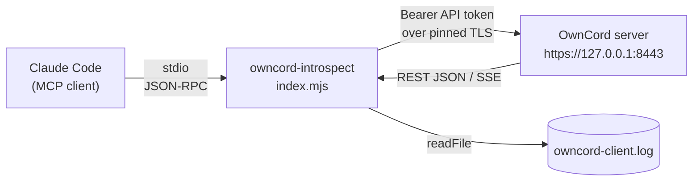
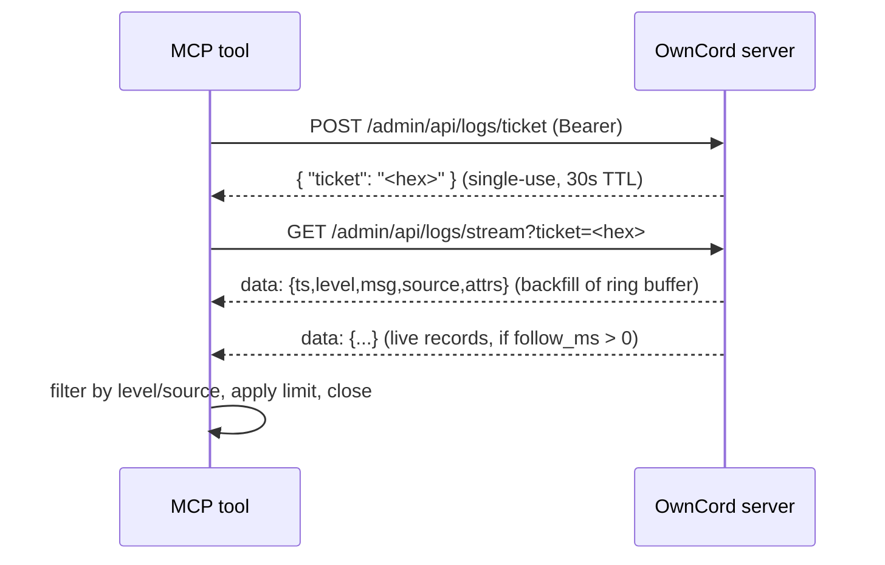

# OwnCord Introspection MCP Server

`tools/mcp-introspect/` is a small [Model Context Protocol](https://modelcontextprotocol.io)
(MCP) server that lets an AI agent — Claude Code — inspect a **locally running** OwnCord
instance: read its logs, query any REST endpoint, and tail the desktop client's log file.

It is a **development tool**, not part of the shipped product. It ships no data of its own and
adds nothing to the server binary — it is a thin wrapper over OwnCord's existing REST API plus
the client's on-disk log.

- **Code:** `tools/mcp-introspect/index.mjs` (one file, ~270 lines)
- **Runtime:** Node ≥ 20, ESM. One real dependency: `@modelcontextprotocol/sdk` (+ `zod`)
- **Registration:** `/.mcp.json` (committed) and `.claude/settings.local.json` (local)

---

## How it works



Claude Code launches `index.mjs` as a child process (`node tools/mcp-introspect/index.mjs`) and
speaks MCP over stdin/stdout. When you (or the agent) call one of its tools, the server makes a
request to the local OwnCord instance — or reads a file — and returns the result.

### Authentication

OwnCord has no static API key. The only credential its API accepts is a **bearer token**, and
until recently the only way to mint one was a username/password login. This tool instead uses a
long-lived **API token** (added alongside this tool — see [API tokens](#api-tokens-server-side)):

- You mint a token once with `server token create` (writes directly to the DB, no login).
- The tool sends it as `Authorization: Bearer <token>` on every request (`OWNCORD_API_TOKEN`).
- Server-side, `auth.ResolveTokenHash` resolves the bearer token: it checks login **sessions
  first** (unchanged behavior), then falls back to API tokens. The token authenticates as the
  user it was bound to (the owner by default), inheriting that user's role — which is why it can
  reach `/admin/api/*` and the log stream.

The tool never sends an `Origin` header: the server treats a missing `Origin` as a non-browser
client and skips CSRF/Origin checks, so a headless client is never blocked on that axis.

### TLS (cert pinning, not CA trust)

OwnCord serves HTTPS with a **self-signed certificate that has no SAN** (Subject Alternative
Name). Trusting it as a CA is not enough — hostname verification against `127.0.0.1` still fails.
So the tool uses `node:https` and:

1. **pins** the exact certificate bytes (`ca: Server/data/cert.pem`), and
2. **skips hostname matching** (`checkServerIdentity: () => undefined`).

Identity is proven by the pin — a MITM would need the identical cert. This is the same
trust-on-first-use model the desktop client's proxy already uses. (`client_logs` needs neither
the token nor the cert.)

### The three tools

**`api_request`** — a single generic passthrough that covers the *entire* REST API. It issues one
`https.request` to `https://127.0.0.1:<port><path>` with the bearer token and returns
`{ status, headers, body }` (body is JSON-parsed when possible, else raw text). Any HTTP method is
allowed, including destructive admin routes.

**`server_logs`** — the server keeps its last 2000 log records in an in-memory ring buffer, exposed
over **Server-Sent Events** (an `EventSource`-style stream can't send an auth header, so it's
guarded by a single-use ticket). The tool runs that flow:



With `follow_ms: 0` (default) it returns after the backfill burst goes quiet; with `follow_ms > 0`
it keeps reading live records for that long. Filtering by `level`/`source` and the `limit` are
applied client-side.

**`client_logs`** — reads the desktop client's rotating log file directly
(`%LOCALAPPDATA%\com.owncord.client\logs\owncord-client.log`); no server involved. Returns the last
N lines with optional level/substring filtering, and degrades gracefully if the file doesn't exist
yet.

---

## Setup

### 1. Install dependencies

```bash
cd tools/mcp-introspect
npm install
```

### 2. Mint an API token

```bash
cd Server
./server.exe token create --label mcp-introspect
# prints the raw token ONCE — copy it now, it is never recoverable
```

The token defaults to the **owner** account (so it can reach the admin API and log stream). Bind it
to a different user with `--user <name>`, or set an expiry with `--expires 720h`. Manage tokens with
`./server.exe token list` and `./server.exe token revoke <id|label>`.

> The running server must be built from the current source for API-token auth to work — the feature
> is compiled into the server binary. Rebuild (`go build -o server.exe .`) and restart if needed.

### 3. Put the token in your environment

`.mcp.json` passes `${OWNCORD_API_TOKEN}` through to the tool, so set it once:

```powershell
setx OWNCORD_API_TOKEN <paste-raw-token>   # Windows user env — open a new shell afterwards
```

### 4. Enable in Claude Code

`owncord-introspect` is already listed in `.claude/settings.local.json` under
`enabledMcpjsonServers`. Restart Claude Code so it picks up the new MCP server.

### Verify

```bash
cd tools/mcp-introspect
npx @modelcontextprotocol/inspector node index.mjs
```

The three tools should appear. Call `api_request` with `{ "method": "GET", "path": "/health" }` and
expect `{status:200, body:{...}}`.

---

## Tool reference

### `api_request`

| Param | Type | Notes |
|-------|------|-------|
| `method` | string | `GET`, `POST`, `PATCH`, `PUT`, `DELETE` |
| `path` | string | Path beginning with `/` (e.g. `/admin/api/stats`) or a full URL |
| `query` | object? | Query-string params |
| `body` | any? | JSON body (object or string) |
| `headers` | object? | Extra request headers |

Returns `{ status, headers, body }`.

```jsonc
// request
{ "method": "GET", "path": "/api/v1/metrics" }
// → { "status": 200, "headers": {...}, "body": { "uptime_seconds": 1820,
//     "goroutines": 42, "connected_users": 1, "voice_sessions": 0, ... } }
```

Useful read-only endpoints: `/health`, `/api/v1/metrics` (runtime/process stats),
`/admin/api/stats` (user/message/channel counts), `/api/v1/diagnostics/connectivity`,
`/admin/api/users`, `/admin/api/channels`, `/admin/api/audit-log`.

### `server_logs`

| Param | Type | Default | Notes |
|-------|------|---------|-------|
| `level` | string? | — | `DEBUG` \| `INFO` \| `WARN` \| `ERROR` |
| `source` | string? | — | `websocket`, `http`, `admin`, `auth`, `database`, `storage`, `updater`, `config`, `server` |
| `limit` | number? | 500 | Max records returned |
| `follow_ms` | number? | 0 | `0` = backfill only; `>0` = also stream live for that many ms |

Returns an array of `{ ts, level, msg, source, attrs }` (`attrs` is parsed from its JSON string when present; `req_id`/`trace_id` appear inside `attrs`).

```jsonc
{ "level": "ERROR", "limit": 50 }              // last 50 ERROR records from the ring buffer
{ "source": "websocket", "follow_ms": 3000 }   // ws logs, backfill + 3s of live tail
```

### `client_logs`

| Param | Type | Default | Notes |
|-------|------|---------|-------|
| `lines` | number? | 200 | Trailing lines to return |
| `level` | string? | — | Keep only lines tagged `[LEVEL]` |
| `grep` | string? | — | Keep only lines containing this substring |

Returns `{ path, found: true, lines: [...] }`, or `{ path, found: false, note }` if the client has
not run yet.

---

## Configuration

All optional except the token (which only the two server-backed tools need).

| Env var | Default | Purpose |
|---------|---------|---------|
| `OWNCORD_API_TOKEN` | *(required for `api_request`/`server_logs`)* | Bearer token from `server token create`. |
| `OWNCORD_BASE_URL` | `https://127.0.0.1:<server.port>` | Override the whole base URL (e.g. a non-TLS endpoint). Port is read from `Server/config.yaml`. |
| `OWNCORD_CERT_PATH` | `Server/data/cert.pem` | Self-signed cert to pin. |
| `OWNCORD_CLIENT_LOG` | `%LOCALAPPDATA%\com.owncord.client\logs\owncord-client.log` | Desktop client log path. |

---

## Troubleshooting

| Symptom | Cause / fix |
|---------|-------------|
| `OWNCORD_API_TOKEN is not set` | Mint a token and set the env var; restart the shell/Claude Code so it's inherited. |
| `OwnCord cert not found at …` | Start the server once to generate `Server/data/cert.pem`, or set `OWNCORD_CERT_PATH` / `OWNCORD_BASE_URL`. |
| `api_request` returns `401` | Token missing/revoked/expired. Mint a fresh owner-bound token. |
| `api_request` returns `403` on `/admin/*` | Either the request didn't come from an allowed IP (the tool must run on the same host as the server; localhost is allowed by default), or the token's user lacks the permission that route requires — see the route table in `docs/api.md`. |
| `server_logs` fails at the ticket step | The log stream still needs ADMINISTRATOR (the widened `/admin/api/*` perimeter does not open it), or the server isn't the current build. |
| `client_logs` → `found: false` | The desktop client hasn't run yet, or the path differs — set `OWNCORD_CLIENT_LOG`. |

---

## Security notes

- **Local-only by design.** The tool talks to `127.0.0.1` and relies on the server's localhost admin
  IP gate. Do not expose it or point it at a remote host without understanding the trust model.
- **`api_request` is full read-write.** It can call any endpoint with any method, including
  destructive admin routes (delete users/channels, restore backups, apply updates). There is no
  write allowlist — it relies on the operator/agent's discretion.
- **The API token is a real credential.** It never expires by default and inherits the owner's
  permissions. Keep it out of version control (it lives in your environment, not `.mcp.json`), and
  revoke it with `server token revoke` if leaked.

---

## API tokens (server side)

The MCP tool depends on a server feature added at the same time: revocable, long-lived **API
tokens**. See the `api_tokens` table in [`schema.md`](schema.md) and the `server token`
subcommands. Key points:

- Stored hashed (SHA-256), like sessions; the raw token is shown once at creation.
- Resolved by the same middleware as sessions (`auth.ResolveTokenHash`) — **sessions are matched
  first**, so existing login behavior is unchanged; API tokens are a fallback.
- `expires_at IS NULL` means never expires; `revoked_at IS NULL` means active. Revocation takes
  effect immediately.
- Kept in a separate table from `sessions`, so bulk logout and the per-user session cap never
  affect them.
